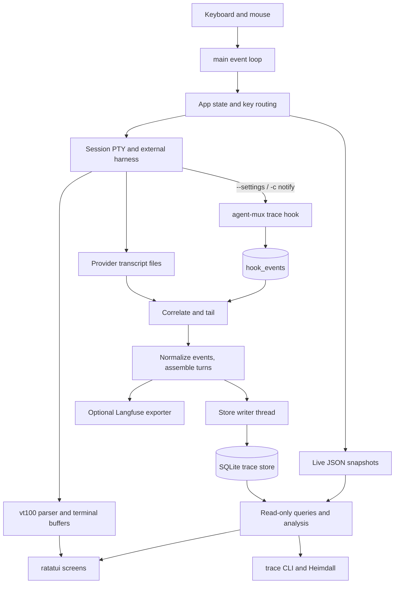
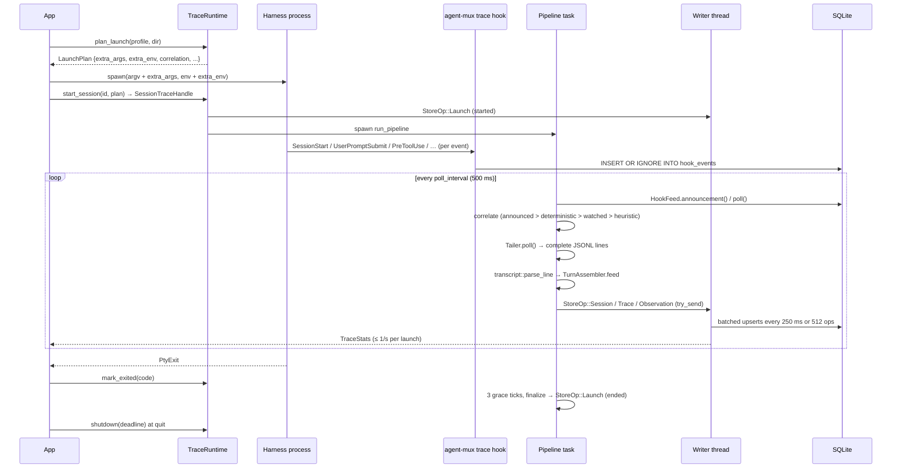

# agent-mux

A terminal multiplexer for AI coding harnesses, with local trace capture, a SQLite analysis store, and portable skills. Run Claude Code (`claude`), Codex CLI (`codex`), and Google Antigravity (`agy`) in separate pseudo-terminals, switch between them, resume provider sessions, inspect turns and tool calls, and compare recorded work.

This README is the developer onboarding guide to the **implemented code in this checkout**. Every screen, panel, query, capture step, hook and SQL statement below was read from the source at the time of writing; file paths are given so you can verify and extend. Design documents under `docs/superpowers/` record development history and are not a guarantee that a proposed feature shipped.

## Contents

1. [Start here](#1-start-here)
2. [Architecture and repository map](#2-architecture-and-repository-map)
3. [Configuration](#3-configuration)
4. [Terminal user interface: every screen and panel](#4-terminal-user-interface-every-screen-and-panel)
5. [Trace capture pipeline](#5-trace-capture-pipeline)
6. [Provider hooks](#6-provider-hooks)
7. [SQLite trace store](#7-sqlite-trace-store)
8. [SQL catalog: which query feeds which consumer](#8-sql-catalog-which-query-feeds-which-consumer)
9. [Command reference](#9-command-reference)
10. [Analysis service, live snapshots, inventory and loop diagnostics](#10-analysis-service-live-snapshots-inventory-and-loop-diagnostics)
11. [Skills and Heimdall](#11-skills-and-heimdall)
12. [Experiments, comparison and scores](#12-experiments-comparison-and-scores)
13. [Langfuse export](#13-langfuse-export)
14. [Developing, testing and troubleshooting](#14-developing-testing-and-troubleshooting)
15. [Loop Engineering](#15-loop-engineering)
16. [Configuration library: prompts, skills, loops and agents](#16-configuration-library-prompts-skills-loops-and-agents)
17. [Workflows](#17-workflows)

---

## 1. Start here

### Build and run

The project is a Rust 2024-edition binary and library (`src/lib.rs` exports the modules; `src/main.rs` is the entry point). SQLite is bundled by `rusqlite`, so no system SQLite is needed. Install and authenticate the harnesses you intend to launch separately; agent-mux invokes their executables from `PATH`.

```sh
cargo build
cargo run
# Install the local checkout as a release binary:
cargo install --path .
agent-mux
# Start with the sidebar hidden:
agent-mux --hide-sidebar      # --full-screen and -b do the same
```

One-shot commands are dispatched in [src/main.rs](src/main.rs) before any terminal setup:

```sh
agent-mux --version           # version, build date and time, branch and commit
agent-mux trace help          # every trace subcommand
agent-mux trace doctor        # config, store health, provider readiness, hooks
agent-mux trace path          # where the SQLite store is
agent-mux skill list
agent-mux run --help
```

There is no general-purpose argument parser: `main` matches only `trace`, `mcp`, `run`, `loop`, `skill`, `--version` (also `-V` and `version`) and the legacy `langfuse` (which prints a migration notice). Anything else opens the TUI.

`--version` prints the stamp [build.rs](build.rs) bakes in at compile time and [src/build_info.rs](src/build_info.rs) formats:

```text
agent-mux 0.1.0
built     2026-09-16T11:29:38-03:00 (4 s ago, debug)
          2026-09-16T14:29:38Z UTC
branch    feat/loops @ 72f7f2a1 (uncommitted changes at build time)
target    aarch64-apple-darwin
binary    /Users/me/.cargo/bin/agent-mux
```

The branch and commit describe the checkout the binary was **compiled** from, not the directory it runs in; when the current directory sits on another branch, a line says so, which is how you catch a stale `cargo install`. The build script emits no `rerun-if-changed` directive, so Cargo rescans the package and refreshes the stamp whenever a source file changes; a branch switch that touches no file keeps the previous stamp until the next rebuild. The same one-line form (`build_info::short()`) closes the help overlay (`?`), and the full stamp opens `trace doctor`. A plain launch uses built-in Claude Code, Codex and Antigravity profiles when no usable configuration exists. Local tracing is on by default and needs no credentials. The database is created by a writer (TUI startup, `trace import`, `agent-mux run`); read commands do not create one.

### Suggested first exploration

1. Start agent-mux, press `n`, pick a profile, launch it in a disposable workspace.
2. Send a short prompt, press `Ctrl+Q` to detach, and watch the trace badge on the Active row update.
3. Press `T` to open the Trace Browser; press `v` to cycle the Detail pane views.
4. Run `agent-mux trace ls --all`, `agent-mux trace show <session-id> --full`, `agent-mux trace show <trace-id> --tree`.
5. Run `agent-mux trace sql 'SELECT * FROM trace_stats ORDER BY start_ns DESC LIMIT 5'`.
6. Read section 5 (capture) and section 7 (store) before touching `src/tracing/`.

### Vocabulary

| Term | Meaning |
| --- | --- |
| Harness / provider | The external CLI and its data format. The Antigravity command is `agy`; stored provider names are `claude`, `codex`, `antigravity`. |
| Live session | An in-memory PTY child, VT100 parser, scrollback, status tracker and optional trace handle, owned by `App` (`src/session.rs`). |
| Provider session | A conversation identity owned by the harness (Claude session UUID, Codex thread id, Antigravity conversation id). Resumable across launches. |
| Run | One lifetime of a trace-store owner process, recorded in the `runs` table. |
| Launch | One attempt to run a profile, recorded in `launches`. A launch binds to at most one provider session. |
| Trace / turn | One user turn assembled from provider events, stored in `traces`. Contains observations. |
| Observation | A generation, tool call, agent (subagent) container, or event inside a turn, stored in `observations`, optionally nested through `parent_id`. |
| Hook event | A provider lifecycle callback stored in `hook_events`; used for correlation, exact timing, subagent nesting and the budget guard. |
| Skill package | `SKILL.md` + optional `skill.toml` + `reference/*.md`, installed into a harness skill directory. The only package type agent-mux manages. |
| Subagent | A child agent invoked by a harness. Represented as `type = 'agent'` observations; not an agent-mux package type. |
| Loop | A scheduled, bounded agent run against one workspace (section 15): registry entry in `~/.agent-mux/loops.json`, contract files in the workspace, runs in `loop_runs`. Not the per-turn "loop diagnostics" of `trace loops`. |
| Loop run | One launch of a loop: an ordinary traced session with `launches.metadata.loop_*` and a `loop_runs` row; blocked runs are rows without a launch. |

---

## 2. Architecture and repository map



Terminal rendering and telemetry are separate paths. The PTY's escape sequences drive the terminal preview; structured provider records and hooks drive telemetry. Session history is read from provider files; saved workspace sessions and live snapshots have their own JSON files.

### Repository map

| Source | Responsibility |
| --- | --- |
| [src/main.rs](src/main.rs), [src/events.rs](src/events.rs) | Command dispatch, terminal lifecycle, `AppEvent` channel, ticks, drawing, shutdown. |
| [build.rs](build.rs), [src/build_info.rs](src/build_info.rs), [src/app/about.rs](src/app/about.rs) | The build stamp baked in at compile time (version, timestamp, branch, commit, dirty flag, profile, target); its formatting for `--version`, the help overlay and `trace doctor`; and the About overlay's rows. |
| [src/app.rs](src/app.rs), [src/keys.rs](src/keys.rs), [src/ui.rs](src/ui.rs) | `App` state machine and every overlay's state, key encoding, all rendering. |
| [src/session.rs](src/session.rs), [src/status.rs](src/status.rs) | PTY spawn/read/write, VT parser with 1,000 lines of scrollback, working/idle/attention status, bell counting. |
| [src/mouse.rs](src/mouse.rs), [src/selection.rs](src/selection.rs), [src/search.rs](src/search.rs) | Mouse routing and encoding, terminal text selection, scrollback search. |
| [src/config.rs](src/config.rs), [src/harness.rs](src/harness.rs) | TOML configuration and resolution, harness detection and flag composition. |
| [src/history.rs](src/history.rs), [src/transcript.rs](src/transcript.rs), [src/persistence.rs](src/persistence.rs) | Provider transcript discovery, JSONL parsers for all three providers, saved sessions. |
| [src/skill/](src/skill/) | Package discovery, per-harness rendering, managed installation, `skill` CLI, launch composition. |
| [src/loops/](src/loops/), [src/app/loops.rs](src/app/loops.rs), [src/app/loops_view.rs](src/app/loops_view.rs), [loops/](loops/) | Loop Engineering: patterns, registry, readiness, gate, breaker, cost, run log, scheduler, worktrees, context, `loop_runs` store access, `loop` CLI; the App's scheduler pass and run lifecycle; the Loops view; the embedded skills, verifier and templates. |
| [src/tracing/mod.rs](src/tracing/mod.rs) | `TraceRuntime`, launch planning, per-launch pipeline task, finalize and shutdown. |
| [src/tracing/hooks/](src/tracing/hooks/) | Hook payload parsing (`mod.rs`), per-launch registration (`register.rs`), persistent installers (`install.rs`), feed reader (`feed.rs`), budget guard (`guard.rs`). |
| [src/tracing/correlate.rs](src/tracing/correlate.rs), [src/tracing/tail.rs](src/tracing/tail.rs) | Bind a launch to a provider transcript; follow a file incrementally. |
| [src/tracing/map.rs](src/tracing/map.rs), [src/tracing/ids.rs](src/tracing/ids.rs) | `TurnAssembler`: events to rows; deterministic ids. |
| [src/tracing/usage.rs](src/tracing/usage.rs), [src/tracing/pricing.rs](src/tracing/pricing.rs), [src/tracing/pricing.toml](src/tracing/pricing.toml) | Provider usage normalization and USD pricing. |
| [src/tracing/agy_usage.rs](src/tracing/agy_usage.rs), [src/tracing/subagents.rs](src/tracing/subagents.rs) | Antigravity token database reader; Claude/Codex subagent sidecar discovery. |
| [src/tracing/store/](src/tracing/store/) | `schema.rs` (DDL and migrations), `model.rs` (row structs), `mod.rs` (open, upserts, maintenance), `writer.rs` (writer thread), `query.rs` (read queries). |
| [src/tracing/analysis/](src/tracing/analysis/) | Typed read-only service, briefing query, workspace scope, cursors, live snapshots, evidence and metrics. |
| [src/tracing/view.rs](src/tracing/view.rs), [src/tracing/cli.rs](src/tracing/cli.rs) | Tree/timeline view math; every `trace` subcommand. |
| [src/tracing/inventory.rs](src/tracing/inventory.rs), [src/tracing/loops.rs](src/tracing/loops.rs) | On-disk skill/agent/command inventory and lint; loop metrics and warnings. |
| [src/tracing/experiments.rs](src/tracing/experiments.rs), [src/tracing/scores.rs](src/tracing/scores.rs) | Headless `run`, experiment registry, comparison; typed scores. |
| [src/tracing/langfuse/](src/tracing/langfuse/) | OTLP mapping and exporter thread. |
| [skills/heimdall/](skills/heimdall/), [docs/skills.md](docs/skills.md), [docs/tracing.md](docs/tracing.md) | Bundled skill; package and tracing references. |
| [tests/](tests/), [scripts/verify-trace-matrix.sh](scripts/verify-trace-matrix.sh) | Integration tests; opt-in live provider check. |
| [vendor/vt100/](vendor/vt100/) | Locally patched terminal emulator selected through `[patch.crates-io]`. |

### Processes, threads and tasks at runtime

| Unit | Kind | Created in | Purpose |
| --- | --- | --- | --- |
| Input reader | OS thread | `main.rs` | Blocking `crossterm::event::read()`; forwards key presses, resize and mouse events. |
| Tick | Tokio task | `main.rs` | Sends `AppEvent::Tick` every 250 ms. |
| PTY reader and exit watcher | OS threads per session | `session.rs` | Read child output into `PtyOutput` events; detect exit. `PtyExit` can arrive more than once and before the last output. |
| Store writer | OS thread | `store/writer.rs` | Drains `StoreOp`s from a bounded queue and commits batches. An OS thread so the post-kill flush survives Tokio teardown. |
| Pipeline | Tokio task per traced launch | `tracing/mod.rs` | Correlate, tail, normalize, hook-feed, emit ops. |
| Langfuse exporter | OS thread (optional) | `langfuse/mod.rs` | Batches OTLP spans and posts them. |
| Briefing refresh | `spawn_blocking` | `app.rs` | Runs the Heimdall briefing query off the UI thread. |
| Hook process | Separate process per hook event | harness | `agent-mux trace hook …` invoked by the CLI; writes one `hook_events` row and exits. |
| MCP server | Separate process per session | harness | `agent-mux mcp serve --stdio` started by the harness for any session; answers the ten `agent_mux_*` tools from `TraceService` and exits on EOF. |

### Event loop

`main` loads configuration, enables raw mode, enters the alternate screen, enables mouse capture and, when supported, keyboard escape disambiguation. A `TerminalGuard` and a panic hook restore the terminal. All producers share one Tokio `mpsc` channel of capacity 1,024. Each frame handles the first received event and up to 256 further queued events (`MAX_EVENTS_PER_FRAME`) before drawing, so a flooding PTY cannot starve rendering. The event enum is:

| `AppEvent` | Producer | Handler |
| --- | --- | --- |
| `Key`, `Mouse`, `Resize` | input thread | `App::handle_key`, `handle_mouse`, `set_terminal_size` |
| `PtyOutput { id, bytes }`, `PtyExit { id }` | session threads | `handle_pty_output`, `handle_pty_exit` (idempotent) |
| `TraceStatus(String)` | trace runtime / writer / exporter | becomes a status-bar warning notice |
| `TraceStats { launch_id, stats }` | writer commit hook, throttled to one per launch per second | `handle_trace_stats` updates the session badge |
| `AnalysisUpdated { revision, result }` | briefing task | `handle_analysis_updated` |
| `Tick` | tick task | `on_tick`: status labels, live snapshot publish, briefing refresh, Trace Browser live refresh |

### Shutdown sequence

In this exact order (`src/main.rs`): the loop exits on `should_quit`, channel close, or a draw error; `save_active_sessions()` writes restart metadata; `kill_all()` kills every PTY child and records experiment links; `cleanup_live_snapshot()` removes this run's snapshot file; `TraceRuntime::shutdown(deadline)` signals the pipelines, waits up to half the deadline for them, then gives the writer and exporter the remainder to drain. The TUI uses `max(shutdown_flush_ms, 1500)` ms even though the resolver default is 1,000 ms. `TerminalGuard::drop` restores the terminal last.

---

## 3. Configuration

[src/config.rs](src/config.rs) searches `./profiles.toml`, then `$USERPROFILE`/`$HOME` + `/.agent-mux/profiles.toml`. The first file that parses and contains either non-empty `profiles` or a `[tracing]` section wins; files are not merged. A tracing-only file gets the three built-in profiles and shadows the home file. Invalid TOML is a hard error. A file containing only `hide_sidebar` does not meet the selection condition. See [profiles.example.toml](profiles.example.toml) for the complete annotated surface.

```toml
hide_sidebar = false
# bypass_approvals = true   # the default: launches skip the harness's approval prompts

[[profiles]]
name = "Claude Code"
command = "claude"
args = []
# default_dir = "/absolute/path/to/project"
# model = "your-installed-harness-model-id"
# bypass_approvals = false  # this profile keeps its prompts

[profiles.tracing]
enabled = true
provider = "claude"      # force detection for wrappers; "none" disables capture
backend = "local"
# max_cost_usd = 5.0     # budget guard (Claude per launch; Codex after `trace hooks install codex`)
# max_turns = 20

[[profiles]]
name = "Codex"
command = "codex"

[[profiles]]
name = "Antigravity"
command = "agy"

[tracing]
enabled = true
content_mode = "full"
hooks = "auto"
backend = "local"
retention_days = 0
poll_interval_ms = 500
flush_interval_ms = 250
shutdown_flush_ms = 1000
content_max_bytes = 65536
backfill_max_bytes = 4194304
redact_literals = []
# db_path = "~/.agent-mux/traces.db"

[tracing.loops]
tool_storm = 25
ping_pong = 6
no_progress = 3

[agents]
hydrate = true      # write a briefing snapshot for agents that ask for one
mcp = "auto"        # "auto" | "off": gate over every package's [agent] mcp
```

### Fields, defaults and precedence

| Setting | Resolution (`config::resolve_tracing`) |
| --- | --- |
| Profile `name`, `command` | Required. The command is launched as an argument vector, never through a shell. Provider detection uses the file stem of `command` (`claude`, `codex`, `agy`; `.exe` stripped). |
| Profile `args`, `default_dir`, `model`, `bypass_approvals` | Empty args; optional initial directory; an unset model passes no flag. Approvals are bypassed unless the profile or the top-level `bypass_approvals` says otherwise (`--dangerously-skip-permissions` on Claude Code and Antigravity, `--yolo` on Codex). The launch dialog can override per launch. |
| `tracing.enabled` | Absent or `true` traces; only `false` turns the TUI runtime off. `trace` CLI commands re-resolve with `enabled = true` so the store stays readable. |
| `db_path` | Config value (trimmed, `~` expanded) → `AGENT_MUX_TRACE_DB` → `~/.agent-mux/traces.db` → `traces.db`. Only `db_path` gets tilde expansion. |
| `content_mode` | `"metadata"` selects metadata-only; any other value, including typos, is `full`. |
| `user_id` | Config → `USER` → `USERNAME` → `agent-mux`. |
| `release`, `environment`, `tags` | Optional labels stored on every launch; tags default to `[]`. |
| `content_max_bytes`, `redact_literals` | 65,536-byte per-field cap; literal substrings masked before storage and export. |
| `backfill_max_bytes` | 4 MiB cap when priming a resumed transcript. |
| `poll_interval_ms` | 500 ms provider polling (floored to 50 ms in the pipeline). |
| `flush_interval_ms` | 250 ms store batch cadence, floored to 20 ms. |
| `shutdown_flush_ms` | 1,000 ms resolver default; the TUI floors its use at 1,500 ms. |
| `retention_days` | `0` keeps forever. Positive values prune at TUI store open. CLI writers pass `0`. |
| `claude_dir`, `codex_dir`, `antigravity_dir` | Optional discovery roots used as given, **without** tilde expansion. |
| `hooks` | `"off"` → Off; `"installed"` → Installed; anything else → Auto. Auto and Installed behave identically at runtime; only Off suppresses per-launch registration. |
| `backend` | `local` (alias `sqlite`), `langfuse`, `both`; unknown → local. |
| `tracing.loops` | Warning thresholds (25 / 6 / 3); `0` disables one. |
| `tracing.models` | Price rows: `id`, optional `provider`, `match` patterns, `input`, `output`, optional `cache_read`, `cache_write`, `cache_write_1h`, `reasoning` (USD per million tokens). Rows with an empty id or negative input/output are dropped silently. |
| Per-profile `[profiles.tracing]` | `enabled`, `provider`, `content_mode`, `inject_session_id`, `hooks`, `backend`, `max_cost_usd`, `max_turns` override the global defaults for that profile. |
| `[agents] hydrate`, `mcp` | `true` and `"auto"` by default (`config::resolve_agents`). `hydrate = false` writes no briefing snapshots; `mcp = "off"` never registers the MCP server for any session or harness. |
| `[loops] enabled`, `max_concurrent`, `catch_up`, `run_timeout_s`, `worktrees_dir` | `true`, `1`, `"once"`, `900`, `".loop-worktrees"` (`config::resolve_loops`). `enabled = false` leaves manual runs only; `catch_up = "skip"` moves a slot missed while agent-mux was closed to the next one; the timeout floors at 30 s. |

Langfuse credentials come from `[tracing.langfuse]` (`host`, `public_key`, `secret_key`, `flush_interval_ms` default 3,000) or from `LANGFUSE_PUBLIC_KEY`, `LANGFUSE_SECRET_KEY`, and `LANGFUSE_HOST` then `LANGFUSE_BASE_URL` for the host (default `https://cloud.langfuse.com`). If the `[tracing.langfuse]` sub-table exists at all, the legacy `[tracing] host/public_key/secret_key` fields are ignored entirely; they are used only when the sub-table is absent, and trip a migration notice. Both keys must resolve or the remote backend is unavailable and launches fall back to local. A trailing `/` or `/api/public` is stripped from the host.

### Files and environment variables

| Location / variable | Purpose |
| --- | --- |
| `~/.agent-mux/profiles.toml` | User configuration. |
| `~/.agent-mux/traces.db`, `-wal`, `-shm` | SQLite store (created `0600`) and WAL sidecars. |
| `~/.agent-mux/sessions.json` / `AGENT_MUX_SESSIONS_FILE` | Saved sessions for restart. |
| `~/.agent-mux/skills/<id>/` / `AGENT_MUX_SKILLS_DIR` | User skill packages; a matching id shadows the bundled one. |
| `~/.agent-mux/workflows/<name>.toml` | Workflow documents; a name matching a built-in replaces it (section 17). |
| `AGENT_MUX_WORKFLOW_CONTEXT`, `AGENT_MUX_WORKFLOW_RUN_ID`, `AGENT_MUX_WORKFLOW`, `AGENT_MUX_WORKFLOW_STEP`, `AGENT_MUX_WORKFLOW_PLAN` | Set on workflow sessions and the planner session (section 17). |
| `~/.agent-mux/prompts.toml`, `loops/registry.toml`, `loops/skills/`, `loops/agents/`, `loops/templates/` / `AGENT_MUX_LIBRARY_DIR` | The configuration library: file-by-file overrides of every compiled-in prompt, pattern, loop skill, agent and template, edited from the Configuration view (`C`) or `agent-mux config` ([docs/configuration.md](docs/configuration.md)). |
| `editor` (top-level key in `profiles.toml`), `VISUAL`, `EDITOR` | The editor the Configuration view and `config edit` open, in that order; `vi` otherwise. |
| `~/.agent-mux/snapshots/` / `AGENT_MUX_RUNTIME_DIR` | Live-state snapshots, one file per run. |
| `AGENT_MUX_TRACE_DB` | Store path override. Skill launches from the TUI receive the store the TUI writes (which honours a configured `db_path`); the CLI-less fallback in `skill::launch` uses this variable or the home default. |
| `AGENT_MUX`, `AGENT_MUX_SESSION_ID`, `AGENT_MUX_EXE` | Set on every traced child: marker, the **launch id**, and the binary path (the last only when hooks are registered). |
| `AGENT_MUX_BIN`, `AGENT_MUX_SKILL_ID` | Passed to skill launches. |
| `AGENT_MUX_BRIEFING`, `AGENT_MUX_BRIEFING_AS_OF` | Path and RFC 3339 time of the briefing snapshot written for an agent launch (section 11). |
| `AGENT_MUX_MCP`, `AGENT_MUX_WORKSPACE` | `registered`, `installed` or `unavailable`: how the session reaches the MCP server; the workspace the server is scoped to. Set on every session, not only agent launches. |
| `~/.agent-mux/snapshots/briefings/<key>.json` | Briefing snapshots, owner-only, removed when the session exits and swept after 24 hours. |
| `AGENT_MUX_AGY_BIN`, `AGENT_MUX_MCP_DEBUG` | Tests point the agy installer at a fake `agy`; the debug variable logs MCP method names on the server's stderr. |
| `AGENT_MUX_HOOK_DEBUG` | When present (any value), `trace hook` prints `inserted=<bool> <error>` on stderr. |
| `CLAUDE_CONFIG_DIR`, `CODEX_HOME` | Honoured when locating Claude's data dir and Codex's config. |
| `LANGFUSE_*` | Optional remote credentials. |

---

## 4. Terminal user interface: every screen and panel

The TUI is a Ratatui application. `App` (`src/app.rs`) owns `Vec<Session>`, the sidebar focus, history rows, skill packages, the mode, and the trace runtime. `Mode` is:

```rust
pub enum Mode {
    Control, Attached,
    NewSession(DialogState), SessionHistory(HistoryState),
    TraceBrowser(Box<TraceBrowserState>), SkillsView(Box<SkillsViewState>),
    SkillLauncher(SkillLauncherState), ConfirmKill, ConfirmQuit, Help,
}
```

`SidebarSection::{Active, Agents, History}` is orthogonal to `Mode` and decides both what the main pane shows and which keys are live. `dispatch()` is a pure function from `(mode, key, context)` to an `Action`; `App::apply()` performs it. Rendering lives in `src/ui.rs`: `draw` splits the frame into body and a one-line status bar, draws the sidebar (30 columns) and main pane, then the modal overlay for the current mode.

```text
Main screen (sidebar visible)                          30 cols │ rest
┌─ Active [1/2] ──────────┬─ Claude Code — ~/proj [working] [● 3t $0.12 ▸ Bash] ─┐
│ > 1 Claude Code [working]│                                                     │
│   2 Codex [idle]        │      VT100 screen of the selected session            │
├─ Agents [1/1] ──────────┤      (or the agent's briefing / history preview      │
│ ⚡ Heimdall [agy]       │       depending on the focused sidebar section)      │
├─ History [3/12] ────────┤                                                      │
│ [C] Fix flaky test…     │                                                      │
└─────────────────────────┴──────────────────────────────────────────────────────┘
 [b] sidebar  [Enter] attach  [n] new  [l] logs  [S] skills  [t/T] trace  [?] help  [q] quit
```

There are three separate notions of "history": terminal scrollback (memory owned by a `Session`, lost on exit), the Session Logs dialog (provider transcript files), and the Trace Browser (normalized SQLite rows).

### 4.1 Main screen

#### Active sidebar (`draw_active_sidebar`)

Title `Active [<selected>/<count>]`. Each row shows a `>` marker, index `1`-`9`, profile name, a coloured status label, and a trace badge when the session is traced.

- **Population:** `App.sessions`. Status from `Session::status(now)` in `src/status.rs`: `Exited(code)` beats `NeedsAttention` (a terminal bell arrived while the session was not focused, cleared on attach) beats `Working` (output within the last 2 seconds) beats `Idle`. Labels: `working` green, `idle` grey, `attention` yellow bold, `exit N` / `exited` red.
- **Trace badge** (`trace_badge`): glyph `●` local, `◆` Langfuse, `◈` both; `[● TRACE]` before the first rollup; afterwards `[● <turns>t <cost>]`, or `<tokens> tok` when no cost is known. The main pane title uses the verbose form and appends `▸ <running tool>`.
- **Refresh:** PTY output redraws immediately; the 250 ms tick keeps working/idle current; `TraceStats` events update the badge. The rollup is produced by the writer's commit hook running `query::launch_stats` (section 8) at most once per launch per second.

#### Agents sidebar (`draw_agents_sidebar`)

Title `Agents [<sel>/<count>]`; rows show the package icon (default `⚡`), display name, and `[harness]` in green when a live session runs that agent. This is where specialized agents such as Heimdall live on the main screen.

- **Population:** `skill::load_skills`: user packages under `AGENT_MUX_SKILLS_DIR` or `~/.agent-mux/skills`, then compiled-in Heimdall unless shadowed by id, sorted by display name. Every agent-mux package is an agent here; the read-only Skills view (`S`) is the place to inspect skills and their usage.
- **Refresh:** loaded at startup and rescanned when `Tab` moves from Active into Agents and when the Skills view opens.

#### Loops sidebar (`draw_loops_sidebar`)

Title `Loops [<sel>/<count>]`, or `Loops [<count>] PAUSED` in yellow while the kill switch is on. Rows show a status glyph (`○` scheduled, `●` running, `‖` paused, `!` waiting on a human, `✗` last run failed or blocked), the pattern id, the configured level, and a right column with the countdown to the next run (`due`, `6h`, `12m`), `now` while running, `—` when paused or `in2` with two inbox items.

- **Population:** `App.loop_registry` (`~/.agent-mux/loops.json`, `AGENT_MUX_LOOPS_FILE` in tests) loaded by `load_loop_registry` at startup, which also applies the catch-up rule and sweeps old context snapshots. Status and the right column come from `App.loop_cards`, rebuilt every second by `refresh_loop_cards` from the registry, the store (`spend_since`, `recent_runs`, `inbox`), the ledger, the workspace files and a readiness audit cached 60 s per workspace.
- **Keys:** `Enter` details (Loops view), `r` run now, `p` pause / resume, `a` add, `e` edit, `x` remove (confirmation; files stay), `K` kill switch, `E` Loops view.

#### History sidebar (`draw_history_sidebar`)

Title `History [<sel>/<count>]`; rows show `[C]` (Claude, magenta) or `[A]` (Antigravity, blue) and a truncated title.

- **Population:** `history::discover_sessions` in `src/history.rs`. Claude: `~/.claude/projects/<slug>/*.jsonl`, current project matched by comparing the folder name with `project_slug(cwd)` (canonical path with `/`, `\`, `:` replaced by `-`). Antigravity: `~/.gemini/antigravity-cli/brain/<conversation>/.system_generated/logs/transcript.jsonl`, current project matched by a substring scan for the working directory. Codex is not discovered here. Newest modified first.
- **Summary fields** (`SessionSummary`): session id (file stem or conversation directory), title (Claude `ai-title` record, else the first user prompt truncated to 40 chars, else `Session <8 chars>`), turn count (Claude counts user and assistant lines; Antigravity counts `USER_INPUT` and `PLANNER_RESPONSE` steps), modified time, cwd (Claude first `cwd` field; Antigravity from the first tool call's path argument).
- **Refresh:** at startup, on every PTY exit, and when `a` toggles scope. If the current-project result is empty, `App` falls back to all projects.

#### Main pane (`draw_main`)

Selection order: with the sidebar visible and Agents focused in Control mode, the agent preview; Loops focused, the loop preview; History focused (or no sessions at all), the history preview; otherwise the selected session's terminal.

- **Terminal:** title `<profile> — <dir> [<status>] <badge> [SCROLL ↑ n/len]`. Rendered with `tui_term::PseudoTerminal` from the session's `vt100` screen. The child cursor is shown only when attached, visible and at the live bottom. Selection highlight is reversed video; search matches get a yellow background, the current match white bold.
- **History preview:** `Title`, `Provider`, `Session ID`, `Directory`, `Turns`, `Modified`, `Transcript` path, and the `[Enter]/[r]`, `[Tab]`, `[a]` actions.
- **Generic agent preview** (`draw_generic_agent_preview`): id, origin (built-in, package directory, or custom), harnesses and default, description, then the `SKILL.md` body with light Markdown styling, and a footer whose `[Enter]` label says Launch or Attach.
- **Telemetry briefing** (`draw_trace_briefing_preview`), the agent preview for a package that declares `trace.read` (Heimdall does): line 1 `Trace Store | Scope | Sessions | Turns | Tools | Tokens | Cost`; line 2 `Cache Status: Refreshed Ns ago` plus any refresh warning; then one card per session: `Session [launch or key] (provider) [RuntimeState] — cwd`, optional `⚡ Right Now`, `🎯 Goal`, `📝 Files`, `💻 Commands`, `💬 Last Out`, and always `📊 Metrics: turns | tools | tokens | cost`.
  - **Population:** `App::refresh_briefing_if_needed` runs only while the sidebar is visible, Agents is focused, the mode is Control and the selected agent has `trace.read`. At most once per second and one in flight. It opens its own read-only connection and calls `analysis::query::briefing(conn, cwd, now-24h, now, live_sessions)` in `spawn_blocking`; live sessions are the mux's own panes mapped to runtime states. The result arrives as `AnalysisUpdated`; stale revisions are dropped and the previous briefing stays visible if a refresh fails. The SQL is listed in section 8.

- **Loop preview** (`draw_loop_preview`): the selected loop's card: `Status` (glyph, next run, cadence, level), `Last run` (time, outcome, found / action / escalated, tokens, cost, duration, verifier), `Budget` (today's runs and tokens against the caps, the mode `normal` / `report-only` / `blocked`), `Breaker` and the kill switch, a 20-cell `Readiness` bar with score, level, ceiling and up to three warnings, `Inbox`, `Files` (state, LOOP.md, budget, run-log, constraints, gate, ledger with `✓ ! ✗`), and `Recent` runs. With no loops the pane explains what a loop is and how to add one.

#### Status bar and search (`draw_status_bar`)

Priority: search prompt, then a transient `Notice` (cleared by the next keypress; cyan/yellow/red by level), then a mode hint. Hints: Attached mode lists `Ctrl+Q detach`, `Ctrl+Shift+B`, `Shift+↑/↓`, `Ctrl+Shift+C/V`, `Ctrl+Shift+F`; Control mode hints vary by focused section and always fit 100 columns, so they name `[S] skills` and `[t/T] trace` but not every key. A left click on the bottom row at column 12 or less toggles the sidebar.

Search (`src/search.rs`) turns the status bar into `Search: <query>  <n/m>`; it is a case-insensitive substring scan over scrollback plus the live screen, re-run on every keystroke and on new output for the selected session. `Enter` steps to the next **older** match, `Shift+Enter` to the next newer, `Esc` closes.

### 4.2 Keys

#### Control mode

| Key | Action (and guard) |
| --- | --- |
| `j`/`k`, `↓`/`↑` | Move within the focused section; at the edges continue into the adjacent section (Active ↔ Agents ↔ Loops ↔ History). |
| `Tab`, `BackTab` | Both advance Active → Agents → Loops → History → Active (BackTab does **not** reverse). Entering Agents rescans packages. With the sidebar hidden, cycle active sessions. |
| `1`-`9` | Select active session; only when Active is focused or the sidebar is hidden. |
| `Enter` | Active: attach. Agents: open the harness picker, or attach to the running agent session. Loops: the Loops view on the selected loop. History: resume. |
| `r` | Active: respawn, only when the selected session has exited (new PTY, same profile and directory, tracing replanned; an agent session keeps its skill id). Agents: picker/attach. Loops: run now (pre-flight still applies). History: resume. |
| `p`, `a`, `e`, `x` (Loops focused) | Pause / resume, add, edit, remove (confirmation) the selected loop. |
| `E` | Loops view (section 4.10), from any section. |
| `v` | About overlay (section 4.7): version, build date and time, branch and commit, the config, store and runtime paths, this session's counts, and the harnesses on `PATH`. |
| `K` | Kill switch: pause every loop; again to resume. Shown in the Loops title and the status bar while on. |
| `h` | Agents focused: open the harness picker. |
| `S` | Skills view (section 4.4), from any section. |
| `C` | Configuration view (section 16), from any section: edit every prompt, skill, loop pattern, loop skill, agent and template in your editor. |
| `W` | Workflows view (section 17), from any section: runs, planned documents, results, journal. |
| `Enter`, `c`, `e`, `x` (Workflows section) | Run the selected workflow (or open the view when a run is live), compose a workflow for a task with the planner, edit the document, cancel the live run. |
| `n` | New session dialog. |
| `l` | Session Logs dialog. |
| `t` | Toggle tracing on the selected session (Active focused or sidebar hidden). Starting requires a live supported session and an available runtime; `plan_attach` back-dates the correlation window by one hour and injects nothing. |
| `T` | Trace Browser (any section). |
| `x` | Active focused or sidebar hidden: remove an exited session immediately, otherwise ask before killing. |
| `X` | Active focused or sidebar hidden: remove all exited sessions, leaving running sessions untouched. |
| `a` | History focused: toggle current-project / all-projects scope. Loops focused: add a loop. |
| `b`, `Ctrl+Shift+B` | Toggle the sidebar. |
| `?`, `F1` | Help overlay (closes with `Esc`, `q`, `?`, `Enter`, `F1`). |
| `q` | Quit immediately, or open the quit confirmation if any session is `working`. |
| `Ctrl+Q` | Immediately after a detach: send a literal Ctrl+Q to the child and reattach. Any other key consumes the pending chord. |

Kill, quit and remove-loop confirmations accept `y`, `Y`, `Enter`; `n`, `N`, `Esc` cancel.

#### Attached mode

`Enter` on an active row attaches. Every ordinary key is encoded by `keys::encode_key_with_mode` and written to the PTY: UTF-8 text, `Ctrl+letter` control bytes, `Alt` as an ESC prefix, `Enter` as `\r` (`Ctrl+Enter`/`Shift+Enter` as `\n`), `Backspace` as `0x7f`, arrows honouring application cursor mode, modified arrows as `CSI 1;<mod> X`, `Alt/Ctrl+←/→` as `ESC b`/`ESC f`, `F1`-`F12`. Any forwarded key first snaps a scrolled view back to the live bottom. A failed write marks the session exited and returns to Control. `Ctrl+Q` detaches.

Reserved in both Control and Attached mode: `Shift+↑/↓` scroll three lines; `PageUp`/`PageDown` one page; `Shift+Home`/`Shift+End` oldest/newest; `Ctrl+Shift+F` search (`Ctrl+F` also works in Control mode); `Ctrl+Shift+C` copy the selection; `Ctrl+Shift+V` paste (bracketed paste when the child enabled it, otherwise newlines become `\r`); `Ctrl+Shift+B` sidebar.

#### Mouse

Clicks select sidebar rows. Wheel over the Agents, Loops or History sidebar moves that selection; elsewhere in Control mode it scrolls the selected terminal. In the main pane, dragging selects and button release copies to the clipboard. While attached, `mouse::route_wheel` decides: Shift or not attached → local scroll; Codex inline transcript → local; the child asked for mouse reports → forwarded in SGR or legacy encoding; alternate screen without mouse capture → three arrow keys; otherwise local. `Alt`+click on the live screen moves the child cursor with arrow keys. Drag ownership is latched on button-down so a modifier change mid-drag cannot retarget it. See `src/mouse.rs` and `src/selection.rs`.

### 4.3 New session dialog (`draw_new_session_dialog`)

Opened by `n`. State is `DialogState`; the visible field list is computed by `DialogState::fields()`.

| Field | Shown when | Behaviour |
| --- | --- | --- |
| Profile | always | One row per configured profile; `↑/↓` or `j/k` cycle. Changing profile reseeds directory, tracing, backend, content mode, model, approvals and budget from the profile. |
| Directory | always | The directory picker (`src/app/dir_picker.rs`, shared with the loop dialog's Workspace): typed path plus a subfolder list (non-hidden directories and `..`, up to four visible). `↓` moves into the list, `↑/↓` choose, `→` enters, `←` goes to the parent, `Enter` selects. Typing while in the list searches subfolders up to three levels deep (`a/b/c` rows, case-insensitive, hidden, `node_modules` and `target` skipped, 200 rows at most); `Backspace` shortens the search and `Esc` clears it before it cancels the dialog. Empty, `.` and `~/…` resolve at launch. |
| Tracing | always | `[●] Enabled` / `[○] Disabled`; `Space`, `t`, `←/→` toggle. |
| Backend | always | Local SQLite → Langfuse → Both; cycles only when Langfuse credentials resolved, otherwise shows `(Langfuse: not configured — see agent-mux trace doctor)`. |
| Content Mode | always | `[Full]` prompts, tool I/O, skills and subagents, or `[Metadata]` timings, tokens and cost only. |
| Model, Approvals, Resume, One-shot prompt | command stem is exactly `claude`, `codex` or `agy` | Rendered by `harness::render`: Claude/Antigravity use `--model`, `--dangerously-skip-permissions`, `--continue`, `-p <prompt>`; Codex uses `--model`, `--yolo`, the `resume --last` subcommand, and `exec <prompt>`. `compose()` places Codex subcommands before profile args and everything else after. |
| Max cost (USD), Max turns | tracing enabled and harness is Claude or Codex | Budget guard. Must be positive; invalid values stay in the dialog as red error text. |
| Experiment, Variant | tracing enabled and a local trace runtime exists | Records the launch as an experiment run when the process exits (variant defaults to `interactive`). |

`Tab`/`BackTab` walk the visible fields, `Enter` launches from any field, `Esc` cancels. On submit, `App::handle_dialog_key` parses the budget, writes enabled/content mode/backend into the profile's tracing overrides, composes harness args **before** trace planning, resolves the directory, spawns through `spawn_traced` (section 5.2), pushes the session, selects it, focuses Active, returns to Control and saves sessions.

### 4.4 Agent harness picker and the Skills view

#### Agent harness picker (`draw_skill_launcher`)

Opened by `Enter`, `r` or `h` on an agent without a live session. Lists only the harnesses the package declares, starting on its default; each row shows `[n] <display name>` and `[active - attach]` when a live session of that agent already runs there. Keys: `↑/↓`, `j/k`, `1`-`3`, `c`/`x`/`a`, `Enter`, `Esc`/`q`. On `Enter`, `App::launch_skill` installs or refreshes the package into the harness skill directory (refusing an unmanaged directory), picks the first configured profile whose command detects as that harness (keeping a wrapper path such as `~/bin/claude`) or a bare one, builds the command with `skill::launch::build_skill_launch_with_db` (section 11), spawns with `AGENT_MUX_SKILL_ID`, `AGENT_MUX_BIN` and `AGENT_MUX_TRACE_DB`, records the skill on the launch row (`launches.metadata.skill_id` and `skill_harness`), tags the session with the skill id and attaches. An agent is a singleton by id across harnesses: with a live session the picker attaches instead, warning if a different harness was requested.

For a package that declares `trace.read` and `[agent] hydrate = ["briefing"]`, the spawn path (`App::prepare_agent_launch`) also writes a briefing snapshot and decides the MCP registration before the process starts (section 11); this runs for fresh launches, restored sessions and respawns alike.

#### Skills view (`draw_skills_view`)

Opened by `S`. A **read-only** modal for looking at skills: which harness can load which skill, where each is installed and whether the installation is current, and when it ran. State is `SkillsViewState` in `src/app/skills_view.rs`; the store is read through `store::open_ro`, and nothing here installs, uninstalls or launches (use the Agents sidebar to launch and the `agent-mux skill` CLI to install). Layout: `[34% Skills | rest detail tabs]` plus a footer.

```text
┌─ Skills (5) [harness: all] ───────┬─ Details | Executions · heimdall · Claude Code (claude) ─────────────┐
│ Claude Code (claude)              │ Package                                                              │
│ > ⚡ Heimdall      installed ✓    │   Name         Heimdall  (id heimdall)                               │
│   ⚙ deploy        native · project│   Origin       built-in (compiled into agent-mux)                    │
│ Codex CLI (codex)                 │   Harnesses    claude, codex, agy  (default agy)                     │
│   ⚡ Heimdall      not installed  │   Capabilities trace.read                                            │
│ Google Antigravity (agy)          │ Installed on Claude Code (claude)                                    │
│   ⚡ Heimdall      running [agy]  │   Directory    ~/.claude/skills/heimdall                             │
│                                   │   State        installed, managed, current                           │
│                                   │ Recorded activity                                                    │
│                                   │   Turns        41 loaded · 9 without attributed work · …             │
└───────────────────────────────────┴──────────────────────────────────────────────────────────────────────┘
 [Tab] tab  [←/→] pane  [↑/↓] select  [1-3] harness  [r] rescan  [T] traces  [Esc] close
```

**Skills pane.** Rows are grouped under a header per harness, in the fixed order Claude Code, Codex CLI, Antigravity. Under each header come the agent-mux packages that declare the harness (icon, name, install state), then the harness's own skill definitions found by the inventory (`⚙`, `native · project|home|plugin:<name>`). A package appears once per declared harness because install state and executions are per harness; the installed copy of a package is not repeated as a native row. Headers are not selectable: `j`/`k` skip them and clamp at the ends. The state column shows `running [harness]` in green when a live session carries the skill id, otherwise `installed ✓`, `stale` (manifest hash differs from the package), `not managed` (a directory agent-mux did not write), or `not installed`. `1`/`2`/`3` (or `c`/`x`/`a`) filter to one harness; the same key again clears.

- **Population:** `SkillsViewState::reload`: `skill::load_skills`, `inventory::inventory_all(cwd, home)` filtered to skills, `skill::install::status` per package and harness, and `inventory::skill_reports` over `query::skill_stats` and 5,000 `query::prompt_rows` when the store opens. A store that cannot be opened leaves packages and install state usable and shows the error in both tabs.
- **Refresh:** on open and on `r` (filesystem and store); executions of the selected row are re-queried at most every 500 ms from the tick while the Executions tab is visible, so live launches update.

**Detail tabs.** `Tab`/`BackTab` cycle Details ↔ Executions. `→` (or `Enter` in the list) focuses the detail pane so `j`/`k` scroll it or move the execution selection; `←` returns to the list.

- **Details:** package name and id, origin, harnesses and default, capabilities, description and startup prompt; then for the row's harness the install directory, state, manifest hash prefix and file list; for a native definition its scope, path, declared tools and trigger phrases; then the store's statistics for the skill (`turns_loaded`, `turns_unused`, generations, tools, cost, first and last load, missed triggers).
- **Executions:** *Sessions launched on this harness* (`query::skill_launches`, newest first, up to 100): start time, provider badge, `● live` or `exit N`/termination, turns, cost, working directory, and `(matched by name)` for rows captured before the skill id was recorded. *Turns that loaded it, any harness* (`query::traces_with_skill_detail`, up to 200): start time, ordinal, latency, cost, `attributed` when an observation in the turn was attributed to the skill or `loaded` otherwise, and the turn name. `Enter` on a live launch attaches to that session; `T` opens the Trace Browser positioned on the selected execution's session and turn.

`Esc`/`q` unwind: detail pane → list, then clear a harness filter, then close. The mouse wheel moves the focused list or scrolls the detail pane.

### 4.5 Session Logs dialog (`draw_session_history`)

Opened by `l`. A two-pane overlay over provider transcript files, separate from the trace store.

- **Left pane** `Past Sessions (<n>) [a: this project|all projects]`: `[Claude]` or `[AGY]`, timestamp, title. Population is the same `history::discover_sessions` as the sidebar (Codex files are not included). Discovery runs when the dialog opens and when `a` changes scope; the dialog does **not** fall back to all projects on an empty result.
- **Right pane** `Log [Claude|Antigravity]: <title> (<id prefix>) [↑ offset/lines]`: the selected transcript parsed by `history::load_session_log` (sniffs the first line for `step_index`/`USER_EXPLICIT` to pick the Antigravity parser) and rendered by `render_log_lines` into `👤 USER`, `🤖 CLAUDE` / `✨ ANTIGRAVITY [model] (time)`, `💭 Thinking`, `⚙️ TOOL: name` with `$ line` bodies, and `── Result ──` / `── Result (Error) ──` blocks capped at 50 lines. The file is re-read synchronously whenever the selection moves; the initial scroll is near the newest entries.
- **Keys:** `Tab`/`BackTab`, `←/→` change pane; `j/k` or arrows select or scroll one line; `PageUp`/`PageDown` 15 lines; `Home`/`End`; wheel three lines; `a` scope; `r`/`Enter` resume; `Esc`/`q` close.
- **Resume** (`App::resume_conversation`): picks a configured profile for the harness (by command detection or a name containing `claude`/`codex`/`antigravity`), **replaces** its args with `harness::resume_args` (`--resume <id>` for Claude, `--conversation <id>` for Antigravity, leading `resume <id>` for Codex), prefers the transcript's recorded cwd, spawns traced, and returns to Control.

### 4.6 Trace Browser (`draw_trace_browser`)

Opened by `T`. Backed by a **read-only** SQLite connection (`store::open_ro`) to the configured store; if tracing is off the Sessions pane shows `tracing is off — nothing to browse`, and an unopenable store shows its error plus a hint to run `trace doctor`. The single mutation, verdict scoring, opens a separate `store::open_aux` connection. Layout: `[26% Sessions | 40% Turns | rest Detail]` plus a footer.

```text
┌─ Sessions (12) [a: this project] ─┬─ Turns (8)  41k tok  $0.34 · ~/proj ─┬─ Turn #7 · list · 9 obs · 12.3s · 6.1k tok · $0.05 ─┐
│ > [C] 09-14 22:10 8t $0.34 ● Fix…  │ > #8  open     3.2s  $0.01  2🔧   fix  │ > 22:10:03 💬 assistant        1.1s  2.0k  $0.02 │
│   [X] 09-14 21:02 3t $0.09   Add…  │   #7  closed  12.3s  $0.05  6🔧 1↻ ⚠ ✓ │   22:10:04 🔧 Bash              0.4s            │
│   [A] 09-13 18:44 1t          Scan │   #6  closed   4.0s  $0.02  1🔧        │   22:10:05 ⏳ Edit                  …           │
└────────────────────────────────────┴───────────────────────────────────────┴──────────────────────────────────────────────────┘
 [Tab] pane  [↑/↓] select  [Enter] drill  [v] view  [space] fold  [/] search  [s] score  [a] all  [r] resume  [Esc] close
```

**Sessions pane.** `query::list_sessions` over the `session_stats` view with `SessionFilter { project_slug: current slug unless all_projects, since_ns: None, limit: 500 }`; newest `last_seen_ns` first. Row: `[C]`/`[X]`/`[A]` provider badge, `MM-DD HH:MM`, `<turns>t <cost>`, a green `●` when `open_turns > 0`, and title → cwd → session id, truncated to 40. Empty state suggests `[a]` or `agent-mux trace import --discover`.

**Turns pane.** `query::list_traces(session_key)` over `trace_stats`, reversed so the newest ordinal is first. Title summarizes the session's tokens, cost and cwd. Row: `#ordinal`, status (`open` green, `aborted` red), `latency cost tools🔧`, `n↻` retries, `⚠` when `loops::warning_kinds(metadata)` is non-empty, `✓`/`✗` verdict from `scores::latest_trace_scores`, `n!` errors, and the turn name after the `profile: ` prefix. While a search or skill filter is active the title becomes `Search: <query> (<n>)`.

**Detail pane.** `query::list_observations(trace_id)` in chronological order. `v` cycles four views:

- **List:** `HH:MM:SS`, glyph (`💬` generation, `🤖` agent, `⏳` unfinished, `🔧` tool), name (agents render as `launch agent: …` or `subagent: …`), `duration tokens cost` coloured by level. If the turn has input but no observations, the first 50 input lines are shown.
- **Tree (hierarchy):** `query::nest_observations` orders children after parents by `parent_id` and sets depth; `trace_view::tree_rows` draws `├─`/`└─` connectors and `▸`/`▾` fold glyphs. `Space` folds the selected node (collapsed rows show `+hidden` and subtree token/cost totals); navigation skips hidden descendants.
- **Timeline (time):** `trace_view::window` widens the turn window to cover observations (reaching "now" only for an open turn); each row is a bar positioned in the track, `▏` for instants, `█…▶` for running spans; an axis line is drawn above.
- **Loop:** `loops::loop_metrics(turn, observations)`: `── calls ──` (tool calls, distinct, retries per tool, errors, declined), `── time ──` (a `█ model / ▓ tools / ░ idle` bar with ms and percentages), `── context ──` (first → last context tokens, cache ratio, compactions), `── warnings ──` from the turn metadata, `── subagents ──` (invocations, tokens, cost).

`Enter` moves focus Sessions → Turns → Detail, then toggles **expanded detail**: a header `<type> <name> <model> (<status message>)`, a `time · duration · tokens · cost` line, then `── input ──`, `── output ──`, `── thinking ──` each capped at 2,000 lines, and `── metadata ──` when present; `PageUp`/`PageDown`/`Home`/`End` scroll it. `Esc`/`q` unwind: close expanded detail, then clear an active search/filter, then close the browser.

**Live refresh.** `refresh_if_live` runs from the 250 ms tick, at most every 500 ms, and not while a search result is displayed. It re-queries all three panes; a selection sitting on row 0 stays pinned to the newest session/turn, otherwise the selection follows the previous key/id.

**Search (`/`).** Type an FTS5 expression and press `Enter`: `query::search(conn, q, 200)` runs `MATCH` over `traces_fts` and `observations_fts`, resolves each hit's turn through `find_trace`, and lists distinct turns newest first. An empty query returns to the session list. Metadata-only captures have little or nothing to match.

**From the Skills view.** `T` on an execution in the Skills view opens the browser through `TraceBrowserState::focus_session`, which widens to all projects when needed and selects that session and turn.

**Score (`s`).** Cycles the `verdict` score on the selected turn: unscored → good (1.0) → bad (0.0) → cleared, through `scores::record`/`scores::clear` on the auxiliary connection, and exports new values to Langfuse in a background thread when credentials resolve.

**Other keys.** `Tab`/`→` and `BackTab`/`←` cycle panes; `a` toggles project scope; `r` resumes the selected session by provider (`claude`, `codex`, `antigravity`; anything else warns); mouse wheel moves the focused list by three rows or scrolls expanded detail.

### 4.7 Help, About and confirmations

`draw_help` lists Control (including `C` for the Configuration view), Attached, scrollback, Loops, Skills view, Session Logs and Trace Browser keys in an 84-column overlay, and closes with the one-line build stamp (`build_info::short()`). `draw_confirm` shows `Kill this session? [y/n]`, `Sessions are still working. Quit anyway? [y/n]` or `Remove this loop from the registry? …`.

**About** (`v`, `Mode::About`, `draw_about`, `src/app/about.rs`) answers "what am I running and where does it keep things":

```text
┌ About agent-mux ─────────────────────────────────────────────────────────────────┐
│  agent-mux 0.1.0                                                                 │
│  A terminal multiplexer for Claude Code, Codex CLI and Antigravity,              │
│  with a local SQLite trace store and scheduled loops.                            │
│                                                                                  │
│  Build                                                                           │
│    built     2026-09-16T11:48:35-03:00 (10 s ago, debug)                         │
│              2026-09-16T14:48:35Z UTC                                            │
│    branch    feat/loop-engineering @ 29b29076 (uncommitted changes at build time)│
│    target    aarch64-apple-darwin                                                │
│    binary    ~/.cargo/bin/agent-mux                                              │
│                                                                                  │
│  This session                                                                    │
│    config    ~/.agent-mux/profiles.toml                                          │
│    store     ~/.agent-mux/traces.db (18.6 MiB)                                    │
│    runtime   ~/.agent-mux/snapshots                                              │
│    run id    80e6eb06-472a-4f66-a7c0-f0a6c5097d10                                │
│    sessions  2 live · 1 traced                                                   │
│    agents    1 package(s)                                                        │
│    loops     3 registered · 1 paused                                             │
│                                                                                  │
│  Harnesses on PATH                                                               │
│    claude    ~/.local/bin/claude                                                 │
│    …                                                                             │
│  [Esc] close  [?] keys                                                           │
└──────────────────────────────────────────────────────────────────────────────────┘
```

Every fact is gathered once by `App::open_about` when the overlay opens — the store is stat-ed and `PATH` is searched there, never on the draw path. Paths under the home directory are shown with `~`. The box sizes itself to its widest row and scrolls with `↑`/`↓`, `PageUp`/`PageDown`, `Home`/`End` when the terminal is short. `?` switches to the key reference, `Esc`, `q`, `v` or `Enter` closes.

### 4.8 Session persistence

`src/persistence.rs` writes a pretty-printed JSON array of `{ profile, dir, skill_id? }` (the full `Profile`, including tracing overrides) to `$AGENT_MUX_SESSIONS_FILE` or `~/.agent-mux/sessions.json` through a temp file and rename. `save_active_sessions` snapshots non-exited sessions after a dialog launch, kill, remove, resume, respawn, skill launch, restore, every PTY exit, and once more before `kill_all` at shutdown. Startup does not reconnect to old PTYs: each entry is respawned as a new child through `spawn_traced` with tracing replanned, the skill id preserved for singleton behaviour, and a missing directory falling back to the current one. Missing or invalid files load as an empty list. Restored sessions become the initial selection.

### 4.9 Panel-to-data map

| Panel | Data structure | Populated by | Query / source | Refresh |
| --- | --- | --- | --- | --- |
| Active rows and badge | `App.sessions[i].status`, `.trace_stats` | `Session::status`, `handle_trace_stats` | in-memory; `query::launch_stats` via writer commit hook | output, 250 ms tick, ≤1 stats/s per launch |
| Terminal pane | `Session.parser` (vt100) | `handle_pty_output` | PTY bytes | immediate |
| Agents rows | `App.skills` | `skill::load_skills` | filesystem | startup; Tab into Agents; Skills view open |
| Agent preview | `SkillDefinition` | same | `SKILL.md`, `skill.toml` | in memory |
| Briefing preview | `App.cached_briefing` | `refresh_briefing_if_needed` | `analysis::query::briefing` (section 8) | ≤1/s while visible |
| Skills view rows | `SkillsViewState.rows` | `SkillsViewState::reload` | `skill::load_skills`, `inventory_all`, `install::status` | open, `r` |
| Skills view Details | `SkillsViewState.detail_lines` | `rebuild_detail` | package, install state, `skill_stats` via `skill_reports` | selection change |
| Skills view Executions | `.launches`, `.turns` | `load_executions` | `skill_launches`, `traces_with_skill_detail` | selection change, 500 ms while visible |
| Loops rows and preview | `App.loop_registry`, `App.loop_cards` | `load_loop_registry`, `refresh_loop_cards` | `loops.json`; `spend_since`, `recent_runs`, `inbox`; ledger, contract files, `readiness::audit` (60 s cache) | startup; every 1 s; after every loop action |
| Loops view Runs / Inbox | `LoopsViewState.runs`, `.inbox` | `load_runs`, `load_inbox` | `recent_runs`, `inbox` | open, selection change, 1 s while visible |
| Loops view Readiness / Budget / Files | `LoopsViewState.detail_lines` | `rebuild_detail` | `readiness::audit`, `spend_since`, `cost::estimate`, `contract_files`, `.loop-worktrees/manifest.json` | tab or selection change |
| History rows and preview | `App.history_sessions` | `history::discover_sessions` | `~/.claude/projects/*/*.jsonl`, Antigravity `transcript.jsonl` | startup, PTY exit, `a` |
| Session Logs left/right | `HistoryState.sessions`, `.log_lines` | `HistoryState::new`, `load_selected_log` | same files, parsed by `transcript.rs` | open, `a`, selection change |
| Trace Browser Sessions | `Vec<SessionStat>` | `list_sessions` | `session_stats` view | open, 500 ms live refresh |
| Trace Browser Turns | `Vec<TraceStat>` | `list_traces` | `trace_stats` view | session change, live refresh |
| Trace Browser Detail | `Vec<ObservationView>` | `list_observations` | `observations` | turn change, live refresh |
| Trace Browser search | `Vec<TraceStat>` | `search` + `find_trace` | `traces_fts`, `observations_fts` | on `Enter` |
| About overlay | `AboutState.rows` | `App::open_about` → `about::rows` | `build_info` constants, `config.loaded_from`, store `metadata`, the registry, `PATH` | once, when `v` opens it |
| Verdict marks | `HashMap<trace_id, f64>` | `scores::latest_trace_scores` | `scores` | observation load, after `s` |

---

### 4.10 Loops: the add-loop dialog and the Loops view

**Add / edit loop** (`a` / `e` in the Loops section, `draw_loop_dialog`, `LoopDialogState`): fields Workspace (`←/→` over the directories of open sessions, the current directory, profile `default_dir`s, history and existing loops, or typed), Pattern (the nine patterns with goal, week-one level, risk and cost tier), Profile (only profiles whose command is `claude` or `codex`; Antigravity is not offered), Every (`<n>m|h|d`, at least `5m`, prefilled with the pattern's default), Level (`L1` preselected; `L2`/`L3` are marked `✗` with the reason when the readiness audit, the git repository or the harness guard ceiling refuses them), Runs/day and Tokens/day (the pattern's caps), USD/run (blank = no cap; otherwise the profile's budget guard and, on Claude, `--max-budget-usd`), Scaffold (write missing files and skills, never overwriting). `Tab`/`↑`/`↓` move, `←`/`→`/`Space` choose, `Enter` validates and saves, `Esc` cancels. The footer line shows the workspace's readiness and the guard ceiling.

**Loops view** (`E`, `Mode::LoopsView`, `draw_loops_view`, `src/app/loops_view.rs`): a left list of loops grouped by workspace and a right pane with five tabs (`Tab`, or `1`-`5`): **Runs** (every `loop_runs` row of the loop, newest first: time, outcome, effective level, found / actions / escalations, tokens, cost, duration, verifier, files; the selected run expands its block reason, cap reason, summary, gate violation, files and launch id; `Enter` attaches to a live run or opens its traces, `T` opens the traces), **Inbox** (runs of every loop with outcome `fix-proposed` or `escalated` and no decision: branch, worktree, files, verdict, `git diff --stat`; `a` applied, `x` rejected), **Readiness** (the audit's score bar, findings and recommendations, the three level gates, the activity evidence), **Budget** (today's runs and tokens per loop with the mode, the cost estimate of the selected loop at its cadence and level, the last seven days of tokens), **Files** (the contract files with present / missing / stale, the installed skills and verifier paths, the worktree manifest). `r` runs the selected loop now, `p` pauses or resumes it, `R` reloads the registry, `Esc` closes.

## 5. Trace capture pipeline

Capture is deliberately **fail-open**: a missing transcript, unavailable store, malformed line, full queue or failed exporter must never block or slow the agent session. Everything below lives under `src/tracing/` unless noted.

### 5.1 End-to-end sequence



### 5.2 Launch planning (`TraceRuntime::plan_launch_opt`)

Provider detection uses the file stem of the profile command: `claude`, `codex`, `agy`. `Harness::detect` in `src/harness.rs` uses the identical rule so a profile can never be traced as one CLI while receiving another's flags. A `[profiles.tracing] provider` override forces the provider for wrapper commands; `provider = "none"`, `enabled = false`, an unknown override, an unrecognized command, or an unresolvable provider directory yields `None`: no extra args, no environment, no pipeline, no launch row.

The plan (`LaunchPlan`) carries `launch_id` (a fresh UUIDv4), `extra_args`, `extra_env`, `provider`, `content_mode`, `correlation: CorrelationSpec`, `correlation_label`, `known_session_id`, `injected`, `attached`, `hooks_registered`, `backend`, `backend_requested`, `guard`, `profile_name`, `dir`. `Session::spawn` builds argv as `prefix + profile.args + extra_args` and adds `extra_env` to the child environment; extras are not folded into the profile so a respawn replans them.

| Provider | Session identity | Extra arguments | Correlation spec |
| --- | --- | --- | --- |
| Claude | If args contain `--resume`, `-r` or `--session-id` with a value: that id, `KnownClaude { resume: true }`, label `deterministic`, no injection. If args contain `--continue`, `-c`, `--print`, `-p`, or `inject_session_id = false`, or the profile is on the fast-failure latch: `CorrelationSpec::None`, label `none`. Otherwise **inject** `--session-id <new uuid>`, `KnownClaude { resume: false }`, label `deterministic`. | `--session-id <uuid>` when injected; `--settings <inline JSON>` when hooks are wanted (section 6). Order: session id first, then settings. | expected path `<claude_dir>/projects/<project_slug(dir)>/<uuid>.jsonl` |
| Codex | none injected | `-c notify=[…]` when hooks are wanted. | `WatchCodex { sessions_dir: <codex_dir>/sessions, cwd, t0: now }`, label `watched` |
| Antigravity | `--conversation <id>` in args → `KnownAntigravity`, label `deterministic`; otherwise `WatchAntigravity { root, cwd, t0 }`, label `watched` | none; agy loads hooks only from its plugin directory | `<root>/brain/<conversation>/…` |

A skill launch also sets `plan.skill = (id, harness)`, which `start_session` records as `launches.metadata.skill_id` and `skill_harness`. Every plan sets `AGENT_MUX=1` and `AGENT_MUX_SESSION_ID=<launch_id>` on the child; `AGENT_MUX_EXE=<binary>` is added when hooks are registered. Provider roots: `claude_dir` config → `CLAUDE_CONFIG_DIR` → `~/.claude`; `codex_dir` → `~/.codex`; `antigravity_dir` → `~/.gemini/antigravity-cli`. `hooks_wanted` requires the global mode not `off`, the profile not `hooks = "off"`, and the profile not on the fast-failure latch. The budget guard (`max_cost_usd`/`max_turns`) is stored on the launch row's metadata; when it cannot be enforced (Claude with hooks off, Codex without `~/.codex/hooks.json`, any Antigravity launch) a status notice explains why. A Langfuse backend without credentials downgrades to local and records the request in `backend_requested`. The launch row's `correlation_plan` is `announced+<label>` when hooks were registered, else the bare label.

`plan_attach` (the `t` key on a running session) ignores `enabled = false`, still honours `provider = "none"`, injects nothing, sets `attached = true`, and back-dates the watch window by one hour.

**Fast-failure latch.** If an injected launch (session id or hooks) exits non-zero within 5 seconds without ever adopting a transcript, that is one strike; the first prints an "old CLI?" hint, the second adds the profile to `injection_disabled` for the rest of the run, and later launches of that profile get neither `--session-id` nor hook flags. Any normal exit clears the counter.

### 5.3 Runtime and the per-launch pipeline

`TraceRuntime::new` opens the store read-write (`store::open_rw`) with the price table `PriceTable::builtin().with_overrides(config models)`, spawns the writer thread (`WriterConfig::new(flush_interval_ms)`), and optionally the Langfuse exporter. A store that fails to open becomes a status-bar notice and the TUI runs untraced.

`start_session` emits the launch row and spawns `run_pipeline` as a Tokio task. The pipeline owns a `TurnAssembler`, a `HookFeed`, a `Tailer` once adopted, and for Antigravity an `AgyUsageReader`. Each tick (`Pipeline::tick`) runs in this order:

1. If not yet adopted: `try_announced()` (a hook row naming the session wins), else `correlate::poll(spec)`.
2. `tick_tail()`: poll the transcript, parse each complete line, feed the assembler, send ops.
3. `follow_continuation()`: Claude `continued-in` hand-off.
4. `poll_agy_usage()`: Antigravity token records.
5. `poll_hooks()`: attach new `hook_events` rows.
6. `assembler.poll_children()`: subagent sidecars.

Then it sleeps `poll_interval` (config, floored to 50 ms) or wakes early on a phase change or shutdown. Phases come from `SessionTraceHandle` through a watch channel: `Running`, `Exited(code)`, `Stopped`. On exit the loop runs three grace ticks (each after `min(poll_interval, 350 ms)`) and then `finalize("exit", code)`. On shutdown it runs up to three ticks of at most 50 ms each, one more tick, then finalizes with `exit`, `stopped` or `app_quit`. Dropping the `Session` closes the channel and counts as an exit.

`finalize` feeds the tailer's held partial line, polls Antigravity usage and hooks once more, closes the assembler (unpaired tools get `no result observed`), emits the ended launch row with termination, exit code, correlation, parse errors, dropped ops, reported cost and the hook-event count, and releases the claim.

**Sending ops.** `send_ops` routes each `StoreOp` by backend: `Launch` rows always go local; `Session`, `Trace` and `Observation` rows go to the local writer when `backend.local()` and to the exporter when `backend.langfuse()`. Both queues are `try_send` only; a full queue drops the op, increments `dropped`, and emits one `tracing: some trace rows were dropped (store errors/backpressure)` notice per run.

**Live rollups.** After every committed batch the writer calls the runtime's commit hook with the launch ids touched. At most once per launch per second it runs `query::launch_stats` and sends `AppEvent::TraceStats`. The exporter has an equivalent throttled callback.

**Shutdown.** `TraceRuntime::shutdown(deadline)`: set the shutdown watch, wait `deadline/2` for the pipelines, then `writer.finish(remaining)` and `exporter.finish(remaining)` in `spawn_blocking`. `WriterHandle::finish` drops its sender and waits on a done channel; it only times out if a pipeline still holds a sender clone.

### 5.4 Correlation (`correlate.rs`)

A process-wide `ClaimRegistry` (`Mutex<HashSet<"provider:id">>`) guarantees two panes never adopt the same provider session; `ClaimGuard` releases on drop. `Adopted { session_id, path, correlation, resume_prime }` records the outcome; `correlation` is stored on the launch row as one of `announced`, `deterministic`, `watched`, `heuristic`.

**Hook announcement first.** `HookFeed::announcement()` selects the first `hook_events` row for this launch and provider, preferring rows with a `transcript_path`, then `SessionStart`, then the oldest. The transcript must exist (for Codex, `codex_rollout_by_thread` resolves the thread id to `rollout-*-<thread>.jsonl` under `sessions/`, depth ≤ 4); `resume_prime` is set when the launch was known to resume or `SessionStart.source == "resume"`.

**Per provider:**

- `KnownClaude`: the expected `<projects>/<slug>/<uuid>.jsonl`; if the slug convention drifted, any `<projects>/*/<uuid>.jsonl`. Both `deterministic`.
- `WatchClaude` (used when tracing is attached to an existing session): newest `*.jsonl` in the project slug directory whose mtime is within 2 s of `t0` → `watched`; the same across all project directories → `heuristic`.
- `WatchCodex`: candidate date directories `sessions/YYYY/MM/DD` for `t0` and now, each ±1 day, then every other date directory newest first. A file qualifies if it is `rollout-*.jsonl`, mtime within the window, and its `session_meta.cwd` (read from the first ten lines, at most 256 KiB) equals the launch cwd (canonical or raw). → `watched`.
- `KnownAntigravity`: `<root>/brain/<id>/.system_generated/logs/transcript_full.jsonl`, falling back to `transcript.jsonl`; always primed. → `deterministic`.
- `WatchAntigravity`: the first poll snapshots existing `brain/*` directories; later polls consider only **new** directories with a transcript. Tier 1: `<root>/presence/<id>.lock` modified within the window → `watched`. Tier 2: the first 64 KiB of the transcript contains the cwd → `heuristic`. Tier 3: after 15 s, exactly one candidate → `heuristic`. Resumed sessions are matched over existing directories with the same two signals and `resume_prime = true`.

**Adoption** installs the claim, sets the assembler's session id, transcript path and hook-feed session, checks whether the store already has v2-identity turns for the session (`SELECT EXISTS(... json_extract(metadata,'$.identity_version') = 2)`) to allow resuming into an open turn, then either primes the file (replays existing lines through the assembler with emission off, capped at `backfill_max_bytes`) or tails from byte 0, and emits the session row and the adopted launch row.

**Continuation.** A Claude transcript that ends with `continued-in <successor>` makes `follow_continuation` close the current assembler, open a fresh one on `<dir>/<successor>.jsonl`, prime it, re-point the claim, hook feed and launch session key, and post a status line. Successors already visited are not re-entered.

### 5.5 Tailing (`tail.rs`)

`Tailer { path, offset, remainder }`. `Tailer::new` starts at offset 0 so a watched or fresh file is fully exported. `Tailer::prime(path, max_bytes)` reads existing content (from `len - max_bytes` when the file is larger, skipping the first probably-cut line) and positions at the consumed offset. `poll()` returns `NoChange` (missing file, no growth, or any I/O error), `Truncated` (file shrank: offset reset to 0), or `Lines` containing only newline-terminated lines; a trailing partial line waits in `remainder`. `take_remainder()` yields it once at finalize. A truncated parent transcript makes the pipeline rebuild a fresh assembler and re-prime; a truncated **child** transcript stops that child's capture and marks the parent row `capture_incomplete`.

### 5.6 Normalization: provider records to canonical events (`transcript.rs`)

`parse_line(provider, line)` returns `Vec<TranscriptEvent>`; malformed JSON yields an empty vector, never an error. Variants:

`SourceTurn { id }` · `Activity` · `Record { kind, payload }` · `User { text, meta }` · `Assistant { text, model, thinking, usage, msg_id, skill, step_index }` · `ToolUse { id, name, args, skill }` · `ToolResult { id, content, is_error, structured }` · `Thinking` · `TokenCount { usage, msg_id, model }` · `TurnDuration` · `CostState` · `TurnBoundary { Start | Complete | Aborted }` · `ContinuedIn` · `SessionMeta { session_id, cwd, extra }`.

`detect_provider(first_line)`: contains `step_index` or `USER_EXPLICIT` → Antigravity; contains `session_meta` → Codex; else Claude.

**Claude JSONL** (`parse_claude_line`), by top-level `type`:

| `type` | Events |
| --- | --- |
| `user` | `User` (string or text items; `<command-name>` lines become `/command args` prompts; `isMeta` or bodies starting with `<local-command-*>`, `<bash-*>`, `<task-notification>`, `<system-reminder>` are meta); `ToolResult` per `tool_result` item with the top-level `toolUseResult` attached as `structured`; `<task-notification>` bodies add an `Activity { type: task_notification }`. |
| `assistant` | One merged `Assistant` fragment per line: all text blocks joined, thinking joined, `message.model`, `message.id`, integer usage (nested `cache_creation.*` flattened), `attributionSkill`; plus one `ToolUse` per `tool_use` block. Text-less lines yield `Thinking` and/or `TokenCount`. |
| `system` | `subtype = turn_duration` → `TurnDuration`; `compact_boundary` → `Record`. |
| `ai-title`, `pr-link`, `file-history-snapshot`, `file-history-delta` | `Record`. |
| `attachment` | Only `skill_listing` and `remote_session_change` records; others dropped. |
| `continued-in` | `ContinuedIn`. |
| `cost-state` | `CostState { total_cost_usd, lines added/removed }`. |

A root line (`parentUuid` null) also emits `SessionMeta` with `git_branch` and `cli_version`; a non-meta user line is preceded by `SourceTurn { id: uuid }` and a `transcript_dag` record carrying `uuid`, `parentUuid`, `sourceToolAssistantUUID`.

**Codex rollout JSONL** (`parse_codex_line`), shape `{timestamp, type, payload}`:

| line `type` / payload `type` | Events |
| --- | --- |
| `session_meta` | `SessionMeta` (id, cwd, cli version, model provider, git, parent thread). |
| `turn_context` | `SessionMeta { model }` + `codex_turn_context` record. |
| `response_item` / `message` (user) | `User`, unless it is a `<user_instructions>`, `<environment_context>` or `<turn_context>` prefix. |
| `response_item` / `message` (assistant) | `Assistant { text }` without usage. |
| `response_item` / `reasoning` | `Thinking`. |
| `response_item` / `function_call`, `custom_tool_call`, `local_shell_call`, `web_search_call` | `ToolUse` (`call_id`; names `local_shell` and `web_search` for the last two). |
| `response_item` / `*_output` | `ToolResult`. |
| `event_msg` / `token_count` | `TokenCount` from `info.last_token_usage`. |
| `event_msg` / `task_started`, `task_complete`, `turn_aborted` | `TurnBoundary` (`task_started` also emits `SourceTurn { turn_id }`). Every `event_msg` is also emitted as an `Activity`. |

**Antigravity transcript** (`parse_antigravity_line`), by step `type`: `USER_INPUT` → `User` (the `<USER_REQUEST>` body) plus a model `SessionMeta` when the text announces a model selection; `PLANNER_RESPONSE` → `Assistant { model, thinking, step_index }` (emitted even when text-less so usage can attach) plus one `ToolUse { id: "" }` per `tool_calls` entry; `GENERIC` → `ToolResult { id: "" }` with `is_error` only when the body carries an explicit non-zero exit line. Antigravity supplies no tool ids, so results pair positionally.

### 5.7 Turn assembly (`map.rs`)

`TurnAssembler::feed(event, received_at)` is the single entry point for live capture and import.

**Opening and closing turns.** Claude and Antigravity have implicit boundaries: a non-meta `User` closes the open turn and opens a new one; meta users never do. Codex has explicit boundaries: the first `TurnBoundary` switches the assembler to explicit mode, `Start` closes and opens, `Complete` closes, `Aborted` marks and closes; a `User` then only opens when nothing is open. Any assistant, tool, thinking or token event calls `ensure_live_turn`. `open_turn` increments the ordinal, derives the trace key (section 5.8), records `native_turn_id` and `identity_version: 2`, and applies any pending `UserPromptSubmit` pin. `close_turn` flushes buffered Codex generations, emits a `usage_only` generation for leftover turn usage, closes unpaired tools with `no result observed`, evaluates loop patterns against the last eight turns' tool sequences, and emits the final row.

**The trace row** (`TraceRow`): `name = "<profile>: <first 80 masked chars of prompt>"` (or `turn <n>` in metadata mode), `input` (prompt), `output` (last assistant text, or the hook's `last_assistant_message`), `thinking`, `skills` (attributed skills loaded in the turn), `reported_duration_ms`/`reported_message_count` (Claude `turn_duration`), `session_cost_usd` (Claude `cost-state`), `timing_approx` (true when any generation exists, because generation starts are back-dated estimates), `status`, `metadata` (`native_turn_id`, `identity_version`, `compacted`, `loop_warnings`, `guard_blocked`, `interrupted`, `api_error`, `turn_number_hook`, Codex ids). The session title is the first prompt's first line (≤ 120 chars), replaced by Claude's `ai-title` record with `title_source: "ai-title"`.

**Observations.**

| Type | When | Parent | Notes |
| --- | --- | --- | --- |
| `generation` | each merged assistant message | none (turn root) | `input` is the prompt for the first generation (`input_scope: turn_prompt`) or the preceding tool results (`preceding_tool_results`). `usage_only` rows carry leftover usage. `usage_invalid: true` when the provider's counts are inconsistent. |
| `tool` | each `ToolUse` | the generation that issued it (Claude by `sourceToolAssistantUUID`, else the last generation) | Name precedence: MCP (`mcp__server__tool` → `mcp: server/tool`, `mcp_server` column) > agent detection > skill detection. Metadata: `summary`, `action`, `command`, `query` (full mode), `path` (both modes), and from Claude's structured result `stdout_bytes`, `stderr_bytes`, `return_code`, `lines_added`/`lines_removed`, `interrupted`, agent/workflow ids. A user rejection sentence becomes `WARNING` + `declined by the user`; `is_error` becomes `ERROR` with `error_summary`; unpaired → `no result observed`. |
| `agent` | Task/Agent-style tools (`agent`, `task`, `dispatch_agent`, `subagent`, `invoke_subagent`, `launch_subagent`, `spawn_agent`, `define_subagent`, `create_agent`), hook `SubagentStart`, or a child transcript's turn | the issuing generation or the transcript's Task row | `kind: agent_invocation` or `subagent_turn`; metadata `agent_type`, `agent_role`, `agent_model`, `agent_prompt`. Agent containers carry no duplicated usage; their child generations supply totals. |
| `event` | Claude `compact_boundary` | none | `kind: compact_boundary`, name `context compacted`, zero duration, `compact_pre_tokens`/`compact_post_tokens`; also sets `traces.metadata.compacted`. |

`span` exists in the store enum but is not produced by the assembler.

**Tool matching.** Results match by id when the provider supplies one (Claude `tool_use_id`, Codex `call_id`); Antigravity results take the oldest open tool. An orphan result becomes a zero-duration `unknown` tool marked `unpaired result`. Duplicate `ToolUse` ids are ignored. Each result's output is appended to the next generation's input.

**Subagents.** Four representations converge: the Task tool row; Claude sidecars under `<transcript stem>/subagents/agent-<id>.{meta.json,jsonl}` and `subagents/workflows/<run>/journal.jsonl` (joined to the parent tool row by `toolUseId`, tailed by a child `TurnAssembler` up to eight levels deep, and re-parented so every child observation id becomes `span("<parent obs>|child|<agent>|<old id>")`); Codex child threads announced by `collab_agent_spawn_end` / `sub_agent_activity` and resolved by `subagents::codex_rollout`; and hook-only agents from `SubagentStart`/`SubagentStop` with tool events carrying `agent_id`. A child turn is closed only when the parent says so or the parent tool ended synchronously. A bare Claude `SubagentStop` for an unknown agent is counted as `subagent_stops` on the turn rather than drawn.

**Skills.** Explicit `skill`/`load_skill`/`use_skill`/`activate_skill` tools, or any tool whose path argument points under `/skills/`, `.claude/skills`, `.gemini/skills`, `.agent/skills` or at `SKILL.md`, become `name = "skill: <name>"`, `kind: skill_load`. Claude's `attributionSkill` fills the `skill` column on generations and tools and accumulates into `traces.skills`. A `skill_listing` attachment becomes `sessions.extra.skill_inventory`.

**Usage and cost.** `usage::normalize(provider, raw)` produces disjoint billable buckets: Claude `input` as given, `cache_read`, `cache_write` (5 m + 1 h), `cache_write_1h`, `output`; Codex `input - cached_input` (OpenAI's input includes cache), `cache_read = cached_input`, `output` with `reasoning` informational; Antigravity `prompt_tokens`, `output_tokens`, `thoughts_tokens`, `cache_read = context - prompt`. Negative or inconsistent counts make the usage invalid and unknown rather than clamped. A Claude message id is charged once even though usage repeats on every fragment line; a model-attributed `TokenCount` joins the last usage-less generation, mints a generation when none is joinable, or accumulates into a turn-level `usage_only` row. **Cost is computed in the store**, not the assembler: `upsert_observation` prices the normalized usage with the run's `PriceTable` unless the row's metadata carries a `provided_cost` map (Claude's own `cost-state`), in which case local pricing is suppressed entirely.

**Content policy.** `full_content(text)` is the single gate: in `metadata` mode it returns nothing; in `full` mode it runs `mask_secrets` (configured `redact_literals` → `[REDACTED]`, `-----BEGIN…END-----` blocks → `[REDACTED KEY BLOCK]`, tokens after `sk-`, `pk-lf-`, `AKIA`, `ghp_`, `xox`, `Bearer ` at a word boundary → `[REDACTED]`) then `truncate_content` at `content_max_bytes` on a UTF-8 boundary with a `…[truncated N bytes]` marker. Metadata mode withholds prompt, output, thinking, tool bodies, the trace name, the session title and the full-mode extracts; byte counts, exit codes, patch line counts, agent identity and error summaries still flow.

**Status and timing.** An `open` row is written eagerly on every change; `close_turn` writes `closed` or `aborted` (Codex `turn_aborted`, hook `Interrupt`/`StopFailure`). `end_ns` is set only on close as `max(last event, hook end)`. Generation `start_ns` is back-dated to the previous event's timestamp (`ts_approx`), Claude's `turn_duration` fills `reported_duration_ms`, Antigravity's database supplies real `latency_ms` and `first_token_ms`, and hook pins overwrite tool start/end (`hook_timed: true`) and move a turn start back to `UserPromptSubmit` when within 60 s before / 2 s after.

### 5.8 Deterministic ids (`ids.rs`)

Namespace `AMX_NS = 8f2f1c65-9a3d-4e8b-b1a4-7c5d2e9066aa`, never to change. `trace_id_hex(key)` is the 32-hex UUIDv5 of the key; `span_id_hex(key)` is its first 8 bytes as 16 hex chars.

| Entity | Key |
| --- | --- |
| Session key (literal, not hashed) | `<provider>:<session_id>`; the launch id substitutes when no session id is known yet |
| Launch id (live) | UUIDv4, not deterministic |
| Launch id (import) | `trace_id("amx1\|import\|<absolute path>")` |
| Turn | `trace_id("amx2\|<provider>\|<session>\|turn\|<native turn id or at-<start ns>>")` |
| Generation | `span("<trace key>\|message\|<message id>")`, else `span("<trace key>\|gen\|<index>")` |
| Tool | `span("<trace key>\|tool\|<tool id>")`, else `span("<trace key>\|tool\|<name>\|<id>\|<event index>")` |
| Compaction event | `span("<trace key>\|event\|compact\|<uuid or index>")` |
| Hook-only agent / its tools | `span("<trace key>\|agent\|<agent id>")`, `span("…\|agent\|<agent id>\|tool\|<tool id>")` |
| Child row re-parented | `span("<parent observation id>\|child\|<agent>\|<original id>")` |
| Hook event dedupe key | `trace_id("amx1\|hook\|<provider>\|<session>\|<event>\|<tool:id \| agent:id \| turn:key \| step:n \| ts:ns>")` |
| Experiment | `span("amx1\|experiment\|<name>")` |

Because ids are content-derived, replaying a transcript, re-importing a file, or re-exporting to Langfuse converges on the same rows.

### 5.9 Import (`trace import`)

`import_transcript` reuses the identical `parse_line` → `TurnAssembler::feed` path. Provider is `--provider` or `detect_provider`; the session id and cwd come from `session_meta` (Codex), the first UUID-shaped parent directory (Antigravity), or the file stem plus a scan of the first 50 lines (Claude). `started_ns` is the transcript's first timestamp, then file mtime, then now, so re-imports do not look freshly active. Each line's own timestamp is used as the receive time. Antigravity imports then read the whole conversation database.

A transcript that yields no trace and no observation is **skipped whole**: no session row, no launch row, nothing. Such files are common — a CLI opened and closed without a prompt writes only its `agent-setting`, `mode`, `permission-mode` and `cost-state` lines, and a slash command the CLI rejects (`Unknown command: /x`) ends the session before the first turn opens. Seeding a session for one leaves a permanently empty row in every listing and in the dossier. `ImportSummary::empty` reports the skip and the CLI prints `skipped <path>: no turns in transcript`; the run's closing line counts them separately.

Once a transcript does carry a turn, a session flagged `legacy_capture` has its capture rows replaced transactionally, ops are applied in chunks of 512, and `recompute_session_bounds` follows. `--discover` enumerates every transcript the history viewer finds plus `rollout-*.jsonl` under `<codex_dir>/sessions` to depth 6.

### 5.10 Antigravity usage database (`agy_usage.rs`)

Antigravity writes no token counts in its transcript. `<root>/conversations/<conversation-id>.db` holds one protobuf record per model request in table `gen_metadata(idx, data)`. A hand-rolled protobuf reader extracts the step indexes (field 2), `prompt_tokens` (1.4.2), `output_tokens` (1.4.3), `thoughts_tokens` (1.4.9), `text_tokens` (1.4.10), `context_tokens` (1.9.10.1), `context_window` (1.9.10.4), `latency_ns` (1.11), `first_token_ns` (1.12.2) and the real model id (1.19). `AgyUsageReader::poll` runs `SELECT idx, data FROM gen_metadata WHERE idx > ?1 ORDER BY idx` on a read-only connection with a 200 ms busy timeout; resumed sessions call `skip_existing()`. Records are joined to the generation that produced the step and re-emitted as an upsert of the same observation id with `usage_source: agy_conversation_db`; records arriving before their generation are parked and replayed.

---

## 6. Provider hooks

Hooks give capture exact timing, subagent nesting, session announcements and the budget guard. Transcripts remain the source of content and usage; hooks never carry tokens or thinking. Two mechanisms exist (`src/tracing/hooks/`):

| Provider | Per-launch registration (touches no user file) | Persistent installer (`trace hooks install`) |
| --- | --- | --- |
| Claude Code | `--settings '<inline JSON>'`, 12 events | none |
| Codex | `-c notify=[…]`, one event (`agent-turn-complete`) | `~/.codex/hooks.json`, 10 events |
| Antigravity | none (agy reads hooks only from its plugin roots) | `~/.gemini/config/plugins/agent-mux/{plugin.json,hooks.json}`, 4 events |

### 6.1 Claude: inline `--settings`

`hooks::register::claude_settings_json` builds `{"hooks": {...}}` and passes it inline on the command line. For each event a group `{ ["matcher": ""], "hooks": [handler] }` is registered:

| Event | Matcher group | Async |
| --- | --- | --- |
| `SessionStart`, `UserPromptSubmit`, `SubagentStart`, `SubagentStop`, `Stop`, `StopFailure`, `PostCompact`, `PostModelSwitch` | no | yes |
| `PreToolUse`, `PostToolUse`, `PostToolUseFailure` | yes (`""` matches everything) | yes, except a guarded `PreToolUse` |
| `SessionEnd` | no | **no** (synchronous, 1 s) |

Handler shape (exec form, no shell quoting):

```json
{
  "type": "command",
  "command": "/absolute/path/to/agent-mux",
  "args": ["trace", "hook", "claude", "--home", "/home/me", "--content-mode", "full"],
  "timeout": 5,
  "async": true
}
```

With a budget guard, `PreToolUse` gains `--guard`, loses `async`, and gets `timeout: 2` so Claude waits for the verdict. No `--launch` argument is passed: Claude hooks inherit `AGENT_MUX_SESSION_ID` from the child environment. The binary path is `std::env::current_exe()` and must be absolute, otherwise nothing is registered. The user's own `hooks` groups from `~/.claude/settings.json`, `<dir>/.claude/settings.json` and `<dir>/.claude/settings.local.json` are appended behind ours per event so the per-launch settings cannot shadow them. `PreCompact`, `Notification`, `PermissionRequest` and `MessageDisplay` are not registered.

### 6.2 Codex: per-launch `notify` and installed `hooks.json`

`codex_notify_override` produces a TOML array value:

```text
-c notify=["/opt/agent-mux","trace","hook","codex-notify","--home","/home/me","--launch","<launch id>"]
```

If `$CODEX_HOME/config.toml` or `~/.codex/config.toml` already defines `notify`, the user's argv is chained as `--chain '["python3","/x/notify.py"]'` and re-spawned by the hook with the raw payload as its last argument. Codex delivers only `agent-turn-complete`, stored as event `TurnComplete` with the thread id as session id and `turn-id` as `turn_key`.

`trace hooks install codex` writes `$CODEX_HOME/hooks.json` or `~/.codex/hooks.json` (temp file + rename), merging with existing content: unknown top-level keys and other people's handlers are preserved, our handlers (recognized by the substring `trace hook codex` in the command) are replaced. Events: `SessionStart`, `UserPromptSubmit`, `PreToolUse` (synchronous, `--guard`), `PostToolUse`, `SubagentStart`, `SubagentStop`, `Stop`, `Interrupt` (synchronous), `PostCompact`, `SessionEnd` (synchronous). Handler shape:

```json
{ "type": "command",
  "command": "'/opt/agent-mux' trace hook codex --home '/home/me'",
  "commandWindows": "\"/opt/agent-mux\" trace hook codex --home \"/home/me\"",
  "timeout": 5, "statusMessage": "agent-mux trace", "async": true }
```

Codex runs a non-managed hook only after the user trusts it in `/hooks`; the installer prints that reminder. `uninstall` strips our handlers and deletes the file when nothing else remains.

### 6.3 Antigravity: plugin directory

`trace hooks install agy` writes `~/.gemini/config/plugins/agent-mux/plugin.json` (`{"name": "agent-mux"}`) and `hooks.json`:

```json
{ "agent-mux": {
    "PostToolUse":    [ { "matcher": "*", "hooks": [ H ] } ],
    "PreInvocation":  [ H ], "PostInvocation": [ H ], "Stop": [ H ] } }
```

with `H = { "type": "command", "command": "'/opt/agent-mux' trace hook agy --event <Event> --home '/home/me'", "timeout": 5 }`. `PreToolUse` is deliberately absent because agy requires a `decision` in every response and each value changes permission behaviour. `uninstall` removes the plugin directory. agy discovers plugins on its next start (`agy plugin list`).

### 6.4 The `trace hook` entry point

```text
agent-mux trace hook <claude|codex|codex-notify|agy> [--event E] [--home DIR] [--launch ID]
                     [--content-mode full|metadata] [--db PATH] [--guard] [--chain JSON] [payload]
```

1. The payload is the last positional argument starting with `{` (Codex notify passes JSON in argv) or else all of stdin.
2. Configuration is loaded from `<--home>/.agent-mux/profiles.toml` (never the cwd file) so a hook running anywhere sees the registering TUI's settings; `--db` and `--content-mode` override; `launch_id` is `--launch`, else `AGENT_MUX_SESSION_ID`.
3. `hooks::parse` normalizes the payload into `HookEvent { provider, session_id, launch_id, event, ts_ns, cwd, transcript_path, turn_key, tool_use_id, tool_name, agent_id, agent_type, step_index, model, is_error, payload }`. Claude requires `hook_event_name` and `session_id`; Codex adds `turn_id`; agy takes the event from `--event` and `conversationId` as session. Content fields (`tool_input`, `tool_response`, `prompt`, `last_assistant_message`, …) are dropped in metadata mode and masked/truncated in full mode; small structural values flow in both.
4. `store::open_hook_sink` opens the existing store read-write with a **150 ms** busy timeout and no creation, migration, pragmas or run row; a store older than schema v2 or newer than the binary is refused. `insert_hook_event` runs one autocommit `INSERT OR IGNORE INTO hook_events (...)`; the unique `key` makes redelivery idempotent.
5. With `--guard` on a `PreToolUse` carrying a launch id, `guard::check` decides (section 6.5) and stamps `payload.agent_mux_guard`.
6. Stdout: agy always receives `{}` or `{"decision":"proceed"}` for `Stop`; a denial prints the deny JSON. The process always exits 0. `AGENT_MUX_HOOK_DEBUG` adds a stderr line.

### 6.5 Budget guard (`guard.rs`)

Reads `SELECT metadata FROM launches WHERE id = ?1` and takes `metadata.guard = {max_cost_usd, max_turns}`; then

```sql
SELECT COALESCE(SUM(o.total_cost_usd), 0) FROM observations o JOIN traces t ON t.id = o.trace_id WHERE t.launch_id = ?1;
SELECT COUNT(*) FROM traces WHERE launch_id = ?1;
```

If spend or turns is strictly greater than the limit it denies with:

```json
{"hookSpecificOutput":{"hookEventName":"PreToolUse","permissionDecision":"deny","permissionDecisionReason":"agent-mux budget: $0.63 spent, over the $0.50 limit for this launch"}}
```

Any error, missing row or delay permits: the guard fails open. It can stop Claude (per-launch synchronous `PreToolUse`) and Codex (installed `hooks.json`), never Antigravity. The pipeline surfaces a block as `traces.metadata.guard_blocked` and a `budget guard` loop warning.

**Loop policy** (`guard::check_tool`). A loop run's launch row also carries `metadata.loop_policy = { report_only, reason, state_file, run_log, denylist, max_files, worktree }`, and the hook receives the raw `tool_name` and `tool_input`. Rules, first hit wins: (1) a shell command (`Bash`, `shell`, `local_shell`, `exec_command`, …) containing `git push`, `git merge`, `git rebase` or `gh pr merge` → `agent-mux loop: pushing and merging are human gates`; (2) a write tool (`Write`, `Edit`, `MultiEdit`, `NotebookEdit`, `apply_patch`, `write_file`) whose path matches a `denylist` glob (globset, dot-directories included) → `… is on the gate.yaml denylist`; (3) `report_only` and the path is not the state file, the run log or under `.loop-context/` → `… this run is report-only (<reason>)`; (4) distinct files already written on the launch at or above `max_files` → `… gate.yaml maxFiles is N`; (5) the budget guard. On a Claude loop launch the per-launch hook carries `--loop` and **fails closed**: when the store or the policy cannot be read, write tools are denied with `agent-mux loop guard unavailable, retry` and read tools permitted. Codex reads the same policy through its installed hooks and stays fail-open; the post-run gate re-check is its backstop.

### 6.6 How hook rows are consumed

`HookFeed` (`feed.rs`) opens the store read-only (100 ms busy timeout) and polls:

```sql
SELECT * FROM hook_events
WHERE id > ?1 AND (launch_id = ?2 OR (?3 IS NOT NULL AND provider = ?4 AND session_id = ?3))
ORDER BY id LIMIT 500
```

Rows bind by launch id (inherited environment) or, once the session is known, by provider and session id (agy plugin, stripped environments). `Pipeline::poll_hooks` stores `SessionStart` (`hooks: true`, `session_start_source`) and `SessionEnd` (`session_end_reason`) on the launch row and hands everything else to `TurnAssembler::attach_hook_event`:

| Event | Effect |
| --- | --- |
| `PreToolUse`, `PostToolUse`, `PostToolUseFailure` | exact tool start/end pins (`hook_timed`); with `agent_id`, a tool row nested under the agent |
| `SubagentStart`, `SubagentStop` | agent observation under the transcript's Task row, output from `result` |
| `UserPromptSubmit` | turn start pin and `turn_key` |
| `Stop`, `TurnComplete` | turn end, fallback output, `turn_number_hook` on mismatch |
| `StopFailure`, `Interrupt` | turn `aborted`, `api_error` / `interrupted` |
| `PostCompact` | `metadata.compacted` |
| `PostModelSwitch` | session `extra.model` |

`trace hooks status` inspects both persistent installs (handler count, whether the command points at the current binary, a Codex trust heuristic) and `trace doctor` adds 24-hour activity from `SELECT provider, count(*), max(ts_ns) FROM hook_events WHERE ts_ns >= ?1 GROUP BY provider`.

---

### 6.7 MCP registration (agent tools)

The same per-launch pattern serves the read-only MCP server (`src/mcp/`). Every session gets it, agent launch or not: the store is local, read-only and scoped to the launch's workspace, so a session can ask what happened in the last one without a skill. `[agents] mcp = "off"` is the one switch that turns it off, for every session and every harness. `App::ensure_mcp` decides per launch and installs what a harness needs first; `mcp::register::plan` produces:

| Harness | Mechanism | Verified flag / file |
| --- | --- | --- |
| Claude Code | Per launch: `--mcp-config '{"mcpServers":{"agent-mux":{"type":"stdio","command":"<binary>","args":["mcp","serve","--stdio","--db","<store>","--workspace","<cwd>"]}}}'`. The user's own servers stay active (`--strict-mcp-config` is not passed). | `claude --help` 2.1.273 |
| Codex | Per launch: `-c 'mcp_servers.agent-mux.command="<binary>"' -c 'mcp_servers.agent-mux.args=[…]'`. | `codex --help` 0.154.0 |
| Antigravity | Installed once: `agy mcp add agent-mux <binary> -- mcp serve --stdio --workspace-from-env` writes `~/.gemini/config/mcp_config.json`; the launch exports `AGENT_MUX_WORKSPACE` for scoping. agent-mux runs it itself before the first agy session of a run when the entry is missing, stale or disabled, which is what `agent-mux mcp install agy` does by hand; `agent-mux mcp uninstall agy` runs `agy mcp remove`. A sandboxed run (a test, an embedded App) never writes that file. | `agy mcp add` 1.2.6 (no per-launch flag) |

The child environment gets `AGENT_MUX_MCP=registered|installed|unavailable` and `AGENT_MUX_WORKSPACE`. Registration needs a trace store (tracing on) and an absolute binary path; otherwise the launch proceeds without tools, one notice says why, and the CLI remains the fallback. `agent-mux mcp status` and the `mcp` section of `trace doctor` (which spawns the server and runs `initialize`, `tools/list` and `agent_mux_get_health`) report the state.

The server itself (`src/mcp/server.rs`) is line-delimited JSON-RPC 2.0 over stdio with `initialize`, `ping`, `tools/list` and `tools/call`; notifications are accepted and unanswered. Tool calls decode through `Request::from_tool_call` and return the service envelope as `structuredContent` and as JSON text; service errors come back as `isError` results carrying the `ServiceError` code, while unknown methods, malformed JSON and batches are JSON-RPC errors. Stdout carries protocol lines only. The server never creates or migrates a store: with a missing store `agent_mux_get_health` still answers and every other tool returns `DB_UNAVAILABLE`.

## 7. SQLite trace store

### 7.1 Opening the database

| Function | Flags | Busy timeout | Used by | Side effects |
| --- | --- | --- | --- | --- |
| `store::open_rw` | READ_WRITE, CREATE, NO_MUTEX | 5 s | TUI runtime, `trace import`, `prune`, `recost` | creates the directory and a `0600` file, `PRAGMA auto_vacuum = INCREMENTAL` on a fresh file, then `PRAGMA journal_mode = WAL; synchronous = NORMAL; foreign_keys = ON; temp_store = MEMORY`; migrates; writes `meta` (`created_at`, `created_by_version`, `schema_version`, `last_opened_by_version`); seeds `models`; registers the run; `recovery_sweep`; retention prune |
| `store::open_ro` | READ_ONLY, NO_MUTEX | 2 s | Trace Browser, `trace` read commands, `HookFeed` | rejects `user_version` 0 or newer than the binary |
| `store::open_aux` | READ_WRITE, NO_MUTEX | 2 s | scores, experiments, `agent-mux run` | `migrate_in_place` first, `PRAGMA foreign_keys = ON` |
| `store::open_hook_sink` | READ_WRITE, NO_MUTEX | 150 ms | `trace hook` | no create, no migration, no run row |

Note that the CLI's `open_ro` wrapper in `cli.rs` calls `migrate_in_place` before opening, so a "read-only" command can upgrade an old store's schema (it prints `trace store migrated to schema v11`).

### 7.2 Migrations

`schema::SCHEMA_VERSION = 11`; `MIGRATIONS = [V1 … V11]` are append-only. `migrate` runs each pending step as `BEGIN; <sql> PRAGMA user_version = n; COMMIT;`, so a v1 store reaches v11 in one open. A store newer than the binary is refused.

| v | Change |
| --- | --- |
| 1 | Base tables `meta`, `runs`, `sessions`, `launches`, `traces`, `observations`, `models`; FTS5 tables and triggers; views `trace_stats`, `session_stats`. |
| 2 | `launches.metadata`; table `hook_events` with three indexes. |
| 3 | `trace_stats` gains `retries` and `declined`; views `loop_stats`, `skill_stats`, `agent_stats`. |
| 4 | Tables `experiments`, `experiment_runs`, `scores`. |
| 5 | Marks pre-existing sessions `extra.legacy_capture = 1`; indexes `observations_parent`, `traces_native_turn`; `trace_stats.latency_ms` includes late child work. |
| 6 | `observations.provided_usage`, `provided_cost`, `usage_details`, `cost_details` backfilled from the legacy `usage` column. |
| 7 | Typed `scores` (`data_type`, `source`, `string_value`, target may be `observation`); `trace_stats.error_count` uses `level = 'ERROR'`. |
| 8 | Drops `traces.ordinal_salted`. |
| 9 | Folds `observations.is_error` into `level = 'ERROR'` and drops the column; recreates `loop_stats` and `agent_stats`. |
| 10 | `SELECT 1;` compatibility marker for a discarded experiment. |
| 11 | Change journal `trace_changes` with triggers on sessions, launches, traces and observations; `meta.store_uuid`. |

### 7.3 DDL catalog (effective schema after v12)

Tables, quoted from `src/tracing/store/schema.rs` with later column changes applied:

```sql
CREATE TABLE meta (key TEXT PRIMARY KEY, value TEXT NOT NULL);

CREATE TABLE runs (
  id TEXT PRIMARY KEY, pid INTEGER, agent_mux_version TEXT NOT NULL,
  started_ns INTEGER NOT NULL, heartbeat_ns INTEGER NOT NULL, ended_ns INTEGER, termination TEXT
);

CREATE TABLE sessions (
  key             TEXT PRIMARY KEY,                         -- "<provider>:<session_id>"
  provider        TEXT NOT NULL CHECK (provider IN ('claude','codex','antigravity')),
  session_id      TEXT NOT NULL,
  user_id TEXT, cwd TEXT, project_slug TEXT, transcript_path TEXT, title TEXT,
  first_seen_ns   INTEGER NOT NULL, last_seen_ns INTEGER NOT NULL,
  extra           TEXT NOT NULL DEFAULT '{}',               -- JSON: legacy_capture, title_source, model, skill_inventory, …
  UNIQUE (provider, session_id)
);
CREATE INDEX sessions_last_seen ON sessions (last_seen_ns DESC);
CREATE INDEX sessions_project   ON sessions (project_slug, last_seen_ns DESC);

CREATE TABLE launches (
  id TEXT PRIMARY KEY, run_id TEXT NOT NULL REFERENCES runs (id),
  agent_mux_session INTEGER NOT NULL, profile TEXT NOT NULL, provider TEXT NOT NULL,
  cwd TEXT NOT NULL, project_slug TEXT NOT NULL,
  content_mode TEXT NOT NULL CHECK (content_mode IN ('metadata','full')),
  correlation_plan TEXT NOT NULL, correlation TEXT, session_key TEXT REFERENCES sessions (key),
  injected_session_id INTEGER NOT NULL DEFAULT 0, attached INTEGER NOT NULL DEFAULT 0,
  started_ns INTEGER NOT NULL, ended_ns INTEGER, termination TEXT, exit_code INTEGER,
  parse_errors INTEGER NOT NULL DEFAULT 0, dropped_ops INTEGER NOT NULL DEFAULT 0,
  reported_cost_usd REAL, reported_lines_added INTEGER, reported_lines_removed INTEGER,
  agent_mux_version TEXT NOT NULL, user_id TEXT, release TEXT, environment TEXT,
  tags TEXT NOT NULL DEFAULT '[]',
  metadata TEXT NOT NULL DEFAULT '{}'                        -- v2: guard, backend, hooks, session_start_source, hook_events, …
);
CREATE INDEX launches_started ON launches (started_ns DESC);
CREATE INDEX launches_session ON launches (session_key);

CREATE TABLE traces (
  rid INTEGER PRIMARY KEY, id TEXT NOT NULL UNIQUE,
  session_key TEXT NOT NULL REFERENCES sessions (key), launch_id TEXT REFERENCES launches (id),
  ordinal INTEGER NOT NULL, name TEXT NOT NULL,
  status TEXT NOT NULL CHECK (status IN ('open','closed','aborted')),
  start_ns INTEGER NOT NULL, end_ns INTEGER,
  input TEXT, output TEXT, thinking TEXT, skills TEXT NOT NULL DEFAULT '[]',
  reported_duration_ms INTEGER, reported_message_count INTEGER, session_cost_usd REAL,
  timing_approx INTEGER NOT NULL DEFAULT 0, closed_by TEXT,
  metadata TEXT NOT NULL DEFAULT '{}'                        -- native_turn_id, identity_version, compacted, loop_warnings, guard_blocked, …
);
CREATE INDEX traces_session ON traces (session_key, ordinal);
CREATE INDEX traces_launch  ON traces (launch_id);
CREATE INDEX traces_start   ON traces (start_ns DESC);
CREATE INDEX traces_open    ON traces (status) WHERE status = 'open';
CREATE INDEX traces_native_turn ON traces(session_key, json_extract(metadata, '$.native_turn_id'));

CREATE TABLE observations (
  rid INTEGER PRIMARY KEY, id TEXT NOT NULL UNIQUE,
  trace_id TEXT NOT NULL REFERENCES traces (id), parent_id TEXT,
  type TEXT NOT NULL CHECK (type IN ('generation','tool','agent','event','span')),
  name TEXT NOT NULL, kind TEXT, start_ns INTEGER NOT NULL, end_ns INTEGER,
  level TEXT NOT NULL DEFAULT 'DEFAULT' CHECK (level IN ('DEBUG','DEFAULT','WARNING','ERROR')),
  status_message TEXT, model TEXT, model_id TEXT,
  input TEXT, output TEXT, thinking TEXT,
  usage TEXT,                                                -- legacy raw usage JSON (kept for compatibility)
  input_tokens INTEGER, output_tokens INTEGER, cache_read_tokens INTEGER, cache_write_tokens INTEGER,
  cache_write_1h_tokens INTEGER, reasoning_tokens INTEGER, total_tokens INTEGER,
  input_cost_usd REAL, output_cost_usd REAL, cache_read_cost_usd REAL, cache_write_cost_usd REAL, total_cost_usd REAL,
  tool_id TEXT, tool_name TEXT, skill TEXT, mcp_server TEXT, path TEXT,
  ts_approx INTEGER NOT NULL DEFAULT 0, metadata TEXT NOT NULL DEFAULT '{}',
  provided_usage TEXT, provided_cost TEXT, usage_details TEXT, cost_details TEXT   -- v6
);
CREATE INDEX observations_trace ON observations (trace_id, start_ns);
CREATE INDEX observations_start ON observations (start_ns DESC);
CREATE INDEX observations_model ON observations (model) WHERE type = 'generation';
CREATE INDEX observations_tool  ON observations (tool_name) WHERE type IN ('tool','agent');
CREATE INDEX observations_open  ON observations (trace_id) WHERE end_ns IS NULL;
CREATE INDEX observations_parent ON observations(parent_id);
CREATE INDEX observations_provided_usage ON observations(provided_usage) WHERE provided_usage IS NOT NULL;

CREATE TABLE models (
  id TEXT PRIMARY KEY, provider TEXT NOT NULL, match TEXT NOT NULL,
  input_per_m REAL NOT NULL, output_per_m REAL NOT NULL,
  cache_read_per_m REAL, cache_write_per_m REAL, cache_write_1h_per_m REAL, reasoning_per_m REAL,
  source TEXT NOT NULL CHECK (source IN ('builtin','config','user')), updated_at TEXT NOT NULL
);

CREATE TABLE hook_events (                                   -- v2
  id INTEGER PRIMARY KEY, key TEXT NOT NULL UNIQUE, provider TEXT NOT NULL, session_id TEXT NOT NULL,
  launch_id TEXT, event TEXT NOT NULL, ts_ns INTEGER NOT NULL, cwd TEXT, transcript_path TEXT,
  turn_key TEXT, tool_use_id TEXT, tool_name TEXT, agent_id TEXT, agent_type TEXT, step_index INTEGER,
  model TEXT, is_error INTEGER NOT NULL DEFAULT 0, payload TEXT NOT NULL DEFAULT '{}'
);
CREATE INDEX hook_events_launch  ON hook_events (launch_id, id);
CREATE INDEX hook_events_session ON hook_events (provider, session_id, id);
CREATE INDEX hook_events_ts      ON hook_events (ts_ns DESC);

CREATE TABLE experiments (                                   -- v4
  id TEXT PRIMARY KEY, name TEXT NOT NULL UNIQUE, prompt TEXT NOT NULL, cwd TEXT, check_cmd TEXT,
  created_ns INTEGER NOT NULL, notes TEXT
);
CREATE TABLE experiment_runs (
  launch_id TEXT PRIMARY KEY REFERENCES launches (id), experiment_id TEXT NOT NULL REFERENCES experiments (id),
  variant TEXT NOT NULL, outcome TEXT NOT NULL CHECK (outcome IN ('pass','fail','unknown')),
  detail TEXT NOT NULL DEFAULT '{}', recorded_ns INTEGER NOT NULL
);
CREATE INDEX experiment_runs_by_experiment ON experiment_runs (experiment_id, variant);

CREATE TABLE scores (                                        -- v7 shape
  id INTEGER PRIMARY KEY,
  target TEXT NOT NULL CHECK (target IN ('trace','observation','session','launch')), target_id TEXT NOT NULL,
  name TEXT NOT NULL,
  data_type TEXT NOT NULL CHECK (data_type IN ('numeric','categorical','boolean','text','correction')),
  source TEXT NOT NULL CHECK (source IN ('api','eval','annotation')),
  value REAL, string_value TEXT, comment TEXT, created_ns INTEGER NOT NULL,
  CHECK ((data_type = 'numeric' AND value IS NOT NULL) OR (data_type != 'numeric' AND string_value IS NOT NULL))
);
CREATE INDEX scores_by_target ON scores (target, target_id);

CREATE TABLE trace_changes (                                 -- v11 change journal
  seq INTEGER PRIMARY KEY AUTOINCREMENT, entity_kind TEXT NOT NULL, entity_id TEXT NOT NULL,
  session_key TEXT, launch_id TEXT, operation TEXT NOT NULL CHECK(operation IN ('insert','update','delete'))
);
```

Full-text search and its sync triggers (v1):

```sql
CREATE VIRTUAL TABLE observations_fts USING fts5 (input, output, content = 'observations', content_rowid = 'rid', tokenize = 'unicode61');
CREATE TRIGGER observations_fts_ai AFTER INSERT ON observations BEGIN
  INSERT INTO observations_fts (rowid, input, output) VALUES (new.rid, new.input, new.output);
END;
CREATE TRIGGER observations_fts_ad AFTER DELETE ON observations BEGIN
  INSERT INTO observations_fts (observations_fts, rowid, input, output) VALUES ('delete', old.rid, old.input, old.output);
END;
CREATE TRIGGER observations_fts_au AFTER UPDATE OF input, output ON observations BEGIN
  INSERT INTO observations_fts (observations_fts, rowid, input, output) VALUES ('delete', old.rid, old.input, old.output);
  INSERT INTO observations_fts (rowid, input, output) VALUES (new.rid, new.input, new.output);
END;
-- traces_fts and traces_fts_ai / _ad / _au are identical over traces(rid, input, output).
```

Views (final definitions):

```sql
CREATE VIEW trace_stats AS                                   -- v7
SELECT t.*,
       datetime(t.start_ns / 1000000000, 'unixepoch', 'localtime') AS started_at,
       (MAX(COALESCE(t.end_ns, t.start_ns), COALESCE(MAX(COALESCE(o.end_ns, o.start_ns)), t.start_ns), t.start_ns) - t.start_ns) / 1000000 AS latency_ms,
       COUNT(o.rid) AS observation_count,
       COALESCE(SUM(o.type = 'generation'), 0) AS generation_count,
       COALESCE(SUM(o.type IN ('tool','agent')), 0) AS tool_count,
       COALESCE(SUM(o.level = 'ERROR'), 0) AS error_count,
       COALESCE(SUM(o.end_ns IS NULL), 0) AS open_count,
       SUM(o.input_tokens) AS input_tokens, SUM(o.output_tokens) AS output_tokens,
       SUM(o.cache_read_tokens) AS cache_read_tokens, SUM(o.cache_write_tokens) AS cache_write_tokens,
       SUM(o.total_tokens) AS total_tokens, SUM(o.total_cost_usd) AS total_cost_usd,
       COALESCE(SUM(o.type = 'generation' AND o.usage_details IS NOT NULL AND o.total_cost_usd IS NULL), 0) AS unpriced_generations,
       GROUP_CONCAT(DISTINCT o.model) AS models,
       COALESCE(SUM(o.type = 'tool' AND trim(COALESCE(o.input, '')) <> ''), 0)
         - COUNT(DISTINCT CASE WHEN o.type = 'tool' AND trim(COALESCE(o.input, '')) <> '' THEN o.name || char(0) || o.input END) AS retries,
       COALESCE(SUM(o.status_message = 'declined by the user'), 0) AS declined
FROM traces t LEFT JOIN observations o ON o.trace_id = t.id
GROUP BY t.rid;

CREATE VIEW session_stats AS                                 -- v1
SELECT s.*,
       datetime(s.last_seen_ns / 1000000000, 'unixepoch', 'localtime') AS last_seen_at,
       COUNT(ts.rid) AS turn_count,
       COALESCE(SUM(ts.status = 'open'), 0) AS open_turns,
       MIN(ts.start_ns) AS first_turn_ns,
       MAX(COALESCE(ts.end_ns, ts.start_ns)) AS last_turn_ns,
       (MAX(COALESCE(ts.end_ns, ts.start_ns)) - MIN(ts.start_ns)) / 1000000 AS duration_ms,
       COALESCE(SUM(ts.observation_count), 0) AS observation_count,
       COALESCE(SUM(ts.tool_count), 0) AS tool_count,
       COALESCE(SUM(ts.error_count), 0) AS error_count,
       SUM(ts.input_tokens) AS input_tokens, SUM(ts.output_tokens) AS output_tokens,
       SUM(ts.cache_read_tokens) AS cache_read_tokens, SUM(ts.cache_write_tokens) AS cache_write_tokens,
       SUM(ts.total_tokens) AS total_tokens, SUM(ts.total_cost_usd) AS total_cost_usd,
       COALESCE(SUM(ts.unpriced_generations), 0) AS unpriced_generations,
       (SELECT MAX(reported_cost_usd) FROM launches l WHERE l.session_key = s.key) AS reported_cost_usd
FROM sessions s LEFT JOIN trace_stats ts ON ts.session_key = s.key
GROUP BY s.key;

CREATE VIEW loop_stats AS                                    -- v9
SELECT t.id AS trace_id, t.session_key, t.ordinal,
       COALESCE(SUM(o.type = 'tool'), 0) AS tool_calls,
       COUNT(DISTINCT CASE WHEN o.type = 'tool' THEN o.name END) AS distinct_tools,
       COALESCE(SUM(o.type = 'tool' AND o.level = 'ERROR'), 0) AS tool_errors,
       COALESCE(SUM(o.status_message = 'declined by the user'), 0) AS declined,
       COALESCE(SUM(o.type = 'agent'), 0) AS subagents,
       COALESCE(json_extract(t.metadata, '$.compacted'), 0) AS compacted,
       SUM(CASE WHEN o.type = 'generation' THEN o.input_tokens END) AS input_tokens,
       SUM(CASE WHEN o.type = 'generation' THEN o.cache_read_tokens END) AS cache_read_tokens
FROM traces t LEFT JOIN observations o ON o.trace_id = t.id GROUP BY t.rid;

CREATE VIEW skill_stats AS                                   -- v3
WITH loaded AS (
  SELECT t.id AS trace_id, t.start_ns, j.value AS skill FROM traces t, json_each(t.skills) j
),
used AS (
  SELECT o.trace_id, o.skill,
         SUM(o.type = 'generation') AS generations, SUM(o.type IN ('tool', 'agent')) AS tools,
         SUM(o.total_tokens) AS tokens, SUM(o.total_cost_usd) AS cost
  FROM observations o WHERE o.skill IS NOT NULL GROUP BY o.trace_id, o.skill
)
SELECT l.skill, COUNT(DISTINCT l.trace_id) AS turns_loaded,
       COALESCE(SUM(u.generations), 0) AS generations, COALESCE(SUM(u.tools), 0) AS tools,
       SUM(u.tokens) AS tokens, SUM(u.cost) AS cost,
       COALESCE(SUM(u.trace_id IS NULL), 0) AS turns_unused,
       MIN(l.start_ns) AS first_ns, MAX(l.start_ns) AS last_ns
FROM loaded l LEFT JOIN used u ON u.trace_id = l.trace_id AND u.skill = l.skill
GROUP BY l.skill;

CREATE VIEW agent_stats AS                                   -- v9
SELECT agent_type, COUNT(*) AS invocations, AVG(dur_ms) AS mean_ms, MAX(dur_ms) AS max_ms,
       SUM(tokens) AS tokens, SUM(cost) AS cost, SUM(failed) AS failures
FROM (
  SELECT COALESCE(json_extract(a.metadata, '$.agent_type'), a.name) AS agent_type,
         (COALESCE(a.end_ns, a.start_ns) - a.start_ns) / 1000000 AS dur_ms,
         COALESCE(a.total_tokens, 0) + COALESCE((SELECT SUM(c.total_tokens) FROM observations c WHERE c.parent_id = a.id), 0) AS tokens,
         COALESCE(a.total_cost_usd, 0) + COALESCE((SELECT SUM(c.total_cost_usd) FROM observations c WHERE c.parent_id = a.id), 0) AS cost,
         (a.level = 'ERROR' OR EXISTS (SELECT 1 FROM observations c WHERE c.parent_id = a.id AND c.level = 'ERROR')) AS failed
  FROM observations a WHERE a.type = 'agent'
) GROUP BY agent_type;
```

Change journal triggers (v11): twelve `AFTER INSERT | UPDATE | DELETE` triggers on `sessions`, `launches`, `traces` and `observations` insert into `trace_changes`. Update triggers fire only on meaningful columns (`sessions`: `last_seen_ns`, `provider`, `cwd`; `launches`: `ended_ns`, `reported_cost_usd`, `termination`; `traces`: `end_ns`, `status`, `session_cost_usd`, `output`; `observations`: `end_ns`, `level`, `total_tokens`, `total_cost_usd`, `output`). Example:

```sql
CREATE TRIGGER IF NOT EXISTS trg_trace_changes_observations_update
AFTER UPDATE ON observations
WHEN NEW.end_ns IS NOT OLD.end_ns OR NEW.level IS NOT OLD.level OR NEW.total_tokens IS NOT OLD.total_tokens
  OR NEW.total_cost_usd IS NOT OLD.total_cost_usd OR NEW.output IS NOT OLD.output
BEGIN
  INSERT INTO trace_changes(entity_kind, entity_id, session_key, launch_id, operation)
  VALUES ('observation', NEW.id,
          (SELECT session_key FROM traces WHERE id = NEW.trace_id),
          (SELECT launch_id FROM traces WHERE id = NEW.trace_id), 'update');
END;
```

`store::read_changes(conn, after_seq)` and `latest_change_seq` read the journal; `meta.store_uuid` identifies the store.

#### `loop_runs` (v12)

```sql
CREATE TABLE loop_runs (
  id               TEXT PRIMARY KEY,                 -- RFC3339 UTC; the run_id in loop-run-log.md
  loop_id          TEXT NOT NULL,
  workspace        TEXT NOT NULL,
  pattern          TEXT NOT NULL,
  harness          TEXT NOT NULL,
  level            TEXT NOT NULL CHECK (level IN ('L1','L2','L3')),
  effective_level  TEXT NOT NULL CHECK (effective_level IN ('L1','L2','L3')),
  launch_id        TEXT REFERENCES launches (id),
  scheduled_ns     INTEGER NOT NULL,
  started_ns       INTEGER,
  ended_ns         INTEGER,
  outcome          TEXT NOT NULL CHECK (outcome IN ('report-only','fix-proposed','escalated','no-op','blocked','failed')),
  items_found      INTEGER, actions_taken INTEGER, escalations INTEGER,
  tokens           INTEGER, cost_usd REAL, readiness_score INTEGER,
  worktree         TEXT, branch TEXT,
  decision         TEXT CHECK (decision IN ('applied','rejected')), decided_ns INTEGER,
  detail           TEXT NOT NULL DEFAULT '{}'   -- reason, level_reason, verifier{ran,verdict}, files[], gate_violation, verifier_missing, diff_stat, final_message, exit_code, timed_out, summary
);
CREATE INDEX loop_runs_by_loop ON loop_runs (loop_id, scheduled_ns DESC);
CREATE INDEX loop_runs_inbox ON loop_runs (outcome) WHERE decision IS NULL;
CREATE VIEW loop_run_stats AS
SELECT loop_id, pattern, workspace, COUNT(*) AS runs, SUM(outcome = 'fix-proposed') AS fixes_proposed,
       SUM(outcome = 'escalated') AS escalated, SUM(outcome = 'blocked') AS blocked, SUM(outcome = 'failed') AS failed,
       COALESCE(SUM(tokens), 0) AS tokens, COALESCE(SUM(cost_usd), 0) AS cost_usd, MAX(started_ns) AS last_started_ns
FROM loop_runs GROUP BY loop_id;
```

The migration is idempotent (`IF NOT EXISTS`) so a store whose `user_version` was reset still upgrades. `loop_runs` is written through `open_aux` by the App and the `loop` CLI (`loops::store::upsert_run`), never by the writer thread.

### 7.4 Row models (`store/model.rs`)

`StoreOp::{Launch(LaunchRow), Session(SessionRow), Trace(TraceRow), Observation(ObservationRow)}` is the writer's input. Every `Option` field means "unknown at this write" and never erases a stored value. All timestamps are Unix **nanoseconds** (`i64`); views convert to milliseconds. `TraceRow` carries `provider` and `session_id` only to create the session stub; `ObservationRow` carries `usage_raw` (provider keys as observed) and `usage: NormalizedUsage`; `metadata` is a JSON object merged with `json_patch`. There is no `HookEventRow`: `hooks::HookEvent` is written directly.

### 7.5 Write path: the upserts (`store/mod.rs`)

`Store::apply(ops)` runs every op in **one transaction**, counts rejected rows without aborting the batch, touches the run heartbeat, and commits. `Err` means the transaction itself failed.

```sql
-- ensure_session / trace FK stub (INSERT OR IGNORE); the real Session op fills the rest later
INSERT OR IGNORE INTO sessions (key, provider, session_id, first_seen_ns, last_seen_ns) VALUES (?1, ?2, ?3, ?4, ?4);

-- upsert_launch
INSERT INTO launches (id, run_id, agent_mux_session, profile, provider, cwd, project_slug, content_mode,
  correlation_plan, correlation, session_key, injected_session_id, attached, started_ns, ended_ns, termination,
  exit_code, parse_errors, dropped_ops, reported_cost_usd, reported_lines_added, reported_lines_removed,
  agent_mux_version, user_id, release, environment, tags, metadata)
VALUES (?1, …, ?17, COALESCE(?18, 0), COALESCE(?19, 0), ?20, …, ?27, COALESCE(?28, '{}'))
ON CONFLICT(id) DO UPDATE SET
  metadata = json_patch(metadata, COALESCE(excluded.metadata, '{}')),
  correlation = COALESCE(excluded.correlation, correlation),
  session_key = COALESCE(excluded.session_key, session_key),
  attached = MAX(attached, excluded.attached),
  started_ns = MIN(started_ns, excluded.started_ns),
  ended_ns = COALESCE(excluded.ended_ns, ended_ns),
  termination = COALESCE(excluded.termination, termination),
  exit_code = COALESCE(excluded.exit_code, exit_code),
  parse_errors = MAX(parse_errors, excluded.parse_errors),
  dropped_ops = MAX(dropped_ops, excluded.dropped_ops),
  reported_cost_usd = COALESCE(excluded.reported_cost_usd, reported_cost_usd),
  reported_lines_added = COALESCE(excluded.reported_lines_added, reported_lines_added),
  reported_lines_removed = COALESCE(excluded.reported_lines_removed, reported_lines_removed);

-- upsert_session
INSERT INTO sessions (key, provider, session_id, user_id, cwd, project_slug, transcript_path, title, first_seen_ns, last_seen_ns, extra)
VALUES (?1, ?2, ?3, ?4, ?5, ?6, ?7, ?8, ?9, ?9, COALESCE(?10, '{}'))
ON CONFLICT(key) DO UPDATE SET
  user_id = COALESCE(excluded.user_id, user_id),
  cwd = COALESCE(excluded.cwd, cwd),
  project_slug = COALESCE(excluded.project_slug, project_slug),
  transcript_path = COALESCE(excluded.transcript_path, transcript_path),
  title = CASE WHEN json_extract(excluded.extra, '$.title_source') = 'ai-title'
               THEN COALESCE(excluded.title, title) ELSE COALESCE(title, excluded.title) END,
  first_seen_ns = MIN(first_seen_ns, excluded.first_seen_ns),
  last_seen_ns = MAX(last_seen_ns, excluded.last_seen_ns),
  extra = json_patch(extra, excluded.extra);

-- upsert_trace (after the stub insert and UPDATE sessions SET last_seen_ns = MAX(last_seen_ns, ?2) WHERE key = ?1)
INSERT INTO traces (id, session_key, launch_id, ordinal, name, status, start_ns, end_ns, input, output, thinking,
  skills, reported_duration_ms, reported_message_count, session_cost_usd, timing_approx, metadata)
VALUES (?1, …, ?11, COALESCE(?12, '[]'), ?13, ?14, ?15, ?16, COALESCE(?17, '{}'))
ON CONFLICT(id) DO UPDATE SET
  launch_id = COALESCE(excluded.launch_id, launch_id),
  name = excluded.name, status = excluded.status, start_ns = excluded.start_ns,
  end_ns = COALESCE(excluded.end_ns, end_ns),
  input = COALESCE(excluded.input, input), output = COALESCE(excluded.output, output),
  thinking = COALESCE(excluded.thinking, thinking),
  skills = CASE WHEN excluded.skills = '[]' THEN skills ELSE excluded.skills END,
  reported_duration_ms = COALESCE(excluded.reported_duration_ms, reported_duration_ms),
  reported_message_count = COALESCE(excluded.reported_message_count, reported_message_count),
  session_cost_usd = COALESCE(excluded.session_cost_usd, session_cost_usd),
  timing_approx = MAX(timing_approx, excluded.timing_approx),
  closed_by = CASE WHEN excluded.status = 'open' THEN closed_by ELSE NULL END,
  metadata = json_patch(metadata, excluded.metadata);
```

`upsert_observation` first rejects a bad parent with one recursive check (a parent that would form a cycle, a parent in another trace, or a row whose trace ownership would change):

```sql
WITH RECURSIVE ancestors(id) AS (
  SELECT ?2 WHERE ?2 IS NOT NULL
  UNION SELECT o.parent_id FROM observations o JOIN ancestors a ON o.id = a.id WHERE o.parent_id IS NOT NULL
) SELECT EXISTS(SELECT 1 FROM ancestors WHERE id = ?1)
    OR EXISTS(SELECT 1 FROM observations WHERE id = ?1 AND trace_id != ?3)
    OR EXISTS(SELECT 1 FROM observations WHERE id = ?2 AND trace_id != ?3)
    OR EXISTS(SELECT 1 FROM observations WHERE parent_id = ?1 AND trace_id != ?3)
```

then prices the usage (`price(prices, model, usage)` unless `metadata.provided_cost` exists) and upserts all 39 columns with `name`, `start_ns` and `level` overwritten, `parent_id = COALESCE(parent_id, excluded.parent_id)` (first non-null wins, so late parent assignment works), every other column `COALESCE(excluded.col, col)`, `ts_approx = MAX(...)`, and `metadata = json_patch(metadata, excluded.metadata)`.

Other write statements:

```sql
-- seed_models (hand-edited 'user' rows win)
INSERT INTO models (...) VALUES (...) ON CONFLICT(id) DO UPDATE SET ... WHERE models.source <> 'user';
-- run lifecycle
INSERT INTO runs (id, pid, agent_mux_version, started_ns, heartbeat_ns) VALUES (?1, ?2, ?3, ?4, ?4)
  ON CONFLICT(id) DO UPDATE SET pid = excluded.pid, heartbeat_ns = excluded.heartbeat_ns, ended_ns = NULL, termination = NULL;
UPDATE runs SET heartbeat_ns = ?1 WHERE id = ?2;                                   -- every batch and every 30 s idle
UPDATE runs SET ended_ns = ?1, heartbeat_ns = ?1, termination = 'quit' WHERE id = ?2;  -- writer exit
-- hook sink
INSERT OR IGNORE INTO hook_events (key, provider, session_id, launch_id, event, ts_ns, cwd, transcript_path,
  turn_key, tool_use_id, tool_name, agent_id, agent_type, step_index, model, is_error, payload) VALUES (?1 … ?17);
-- scores (scores.rs)
INSERT INTO scores (target, target_id, name, data_type, source, value, string_value, comment, created_ns) VALUES (?1 … ?9);
DELETE FROM scores WHERE target = ?1 AND target_id = ?2 AND name = ?3;
```

### 7.6 Writer thread (`store/writer.rs`)

One OS thread owns the `Store`. Pipelines hold `SyncSender<StoreOp>` clones to a bounded queue of **8,192** ops and use `try_send` only. The loop collects ops into a batch and flushes when the batch reaches **512** ops or `flush_interval` (config, default 250 ms) has elapsed since the first queued op; an idle writer heartbeats the run row every 30 s. `flush` calls `Store::apply`; `SQLITE_BUSY`/`LOCKED` is retried three times with 50, 200 and 800 ms backoff; any other error or exhausted retries records a breaker failure (five consecutive failures open the breaker for 60 s, during which batches are dropped and counted) and emits one `tracing paused: …` notice. After a successful commit the `CommitHook` receives the touched launch ids (this is what drives `TraceStats`). On disconnect the thread drains a final batch unless the breaker is open, calls `end_run`, and signals `done_rx` so `WriterHandle::finish(deadline)` can return.

### 7.7 Maintenance

**Recovery sweep** at every `open_rw` (runs older than 120 s without heartbeat are declared crashed):

```sql
UPDATE runs SET ended_ns = heartbeat_ns, termination = 'crash' WHERE ended_ns IS NULL AND id <> ?1 AND heartbeat_ns < ?2;
UPDATE launches SET termination = 'crash', ended_ns = COALESCE((SELECT MAX(COALESCE(o.end_ns, o.start_ns)) FROM traces t
   JOIN observations o ON o.trace_id = t.id WHERE t.launch_id = launches.id), started_ns)
 WHERE ended_ns IS NULL AND run_id IN (SELECT id FROM runs WHERE termination = 'crash');
UPDATE traces SET status = 'closed', closed_by = 'recovery',
   end_ns = COALESCE((SELECT MAX(COALESCE(end_ns, start_ns)) FROM observations WHERE trace_id = traces.id), start_ns)
 WHERE status = 'open' AND launch_id IN (SELECT id FROM launches WHERE termination = 'crash');
UPDATE observations SET end_ns = start_ns, status_message = COALESCE(status_message, 'no result observed (recovery)')
 WHERE end_ns IS NULL AND trace_id IN (SELECT id FROM traces WHERE closed_by = 'recovery');
```

**Prune** (`retention_days` at open, or `trace prune`), in FK order, followed by `PRAGMA incremental_vacuum`:

```sql
DELETE FROM observations WHERE trace_id IN (SELECT id FROM traces WHERE start_ns < ?1);
DELETE FROM traces WHERE start_ns < ?1;
DELETE FROM launches WHERE started_ns < ?1 AND id NOT IN (SELECT launch_id FROM traces WHERE launch_id IS NOT NULL);
DELETE FROM sessions WHERE last_seen_ns < ?1 AND key NOT IN (SELECT session_key FROM traces)
  AND key NOT IN (SELECT session_key FROM launches WHERE session_key IS NOT NULL);
DELETE FROM runs WHERE started_ns < ?1 AND ended_ns IS NOT NULL AND id NOT IN (SELECT run_id FROM launches);
DELETE FROM hook_events WHERE ts_ns < ?1;
```

`--vacuum` additionally runs `PRAGMA wal_checkpoint(TRUNCATE); VACUUM;`.

**Recost** re-reads `SELECT o.rid, o.model, o.usage, s.provider, o.total_cost_usd FROM observations o JOIN traces t ON t.id = o.trace_id JOIN sessions s ON s.key = t.session_key WHERE o.usage IS NOT NULL`, renormalizes and reprices each row against the current table, and updates the token and cost columns.

**Session rebuild** (`replace_session_capture`) deletes a session's observations and traces and clears `legacy_capture`; scores survive because their target ids are stable. `recompute_session_bounds` resets `first_seen_ns`/`last_seen_ns` from the durable rows.

### 7.8 Pricing (`pricing.rs`, `pricing.toml`)

The bundled table (17 rows: Claude Fable/Mythos 5.1 and 5, Opus 5 and 4.x, Sonnet 5 and 4.x, Haiku 4.5, GPT-5 and Codex variants) is compiled in with `include_str!`. `PriceTable::find(model)` normalizes the name (lowercase; strip `anthropic/`, `openai/`, `google/`, `models/`, region prefixes such as `us.`, a trailing `[1m]`, `-v1:0`, and date suffixes), refuses empty names and `<synthetic>`, prefers an exact pattern, then the longest `prefix*` match. `[[tracing.models]]` rows replace a bundled id in place or append. `cost_for` charges `input`, `cache_read`, `cache_write` (5-minute and 1-hour buckets at their own rates), and `output` (with `reasoning` split out when a rate exists); a bucket with unknown usage yields `None`, never zero.

---

## 8. SQL catalog: which query feeds which consumer

All read queries take a plain `rusqlite::Connection` so callers can use a read-only one. Source: `src/tracing/store/query.rs` unless noted.

| Consumer | Function | SQL |
| --- | --- | --- |
| Trace Browser Sessions; `trace ls`; `trace loops` default session | `list_sessions` | `SELECT * FROM session_stats WHERE (?1 IS NULL OR project_slug = ?1) AND (?2 IS NULL OR last_seen_ns >= ?2) ORDER BY last_seen_ns DESC LIMIT ?3` |
| `trace show`, `score`, `export --session`, `compare` | `find_session` | `SELECT * FROM session_stats WHERE key = ?1 OR session_id = ?1 OR session_id LIKE ?1 \|\| '%' ORDER BY (key = ?1 OR session_id = ?1) DESC, last_seen_ns DESC LIMIT 1` |
| Trace Browser Turns; `trace show <session>`; `loops`; `compare` | `list_traces` | `SELECT * FROM trace_stats WHERE session_key = ?1 ORDER BY ordinal, start_ns` (the browser reverses the result) |
| `trace show <trace>`, browser search resolution, `score` | `find_trace` | `SELECT * FROM trace_stats WHERE id = ?1 OR id LIKE ?1 \|\| '%' ORDER BY (id = ?1) DESC LIMIT 1` |
| Trace Browser Detail (list, timeline, loop) | `list_observations` | `SELECT * FROM observations WHERE trace_id = ?1 ORDER BY start_ns, rid` |
| Tree view; `trace show --tree` | `list_observations_tree` → `nest_observations` | same rows, reordered parent-first in Rust with a `depth` |
| Browser `/`; `trace search` | `search` | `SELECT t.id, t.name, t.start_ns, snippet(traces_fts, -1, '[', ']', '…', 12) FROM traces_fts f JOIN traces t ON t.rid = f.rowid WHERE traces_fts MATCH ?1 ORDER BY rank LIMIT ?2` and the same over `observations_fts`/`observations`; merged newest first |
| Loops pre-flight and preview; `loop status` | `loops::store::spend_since` | `SELECT COUNT(*), COALESCE(SUM(tokens), 0), COALESCE(SUM(cost_usd), 0) FROM loop_runs WHERE loop_id = ?1 AND started_ns >= ?2 AND outcome != 'blocked'` (`?2` = UTC midnight) |
| Loops preview, context snapshot, Loops view Runs | `loops::store::recent_runs` | `SELECT … FROM loop_runs WHERE loop_id = ?1 ORDER BY scheduled_ns DESC LIMIT ?2` |
| Loops view Inbox; `loop inbox` | `loops::store::inbox` | `SELECT … FROM loop_runs WHERE outcome IN ('fix-proposed','escalated') AND decision IS NULL ORDER BY started_ns DESC` |
| Readiness audit (store evidence) | `loops::store::activity_count` | `SELECT COUNT(*) FROM loop_runs WHERE workspace = ?1 AND ended_ns >= ?2 AND outcome NOT IN ('blocked','failed')` |
| Post-run accounting | `loops::store::run_facts` | `launch_stats` over `trace_stats`; `SELECT … FROM observations o JOIN traces t … WHERE t.launch_id = ?1 AND o.type = 'agent'` for the verifier; write-tool observations' `input` for files touched; `experiments::final_message` |
| Loop guard `max_files` | `loops::store::files_touched` | the same write-tool observation scan, per launch |
| `trace doctor` | `counts`, `unpriced_models` | `SELECT COUNT(*) FROM sessions | launches | traces | observations`, `… FROM traces WHERE status = 'open'`, `… FROM runs WHERE ended_ns IS NULL`; `SELECT model, COUNT(*) FROM observations WHERE type = 'generation' AND usage IS NOT NULL AND model_id IS NULL AND model IS NOT NULL AND model NOT LIKE '<%' GROUP BY model ORDER BY COUNT(*) DESC` |
| Active sidebar badge | `launch_stats` | `SELECT COUNT(*), SUM(total_tokens), SUM(total_cost_usd) FROM trace_stats WHERE launch_id = ?1` and `SELECT o.name FROM observations o JOIN traces t ON t.id = o.trace_id WHERE t.launch_id = ?1 AND o.end_ns IS NULL AND o.type IN ('tool','agent') ORDER BY o.start_ns DESC LIMIT 1` |
| Browser scope toggle | `session_project_slugs` | `SELECT DISTINCT project_slug FROM sessions WHERE project_slug IS NOT NULL` |
| Skills view, `trace skills` | `prompt_rows` | `SELECT id, input, skills FROM traces WHERE input IS NOT NULL AND input != '' ORDER BY start_ns DESC LIMIT ?1` (5,000) |
| Heimdall reference, `trace skills` | `traces_with_skill` | `SELECT * FROM trace_stats WHERE EXISTS (SELECT 1 FROM json_each(trace_stats.skills) j WHERE j.value = ?1) ORDER BY start_ns DESC LIMIT ?2` |
| Skills view Executions (turns) | `traces_with_skill_detail` | the same, plus `EXISTS (SELECT 1 FROM observations o WHERE o.trace_id = trace_stats.id AND o.skill = ?1) AS attributed` |
| Skills view Executions (sessions) | `skill_launches` | `SELECT l.id, l.provider, l.profile, l.cwd, l.started_ns, l.ended_ns, l.termination, l.exit_code, l.session_key, json_extract(l.metadata, '$.skill_id') IS NOT NULL AS by_id, (SELECT COUNT(*) FROM traces t WHERE t.launch_id = l.id) AS turns, (SELECT SUM(ts.total_cost_usd) FROM trace_stats ts WHERE ts.launch_id = l.id) AS total_cost_usd, (l.ended_ns IS NULL AND EXISTS (SELECT 1 FROM runs r WHERE r.id = l.run_id AND r.ended_ns IS NULL)) AS live FROM launches l WHERE (json_extract(l.metadata, '$.skill_id') = ?1 OR (json_extract(l.metadata, '$.skill_id') IS NULL AND l.profile = ?2)) AND (?3 IS NULL OR l.provider = ?3) ORDER BY l.started_ns DESC LIMIT ?4` |
| `trace skills lint` known tools | `tool_names` | `SELECT DISTINCT o.name FROM observations o JOIN traces t ON t.id = o.trace_id JOIN sessions s ON s.key = t.session_key WHERE s.provider = ?1 AND o.type = 'tool' AND o.name NOT LIKE 'skill: %' ORDER BY o.name` |
| Skills inventory, `trace skills` | `skill_stats` | `SELECT skill, turns_loaded, generations, tools, tokens, cost, turns_unused, first_ns, last_ns FROM skill_stats ORDER BY turns_loaded DESC, skill` |
| `trace agents` | `agent_stats` | `SELECT agent_type, invocations, mean_ms, max_ms, tokens, cost, failures FROM agent_stats ORDER BY invocations DESC, agent_type` plus `SELECT COALESCE(json_extract(metadata, '$.agent_type'), name), (COALESCE(end_ns, start_ns) - start_ns) / 1000000 FROM observations WHERE type = 'agent' ORDER BY 1, 2` for a nearest-rank p90 |
| Verdict marks, `trace score` listing | `scores::latest_trace_scores`, `scores::for_target` | `SELECT target_id, value FROM scores WHERE target = 'trace' AND name = ?1 ORDER BY created_ns` (latest wins); `SELECT … FROM scores WHERE target = ?1 AND target_id = ?2 ORDER BY created_ns` |
| Hook feed | `HookFeed::poll`, `announcement` | section 6.6 |
| Budget guard | `guard::check` | section 6.5 |
| `trace export` | inline | `SELECT * FROM sessions | launches | traces …`, `SELECT o.* FROM observations o JOIN traces t …`, `SELECT h.* FROM hook_events h …`, each filtered by optional session key and since |
| `trace export --langfuse` | `read_session_ops` | `SELECT … FROM sessions WHERE key = ?1`; `SELECT … FROM traces WHERE session_key = ?1 ORDER BY ordinal, rid`; `SELECT … FROM observations WHERE trace_id = ?1 ORDER BY start_ns, rid` |
| Experiments | `experiments.rs` | section 12 |

**Heimdall briefing preview and `trace briefing`** (`src/tracing/analysis/query.rs`, `briefing`): existence probes on `sqlite_master`, then

```sql
SELECT key, provider, cwd, first_seen_ns, last_seen_ns FROM sessions
 WHERE (last_seen_ns >= ?1 AND first_seen_ns < ?2) AND (cwd IS NULL OR cwd = '' OR cwd = ?3)
 ORDER BY last_seen_ns DESC;
```

and per session card, with `{filter}` = `session_key = ?` / `launch_id = ?` / both:

```sql
SELECT input  FROM traces WHERE {filter} AND input  IS NOT NULL AND trim(input)  != '' ORDER BY start_ns ASC  LIMIT 1;  -- goal
SELECT COUNT(*) FROM traces WHERE {filter};                                                                             -- turns
SELECT COUNT(*) FROM traces WHERE {filter} AND end_ns IS NULL;                                                          -- open turns
SELECT output FROM traces WHERE {filter} AND output IS NOT NULL AND trim(output) != '' ORDER BY start_ns DESC LIMIT 1;  -- last output
SELECT SUM(total_tokens), SUM(total_cost_usd), MIN(start_ns), MAX(COALESCE(end_ns, start_ns)) FROM trace_stats WHERE {filter};
SELECT o.name, COUNT(*) FROM observations o JOIN traces t ON t.id = o.trace_id WHERE {t.filter} AND o.type = 'tool'
 GROUP BY o.name ORDER BY COUNT(*) DESC;                                                                                -- tool counts
SELECT o.name, o.input FROM observations o JOIN traces t ON t.id = o.trace_id WHERE {t.filter} AND o.type = 'tool'
 ORDER BY o.start_ns DESC LIMIT 50;                                                                                     -- files (10) and commands (5)
SELECT o.name, o.input FROM observations o JOIN traces t ON t.id = o.trace_id WHERE {t.filter}
   AND o.end_ns IS NULL AND o.type IN ('tool', 'agent') ORDER BY o.start_ns DESC LIMIT 10;                             -- in-flight clue
```

The remaining analysis-service requests are listed in section 10.

---

## 9. Command reference

`agent-mux trace` uses a hand-written parser: `--k=v` or `--k v`; the boolean flags are `all`, `json`, `full`, `discover`, `vacuum`, `dry-run`, `langfuse`, `tree`, `timeline`, `all-workspaces`; **any other `--name` consumes the next argument as its value**. Durations for `--since` and `--older-than` accept `d`, `h`, `m`, `w` suffixes or bare days; `briefing` uses RFC 3339 timestamps instead. Unknown commands print usage and exit 0.

### Read and analysis commands

| Command | What it does |
| --- | --- |
| `--version`, `-V`, `version` | The build stamp: version, build date and time (local and UTC, with the age), the branch and commit it was compiled from, the target, and the running binary's path. |
| `trace doctor` | The build stamp, config path and resolved settings, Langfuse credential source and probe, store size, `user_version`, journal mode, `quick_check`, FTS5 compile option, row counts, unpriced models, overlapping price patterns, provider executables and data directories, `claude --help` support for `--session-id`, hook mode and installer status, 24 h hook activity, the MCP server self-test, and a `loops` section (registry, scheduler, per-harness guard ceiling, `git`, the inbox, one line per loop with missing or stale files). |
| `trace path` | Prints the resolved store path. |
| `trace briefing [--since RFC3339] [--until RFC3339] [--provider P] [--workspace DIR \| --all-workspaces] [--db PATH] [--json] [--limit N] [--cursor T]` | `TraceService::Briefing` over store evidence plus live snapshots. Defaults: current workspace, last 24 h. The only `trace` command with `--db`. |
| `trace ls \| list [--all] [--project DIR] [--since 7d] [--limit N] [--json]` | `list_sessions`; current project slug unless `--all`; limit 50; JSON is one object per line. |
| `trace show <session-or-trace> [--full] [--json] [--tree \| --timeline]` | Session view: header plus a turn table, `--full` adds the first 200 lines of input/output per turn. Trace view: flat observation list, `--tree` hierarchy, `--timeline` 60-column bars. |
| `trace search '<fts5>' [--limit N] [--json]` | FTS over traces and observations; limit 20. |
| `trace loops [session] [--json]` | Per-turn `loop_metrics` for the named or most recent session. |
| `trace skills [--harness H] [--json]` | Disk inventory joined to `skill_stats` and 5,000 prompts; works without a store. |
| `trace skills lint [name] [--harness H] [--json]` | Lint definitions (section 10.4). |
| `trace agents [--harness H] [--json]` | `agent_stats` plus defined agents on disk. |
| `trace compare <a> <b>` | Turn-or-session metrics with right-minus-left deltas and an LCS diff of tool names. |
| `trace score <target>` | Lists scores on a trace, observation, session or launch (resolved in that order, prefix allowed). |
| `trace experiments [name]` | Registry table, or per-variant summary for one experiment. |
| `trace sql '<SELECT \| WITH \| EXPLAIN \| PRAGMA …>' [--json]` | Read-only connection; one statement only; tab-separated or JSON rows. |
| `trace hooks status [codex\|agy]` | Installer status; Claude and Codex notify are per-launch. |

### Commands that write or contact a service

| Command | Side effects |
| --- | --- |
| `trace import <path>… \| --discover [--provider claude\|codex\|antigravity] [--content-mode full\|metadata]` | Opens/creates/migrates the store and assembles transcripts into idempotent rows (section 5.9). |
| `trace export [--session ID] [--since 30d] [--out FILE]` | JSON Lines of `sessions`, `launches`, `traces`, `observations`, `hook_events` only (each row tagged `table`); not a full backup. |
| `trace export --langfuse [--session ID] [--since 30d] [--dry-run]` | Replays stored sessions to Langfuse (section 13). |
| `trace prune [--older-than 90d] [--vacuum] [--dry-run]` | Section 7.7. Dry run still opens the store writable (run row, migration). |
| `trace recost` | Recomputes usage/cost columns from raw usage and the current price table. |
| `trace score <target> <good\|bad\|number\|text> [--name N] [--note T] [--type numeric\|categorical\|boolean] [--source annotation\|api\|eval]` | Inserts a score through `open_aux`; exports to Langfuse when configured. |
| `trace hooks install\|uninstall codex\|agy` | Section 6. |
| `trace hook …` | Internal hook entry point. |
| `skill list \| show <id> [--harness H] \| install <id> [--harness H\|all] [--force] \| uninstall <id> [--harness H] \| status [id]` | Section 11. |
| `config ls [--json] \| show <id> [--builtin] \| path [<id>] \| edit <id> \| reset <id> \| new skill\|loop-skill\|loop-agent\|workflow <name> \| check \| push [--dry-run]` | The configuration library (section 16): `edit` and `new` write under `~/.agent-mux` and run the editor; `push` rewrites loop skills and agents in registered loop workspaces; `check` exits 1 on an invalid item. |
| `workflow ls [--json] \| show <name> \| check [<name>] \| skills \| run <name> --workspace DIR [--harness H] [--profile P] [--arg k=v …] [--budget N] [--max-cost USD] [--isolation none\|worktree] [--resume RUN] [--json] \| plan "<task>" --workspace DIR [--harness H] [--run] [--save NAME] [--json] \| runs [--json] \| status <run> [--json] \| save <run> <name>` | Workflows (section 17). `run` and `plan` drive a private App headlessly; `run` exits 0 finished, 1 failed, 2 cancelled, 3 budget exhausted. |
| `mcp serve --stdio [--db PATH] [--workspace DIR \| --all-workspaces \| --workspace-from-env]` | The read-only MCP server (section 6.7); started by harnesses, usable by hand for debugging. |
| `mcp install \| uninstall agy`, `mcp status [claude\|codex\|agy]` | Antigravity's installed entry through `agy mcp add|remove`; how each harness reaches the server. |
| `run --experiment <name> --variant <label> --prompt <text> [--harness H] [--profile P] [--model M] [--bypass] [--cwd DIR] [--check CMD] [--repeat N] [--timeout SECS] [--max-cost USD] [--max-turns N]` | Section 12. |
| `loop ls [--json]`, `loop add --workspace DIR --pattern ID [--profile P] [--harness claude\|codex] [--every 1d] [--level L1] [--max-runs-per-day N] [--max-tokens-per-day N] [--max-cost USD] [--no-scaffold]`, `loop rm ID`, `loop run ID [--now]`, `loop pause [ID\|--all]`, `loop resume [ID\|--all]`, `loop init DIR --pattern ID --harness H`, `loop audit DIR [--json]`, `loop status [ID] [--json]`, `loop cost --pattern ID [--every 15m] [--level L2] [--with-caching] [--json]`, `loop inbox [--json]`, `loop decide RUN applied\|rejected` | Section 15. `loop run` exits 0 report-only/no-op, 3 fix-proposed, 4 escalated, 1 blocked, 2 failed. |

Examples:

```sh
agent-mux trace ls --all --since 7d --limit 100
agent-mux trace briefing --all-workspaces --json
agent-mux trace show <session-id> --full
agent-mux trace show <trace-id> --timeline
agent-mux trace search '"connection refused"'
agent-mux trace sql 'SELECT provider, COUNT(*) AS turns FROM traces GROUP BY provider' --json
agent-mux trace sql 'SELECT skill, turns_loaded, turns_unused FROM skill_stats ORDER BY turns_loaded DESC'
```

---

## 10. Analysis service, live snapshots, inventory and loop diagnostics

### 10.1 `TraceService` (`analysis/service.rs`)

An in-process, typed, read-only service. Requests: `Briefing`, `ListSessions`, `GetSession`, `Timeline`, `Search`, `AnalyzeSkills`, `CompareRuns`, `Health` (with `agent_mux_*` tool names and closed JSON schemas). The MCP server adds a ninth tool outside the service, `agent_mux_get_loop_context` (`loops::context::live`), which reads the loop registry and the workspace files besides the store. `trace briefing`, the briefing snapshot written at agent launch, and the stdio MCP server (`agent-mux mcp serve`, section 6.7) use it; there is no network server. Rules:

- Each request opens a fresh `READ_ONLY | NO_MUTEX` connection and installs a progress handler every 50 VM steps that interrupts at the deadline: 5 s for `AnalyzeSkills` and `CompareRuns`, 2 s otherwise. `Health` never needs the database.
- Admission: 4 concurrent, 16 waiting per instance; a full queue returns `BUSY`.
- Pages default to 20 items, max 100. The envelope `{ schema_version: 1, as_of, scope, window, data, coverage, warnings, next_cursor, truncated }` is bounded to 64 KiB by progressively truncating strings and dropping array items.
- `Scope::workspace(path)` matches session `cwd` by **exact normalized equality**; subdirectories are outside scope unless `all_workspaces`.
- Cursors are `hex(json) . hex(HMAC-like SHA-256 tag)` bound to the filters, expire after 10 minutes, and are keyed per `TraceService` instance: a cursor cannot cross process boundaries, so `trace briefing --cursor` from a new process fails.
- The database path is resolved as explicit → `AGENT_MUX_TRACE_DB` → `~/.agent-mux/traces.db`; the config file's `db_path` is honoured only because `trace briefing` passes the resolved path explicitly.

Request SQL beyond the briefing (section 8): `ListSessions` joins `sessions` to `session_stats` within the window and filters scope, provider and runtime state in Rust; `GetSession` checks `SELECT cwd, provider FROM sessions WHERE key = ?1` and launch ownership, then builds a full-window card; `Timeline` reads `SELECT id, start_ns, end_ns, input, output FROM traces WHERE session_key = ?1 AND (?2 = '' OR launch_id = ?2) ORDER BY start_ns, id` and the observations per trace; `Search` is a `LIKE '%q%'` over `traces.input`/`output` within window, scope, session and provider (not FTS); `CompareRuns` counts turns, tools, tokens, cost and duration per launch id; `AnalyzeSkills` delegates to `metrics::analyze_skills`. Errors are typed (`INVALID_ARGUMENT`, `NOT_FOUND`, `SCOPE_DENIED`, `DB_UNAVAILABLE`, `QUERY_TIMEOUT`, `BUSY`, `CURSOR_EXPIRED`, …).

Both the `Timeline` observation query and `metrics::analyze_skills` derive `is_error` from `level = 'ERROR'`; the analysis test fixtures model that column so a schema drift shows up as a test failure rather than a silently empty result.

### 10.2 Live snapshots (`analysis/live.rs`)

The TUI publishes `LiveSnapshot { run_id, revision, heartbeat_ns, sessions: [ { run_id, launch_id, session_id, session_key, provider, cwd, state, updated_at_ns, active_tools } ] }` to `~/.agent-mux/snapshots/<run_id>.json` (or `AGENT_MUX_RUNTIME_DIR`) at most once per second, through a `0600` temp file and rename in a `0700` directory. Readers reject symlinks, files or directories not owned by the current user, files over 1 MiB, malformed JSON, and heartbeats older than 5 s; duplicate run ids keep the highest revision. Normal exit removes this run's file; a crash cannot, so a stale file expires by heartbeat. Runtime state (`working`, `waiting_for_user`, `idle`, `exited`, `disconnected`, `unknown`) is kept separate from task outcome; a closed turn or exited PTY is not evidence that the task succeeded.

### 10.3 Evidence and metrics

Evidence values carry a source (`transcript`, `live_process`, `store_rollup`), a confidence (observed, derived, heuristic) and limitations. `metrics::ttft_ms` requires both request start and first-token timestamps and refuses backwards clocks; generation duration is never substituted. `completed_percentiles` computes nearest-rank p50/p95/max over finished spans only. `correlation::resolve_binding` maps a launch to a session by exact launch id, then the newest launch for a session key, then run id plus mux session index, never by working directory.

### 10.4 Inventory and lint (`inventory.rs`)

`inventory(harness, cwd, home)` scans, in shadowing order project → home → plugin:

| Harness | Project | Home | Plugins |
| --- | --- | --- | --- |
| Claude | `.claude/skills/*/SKILL.md`, `.claude/agents/*.md`, `.claude/commands/*.md` | same under `~/.claude/` | `~/.claude/plugins/installed_plugins.json` → each install path's `skills/`, `agents/`, `commands/` |
| Codex | `AGENTS.md` (kind `instructions`) | `~/.codex/skills/*/SKILL.md` | `~/.codex/plugins/cache/<marketplace>/<plugin>/<newest version>/skills/*/SKILL.md` |
| Antigravity | `.agents/skills/*/SKILL.md`, `.agents/workflows/*.md`, `.agents/plugins/*/{skills,workflows}` | `~/.gemini/config/skills/*/SKILL.md` | `~/.gemini/config/plugins/*/{skills,workflows}` |

Each `Definition` records kind (`skill`, `agent`, `command`, `instructions`), scope (`project`, `home`, `plugin:<name>`), description, tools (`tools`, `allowed-tools`, …), model, and trigger phrases (quoted strings of 3 to 80 chars in the description). Lint rules: `no-frontmatter`, `name-mismatch`, `empty-description`, `one-word-description`, `long-description` (over 1,024 chars), `no-triggers` (Claude skills), `unknown-tool` (against a 23-tool Claude floor plus names seen in the store), `unknown-model` (aliases `inherit`, `default`, `sonnet`, `opus`, `haiku`, or a priced model). `skill_reports` joins definitions to `skill_stats` by every store name and counts `missed` prompts whose text contains a trigger phrase while the turn loaded none of the skill's names.

### 10.5 Loop diagnostics (`loops.rs`)

`loop_metrics(turn, observations)`: tool calls, distinct tools, retries (identical `(name, input)` pairs; calls without recorded input never match), tool errors (`level = ERROR`), declined, model/tool/idle time (unions of overlapping spans clipped to the turn, so nested children are not double-counted), first and last context (`input + cache_read` of the first and last usage-bearing generation), cache ratio, compactions, subagent count/tokens/cost. Warnings are evaluated when a turn closes, against the last eight turns: **tool storm** (more than 25 calls of one tool), **ping-pong** (more than 6 read/edit alternations on one file), **no progress** (3 consecutive turns with an identical tool sequence), plus **budget guard** from `metadata.guard_blocked`. Findings are stored in `traces.metadata.loop_warnings` and shown as a status notice, the `⚠` mark, and the Loop view. These are heuristics about recorded inputs, not model intent.

---

## 11. Skills and Heimdall

A skill package is:

```text
<id>/
  SKILL.md            # frontmatter name + description, then the body
  skill.toml          # optional: name, icon, harnesses, default_harness, capabilities, startup_prompt, [agent]
  reference/*.md      # optional, copied unchanged
```

`[agent]` in `skill.toml` tells Rust what to prepare for a launch: `hydrate = ["briefing"]` writes a briefing snapshot, `mcp = "auto" | "off"` controls MCP registration. Both need the `trace.read` capability; without it they are disabled and `skill list` prints a warning. `mcp` defaults to `auto` when `trace.read` is declared. The rule behind the split: facts are computed in Rust (`TraceService`), judgment and presentation live in the package, and mid-session questions go through MCP with the CLI as fallback.

`skill::parse_skill` requires the frontmatter, an id matching `^[a-z0-9][a-z0-9_-]*$` that equals the directory name, a non-empty description containing neither `: ` nor ` #` (so every harness parses it as a plain YAML scalar), a non-empty body, and a `default_harness` listed in `harnesses`. `source_hash` is SHA-256 over `SKILL.md`, `skill.toml` and every reference file. Discovery: user packages under `AGENT_MUX_SKILLS_DIR` or `~/.agent-mux/skills` first, then the compiled-in Heimdall unless shadowed by id.

| Harness | Installed directory | Invocation | Launch command |
| --- | --- | --- | --- |
| Claude Code | `~/.claude/skills/<id>/` | `/<id>` | `claude [--model M] [--dangerously-skip-permissions] "<invocation> <startup_prompt>"` |
| Codex | `~/.codex/skills/<id>/` | `$<id>` | `codex [--model M] [--yolo] "<invocation> <startup_prompt>"` |
| Antigravity | `~/.gemini/config/skills/<id>/` | `/<id>` | `agy [--model M] [--dangerously-skip-permissions] --prompt-interactive "<invocation> <startup_prompt>"` |

`render_skill_md` writes the canonical `SKILL.md` with `Invoke with /<id>.` or `Invoke with $<id>.` appended to the description. `install` writes a `.agent-mux.json` manifest (`installed_by`, `id`, `harness`, `source_hash`, `files`); an unchanged hash skips the write; a directory without a manifest is refused unless `--force`. Launches set `AGENT_MUX_SKILL_ID`, `AGENT_MUX_BIN` and `AGENT_MUX_TRACE_DB`; the TUI passes the store its runtime writes (`build_skill_launch_with_db`), so a configured `db_path` reaches the skill. The session is named `<name> (<harness>)`; the base profile is the first configured profile for that harness, and its command is kept when it already detects as that harness (a wrapper path), otherwise the bare executable name is used. The launch row records `metadata.skill_id` and `skill_harness`, which is how the Skills view lists a skill's executions. A skill is a singleton by id; `Enter` attaches to the live instance, including restored ones.

**Hydration.** When the package asks for `briefing` and `[agents] hydrate` is on, `skill::launch::hydrate` runs `Request::Briefing` on a `TraceService` scoped to the launch directory (default 24-hour window) and writes the envelope to `<runtime>/briefings/<uuid>.json` through a temp file and rename, owner-only. A failure never blocks the launch: the file then holds `{"schema_version":1,"as_of":…,"error":{"code","message"}}` and the status bar shows one notice. The child gets `AGENT_MUX_BRIEFING` and `AGENT_MUX_BRIEFING_AS_OF`, and the opening prompt ends with a sentence pointing at them (`HYDRATION_HINT`), so the agent reads facts before running anything. The file is removed when the session exits and files older than 24 hours are swept at startup.

```sh
agent-mux skill list
agent-mux skill show heimdall --harness codex
agent-mux skill install heimdall --harness all
agent-mux skill status heimdall           # not installed | present, not managed | installed, current | installed, stale
agent-mux skill uninstall heimdall --harness codex
```

**Heimdall** (`skills/heimdall/`, compiled in with `include_str!`; icon `⚡`, default harness `agy`, capability `trace.read`, `[agent] hydrate = ["dossier"]`, `mcp = "auto"`) briefs on active and recent sessions and evaluates skills and subagents, read-only. It starts from the startup dossier in `$AGENT_MUX_BRIEFING` (`$AGENT_MUX_BRIEFING_SCHEMA=2`, [docs/heimdall-dossier.md](docs/heimdall-dossier.md)), answering its default startup briefing and evaluation reports without tool calls. It prefers the ten `agent_mux_*` MCP tools when `$AGENT_MUX_MCP` is not `unavailable`, and falls back to the `agent-mux trace` CLI (`doctor`, `briefing`, `ls`, `show`, `search`, `loops`, `skills`, `skills lint`, `agents`, `compare`, `sql`) for newer or narrower follow-ups. `SKILL.md` carries the tool-to-CLI table and four playbooks (session briefing, skill evaluation, agent evaluation, drill-down); `reference/sessions.md`, `skills.md`, `agents.md` hold thresholds and report shapes. Ad-hoc SQL for `trace sql` is developer material in [docs/trace-sql-examples.md](docs/trace-sql-examples.md), not part of the package. See [docs/skills.md](docs/skills.md).

---

## 12. Experiments, comparison and scores

`agent-mux run` (`experiments.rs`) is a headless runner reusing `App`, PTYs and `TraceRuntime`:

1. Parse arguments; require tracing (`tracing is disabled: a run needs the trace store`).
2. Pick the profile (`--profile`, else the first profile for the harness, else a bare one) and compose the one-shot command (`-p`/`exec`, model, bypass).
3. Per repetition: a fresh runtime and `App`; Claude gets `--session-id <uuid>` when absent; `--max-cost`/`--max-turns` become the profile guard; launch (must be traced); pump PTY events until exit or `--timeout` (default 600 s); `kill_all`; `shutdown(5 s)` so rows are flushed **before** judging; outcome `fail` on timeout, else the `--check` command through `sh -c` in the cwd (exit 0 `pass`, otherwise `fail`), `unknown` without a check.
4. Record through `open_aux`:

```sql
INSERT INTO experiments (id, name, prompt, cwd, check_cmd, created_ns) VALUES (?1, ?2, ?3, ?4, ?5, ?6)
 ON CONFLICT(name) DO UPDATE SET prompt = COALESCE(NULLIF(excluded.prompt, ''), prompt),
   cwd = COALESCE(excluded.cwd, cwd), check_cmd = COALESCE(excluded.check_cmd, check_cmd);
INSERT INTO experiment_runs (launch_id, experiment_id, variant, outcome, detail, recorded_ns) VALUES (?1, ?2, ?3, ?4, ?5, ?6)
 ON CONFLICT(launch_id) DO UPDATE SET outcome = excluded.outcome, detail = excluded.detail, recorded_ns = excluded.recorded_ns;
SELECT output FROM traces WHERE launch_id = ?1 ORDER BY ordinal DESC LIMIT 1;   -- final message, first 2,000 chars in detail
```

`detail` holds `exit_code`, `check_code`, `wall_ms`, `timed_out`, `final_message`. The experiment id is `span("amx1|experiment|<name>")`. Interactive launches with an Experiment field record an `unknown` run with `interactive: true` when the session ends.

`trace experiments <name>` summarizes per variant with:

```sql
SELECT r.variant, r.outcome, l.started_ns, l.ended_ns,
       (SELECT COUNT(*) FROM traces t WHERE t.launch_id = r.launch_id),
       (SELECT SUM(ts.total_cost_usd) FROM trace_stats ts WHERE ts.launch_id = r.launch_id),
       (SELECT AVG(s.value) FROM scores s WHERE (s.target = 'launch' AND s.target_id = r.launch_id)
          OR (s.target = 'trace' AND s.target_id IN (SELECT id FROM traces WHERE launch_id = r.launch_id)))
FROM experiment_runs r JOIN launches l ON l.id = r.launch_id JOIN experiments e ON e.id = r.experiment_id
WHERE e.name = ?1 ORDER BY r.variant, l.started_ns;
```

Pass rate excludes unknown outcomes. The runner does not isolate the working directory: variants that edit the same repository need separate checkouts.

```sh
agent-mux run --experiment onboarding-check --variant baseline --harness codex \
  --cwd /path/to/disposable-checkout --prompt 'Inspect the project and summarize its test entry points.' \
  --check 'cargo test' --repeat 1 --timeout 600
agent-mux trace experiments onboarding-check
agent-mux trace compare <session-a> <session-b>
agent-mux trace score <trace-id> good --note 'Verified by the reviewer'
```

**Scores** (`scores.rs`) target a trace, observation, session or launch with a name (default `verdict`), a data type (numeric, categorical, boolean; text and correction exist in the schema), a source (annotation, api, eval), a value or string value and a comment. Every record is a new row; the latest wins for display and `clear` deletes all rows of that name on the target. Remote export posts a `score-create` batch to `<host>/api/public/ingestion` with a deterministic id `trace_id("amx1|score|<row id>")`.

---

## 13. Langfuse export

`backend = "langfuse"` or `"both"` routes `Session`, `Trace` and `Observation` ops to an exporter thread; launch rows stay local. Rows are mapped to **OTLP/JSON spans** (`langfuse/map.rs`), not the ingestion API: a turn becomes a root span with id `span("amx1|otlp|root|<trace id>")` carrying `langfuse.trace.name`, `session.id` (provider session id), `user.id`, trace/observation input and output, tags (configured tags plus the provider) and a metadata JSON string; each observation becomes a child span (its own id, parent the observation's `parent_id` or the root) with `langfuse.observation.type` (`generation`, `tool`, `agent`, `event`, `span`), level, status message, model name, and **either** `usage_details` plus locally priced `cost_details` **or** provider-supplied `cost_details`, never both. Usage keys: `input`, `output`, `total`, `cache_read_input_tokens`, `input_cache_creation_5m`, `input_cache_creation_1h`, `output_reasoning_tokens`.

The exporter posts to `<host>/api/public/otel/v1/traces` with basic auth and `x-langfuse-sdk-name: agent-mux`. Defaults: queue 4,096 (`try_send`), batches of 256 events or 1 MiB, connect 5 s, request 15 s, three attempts with 1 s then 4 s backoff and ±25 % jitter, `Retry-After` honoured up to 60 s for at most two waits, breaker after five consecutive failures for 60 s, export disabled after two consecutive 401/403. A `partialSuccess` with rejected spans counts the batch as dropped. `trace export --langfuse` replays stored sessions through `read_session_ops` with blocking sends and a 120 s deadline; deterministic ids make a replay merge instead of duplicate. `trace doctor` probes the endpoint with an empty batch.

---

## 14. Developing, testing and troubleshooting

### Checks

```sh
cargo build
cargo test                        # or a single suite: cargo test --test trace_store
cargo clippy --all-targets
cargo fmt --check                 # apply with cargo fmt
```

Repository rules are in [AGENTS.md](AGENTS.md): schema changes go through `PRAGMA user_version` migrations in `store/schema.rs`; analysis code never writes to a user's store; harness command lines are verified against the installed CLIs (`--help`), and the probe is recorded in the module docs.

| Test file | Focus |
| --- | --- |
| `app_flow`, `pty_session`, `scroll_ux`, `session_history`, `persistent_sessions` | Dialog launch and modes, PTY lifecycle, scrolling and selection, history discovery and the Session Logs pane, saved-session restore. |
| `skill_package`, `skill_ui`, `skill_hydrate` | Package validation and the `[agent]` contract, shadowing, per-harness rendering, managed installs; the Agents sidebar and picker (launch through a fake `claude` in a temporary home), the singleton rule, the read-only Skills view; the briefing snapshot, its environment and prompt hint, per-launch MCP registration, the global switches and the sweep. |
| `mcp_protocol` | The built binary as an MCP server over piped stdio: initialize, tool catalog, calls equal to the in-process service, typed tool errors, protocol errors, EOF, and a missing store. |
| `trace_capture`, `trace_session`, `trace_tail`, `trace_correlate`, `trace_provider_matrix`, `zz_sub` | Assembler regressions on committed rows, the full pipeline with a fake `claude`, tailing edge cases, adoption per provider, provider-neutral row contract, subagent recovery. |
| `trace_hooks`, `trace_guard` | `trace hook` against a real store (policy, dedupe, locked store, agy contract, announcements); budget guard decisions. |
| `trace_store`, `trace_changes` | Writer batches and deadlines, parent validation, replay, views; change journal. |
| `trace_analysis`, `trace_service`, `trace_analysis_benchmark`, `live_snapshots` | Evidence and metrics, service scope/limits/errors, briefing latency on a 100k-observation store, snapshot rules. |
| `trace_inventory`, `trace_scores`, `trace_experiments`, `trace_langfuse` | Inventory joins and lint, scores locally and remotely, the runner end to end, exporter behaviour against a scripted server. |

An opt-in live check exercises real authenticated providers and can consume usage:

```sh
AGENT_MUX_LIVE=1 KEEP_AGENT_MUX_LIVE_ARTIFACTS=1 scripts/verify-trace-matrix.sh
```

It builds a temporary project and home with `alpha`/`beta` skills and a `verifier` agent, runs `agent-mux run` for each harness, and asserts per provider at least one turn, two distinct skills and one agent observation.

### Where to start a change

| Change | Start here | Verify |
| --- | --- | --- |
| Add a screen or action | `app.rs` state and `dispatch`, `keys.rs`, `ui.rs` render, `mouse.rs` hit testing | Modes, focus, empty and error states, small terminals, mouse. |
| Adjust launch flags | `harness.rs`, `tracing/mod.rs` planner, `skill/launch.rs` | Installed CLI `--help`, interactive/resume/headless combinations, duplicate flags, wrappers, the fast-failure latch. |
| Add a provider record | `transcript.rs`, `map.rs`, `correlate.rs`, `hooks/` | Realistic fixture, deterministic identity, replay convergence, missing fields. |
| Change storage | `store/schema.rs` (new migration), `store/model.rs`, `store/mod.rs` upserts, `query.rs`, this README's catalog | Fresh store and old-schema migration, idempotent replay, views and FTS, reader compatibility. |
| Add analysis | `analysis/`, `query.rs`, a CLI or UI adapter | Read-only, scope, unknown evidence, windows, deadlines, response bounds. |
| Change the package format | `skill/`, `skills/heimdall`, `docs/skills.md` | Every harness rendering, managed/unmanaged directories, stale manifests, singleton behaviour. |

### Troubleshooting

| Symptom | Check |
| --- | --- |
| Terminal works but no traces appear | `trace doctor`; the selected backend; `enabled`/`provider` overrides; the launch's `correlation` and `correlation_plan` (`trace sql 'SELECT id, provider, correlation_plan, correlation, termination FROM launches ORDER BY started_ns DESC LIMIT 5'`); transcript roots; hook status. |
| `trace ls` is empty but data exists | It defaults to the current project slug; try `--all`. `briefing` filters by exact workspace path and 24 h. |
| A session shows in History but not in Traces | History scans provider files; trace rows need live capture or `trace import`. |
| Bodies or search results are missing | Metadata-only capture, truncation, redaction, or a provider field that does not exist. `search` only matches full-mode content. |
| Costs are unknown | `trace doctor` lists unpriced models; add a `[[tracing.models]]` row and run `trace recost`. Unknown is not zero. |
| Hook rows exist but timing/nesting is incomplete | Confirm the launch bound to the session (`hook_events.launch_id` vs `AGENT_MUX_SESSION_ID`), the provider's registered events, and whether the transcript carried matching ids. |
| Claude launches exit immediately | An old CLI may reject `--session-id`/`--settings`; after two fast failures injection is disabled for the profile. Set `inject_session_id = false` or `hooks = "off"`. |
| Budget guard never fires | Claude needs hooks on; Codex needs `trace hooks install codex` and trust in `/hooks`; Antigravity cannot enforce it. |
| Old process lingers in the briefing | Snapshots expire 5 s after the last heartbeat; a crash cannot clean up. |
| SQLite is busy or unhealthy | Check for other writers; on WSL keep the store under `$HOME`, not `/mnt/*`; never delete `-wal`/`-shm` while a writer runs. |
| A skill refuses installation | `skill status` or the Skills view row says `not managed`: the directory has no `.agent-mux.json`; `agent-mux skill install <id> --force` replaces it. |
| The Skills view shows no executions for a skill that ran | Rows before this version carry no `skill_id`; they match only when the launch's profile name equals `<name> (<harness>)`. Executions need the trace store; with tracing off the tab says so. |
| Restarted session starts fresh | Persistence relaunches profiles; it does not reconnect PTYs. Resume the conversation from History or the Trace Browser. |
| A launched skill reads the wrong store | Check `AGENT_MUX_TRACE_DB` in the skill session (`trace path` inside it); the TUI passes its own store path, and the variable wins over `db_path` when set. |
| The agent says MCP is unavailable | `agent-mux mcp status`: Claude and Codex need tracing on and an absolute binary path; Antigravity needs `agent-mux mcp install agy` (and the entry enabled). `[agents] mcp = "off"` or the package's `[agent] mcp = "off"` also disable it. The CLI fallback still works. |
| The briefing snapshot holds an error | Its `error.code` is the service error (`DB_UNAVAILABLE` when tracing is off); `trace doctor` shows the store state. The launch itself is unaffected. |

### Documentation map and current boundaries

- [docs/tracing.md](docs/tracing.md): tracing reference by provider.
- [docs/skills.md](docs/skills.md): package format, installation, invocation.
- [skills/heimdall/reference/](skills/heimdall/reference/): analysis playbooks and thresholds.
- [docs/trace-sql-examples.md](docs/trace-sql-examples.md): ad-hoc SQL for `trace sql`, with the tool or command that answers the same question.
- [docs/loops.md](docs/loops.md): Loop Engineering operator guide (week one, files, levels, inbox, Antigravity status).
- [docs/configuration.md](docs/configuration.md): the configuration library, the Configuration view and `agent-mux config`.
- [docs/workflows.md](docs/workflows.md): workflows, the document format, step skills, the planner and `agent-mux workflow`.
- [docs/superpowers/specs/](docs/superpowers/specs/), [docs/superpowers/plans/](docs/superpowers/plans/): historical designs.

The implementation is best-effort capture with provider-dependent evidence, heuristic attribution and loop warnings, an in-process analysis service, and optional remote export. It does not infer task success from process exit, recreate lost hook events from terminal output, manage packages other than skills, provide a full database restore through `trace import`, or expose a network analysis server (the MCP server is local stdio only). Known limitations at the time of writing: analysis cursors are keyed per process (section 10.1), CLI writers ignore `retention_days`, read commands other than `doctor` migrate an old store in place, and the Skills view accepts mouse wheel input but not clicks.

---

## 15. Loop Engineering

A **loop** is a scheduled, bounded agent run against one workspace, driven from the Loops sidebar section (4.1), the add-loop dialog and the Loops view (4.10), and `agent-mux loop …` (9). agent-mux is the scheduler, the observer and the enforcer; the skills are its own (`loops/skills`, nine of them, plus `loops/agents/loop-verifier.md` and eight templates, embedded with `include_str!`); the files a workspace keeps follow the loop-engineering method's conventions. Nothing from another vendor is installed or executed. Operator guide: [docs/loops.md](docs/loops.md); design: `docs/superpowers/specs/2026-09-15-loop-engineering-design.md`.

### 15.1 Modules

| Module | Role |
| --- | --- |
| `loops/registry.toml`, `src/loops/patterns.rs` | The nine patterns: cadence, week-one level, state file, skills, verifier, breaker, gates, caps, priority, token profile. |
| `src/loops/registry.rs` | `~/.agent-mux/loops.json` (`AGENT_MUX_LOOPS_FILE`): `Registry { version, pause_all, loops: [LoopEntry] }`, atomic save, resolve by id, prefix or `pattern@workspace`. |
| `src/loops/schedule.rs` | Due loops in priority order (ci-sweeper, pr-babysitter, dependency-sweeper, post-merge-cleanup, changelog-drafter, daily-triage, issue-triage), `max_concurrent`, one run per workspace, the catch-up rule. |
| `src/loops/run.rs` | Pre-flight (section 15.2), the `loop-result` block, outcome derivation, the run-log entry. |
| `src/loops/readiness.rs` | The Loop Ready audit: additive weights (base 7, state file 18, triage 14, LOOP.md 9, AGENTS.md 9, skills 14/7, verifier 14, safety 4+4, GitHub 6+4, MCP 3, worktree 3, registry 2, cost 3+3+2+2, governance 3×4, constraints 4+2, activity 14, harness/memory/fleet for parity), clamped to 100; gates L1 ≥ 38 + state, L2 ≥ 58 + triage, L3 ≥ 78 + verifier + state + cost observability + fresh activity; the 14-day activity window with the 60 s future tolerance; `store:<n> runs` as agent-mux's own evidence. |
| `src/loops/gate.rs` | `gate.yaml` (a hand-written YAML subset: `version`, `denylist`, `maxFiles`, `autoMergeAllowlist`), globset matching, `check(action, paths)`. |
| `src/loops/breaker.rs` | `loop-ledger.json`: attempts, error signatures (timestamps, hex, paths, digits normalized), trigram similarity, the four triggers, prune with `repeated`. |
| `src/loops/cost.rs` | Runs/day from the interval, the realistic mix per level, the verifier multiplier, prompt caching, the five warnings. |
| `src/loops/runlog.rs` | `loop-run-log.md`: one JSON line after the marker, replace by `run_id`, 30-day prune of ISO ids. |
| `src/loops/worktree.rs` | `git worktree add -b loop/<run> <ws>/.loop-worktrees/<run> <base>`, `manifest.json` under a lock file, changes and `diff --stat`, remove, stale sweep. |
| `src/loops/context.rs` | The context snapshot (`<runtime>/loops/<run>.json`, `$AGENT_MUX_LOOP_CONTEXT`), `live` for the MCP tool, the doctor lines. |
| `src/loops/store.rs` | `loop_runs` rows, spend, inbox, decisions, activity, run facts from the traces. |
| `src/loops/scaffold.rs` | Project-level installation of skills, the verifier and the contract files (never overwriting), `contract_files`. |
| `src/app/loops.rs` | The App side: registry, cards, scheduler pass on the tick, `start_loop_run`, `post_run`, inbox decisions, the dialog. |
| `src/tracing/hooks/guard.rs` `check_tool` | The loop policy rules (6.5). |

### 15.2 A run, end to end

1. **Due**: on the 250 ms tick, at most once a second, `schedule::due` picks loops whose `next_run_at` passed, not paused, not live, not sharing a workspace with a live run, within `max_concurrent`.
2. **Pre-flight** (`run::preflight`, in order): kill switch (`K` or the literal `loop-pause-all` in the state file or `LOOP.md`) → workspace exists (git repository for L2+) → runs today `< max_runs_per_day` → tokens today `< 100 %` of `max_tokens_per_day` (≥ 80 % forces report-only) → breaker (fix patterns) → readiness (`audit.allows(level)`; a stale state file caps at L1) → harness resolves → the triage skill is installed in the workspace → concurrency. A block writes a `loop_runs` row with `detail.reason`, advances `next_run_at`, pauses the loop on a breaker trip, and never touches `loop-run-log.md`.
3. **Isolation**: L1 runs in the workspace; L2+ in a fresh worktree on `loop/<run_id>` (the run id is the RFC 3339 start time, `:` → `-` in paths). The worktree only holds committed files, so `worktree::seed_loop_files` copies the untracked `loop-*` skills and the verifier into it (ignored by the change detectors); the state file, run log and ledger stay in the workspace and the context carries their absolute paths (`$AGENT_MUX_LOOP_STATE`).
4. **Context**: `context::write` produces the snapshot (run and effective level with its reason, files, budget, breaker, gate, readiness, previous and recent runs, inbox count, human gates).
5. **Launch**: the loop's profile (by name, else the first for the harness), `LaunchOptions { one_shot: "<invocation> Run the <pattern> loop … Update <state file>. Finish with a loop-result block. <hydration hint>" }` composed through `harness::compose` (`claude -p … --dangerously-skip-permissions`, `codex exec … --yolo`: a print-mode run has nobody to answer approval prompts, so they are always bypassed and the guard is the control), `--max-budget-usd` on Claude when a USD cap is set (also the profile's budget guard), the per-launch MCP registration, the environment `AGENT_MUX_LOOP_ID/RUN_ID/PATTERN/LEVEL/CONTEXT/WORKSPACE`, and `LaunchPlan::attach_loop` writing `launches.metadata.loop_*` and `loop_policy` (on Claude, the `--settings` hook document is recomputed with `--loop`). The session appears in Active as `<pattern> ↻ <workspace>`.
6. **Timeout**: `[loops] run_timeout_s` kills the session; the run is `failed` and the loop pauses.
7. **Post-run** (1.2 s after exit, so the writer flushed): `store::run_facts` (tokens and cost from `trace_stats`, the verifier observation and its verdict, files touched, the final message), the worktree's changes, the state file before/after; outcome from the `loop-result` block or derived (`Unknown command: /<skill>` in the session's output is a `failed` run, not a no-op); the gate re-check over every touched path (a hit → `escalated`, pause); `verifier_missing` on an unverified fix; the row, the run-log line (`tokens_estimate` from the store, `source: agent-mux`), the ledger attempt, the registry (`last_run_id`, auto-pause on failure), the worktree (removed when unchanged, kept for the inbox otherwise), a notice.
8. **Inbox**: `a` applied (worktree removed, branch kept for you to merge), `x` rejected (both removed); `loop_runs.decision` records it.

### 15.3 Per-harness ceiling

| Harness | Guard | Worktree | Ceiling |
| --- | --- | --- | --- |
| Claude Code 2.1.273 | per launch, `--loop`, fail-closed for write tools | yes | L3 |
| Codex 0.154.0 with `trace hooks install codex` | installed `hooks.json`, fail-open | yes | L3 |
| Codex without installed hooks | none | yes | L1 (the state-file rule is enforced by the skill and the post-run check) |
| Antigravity 1.2.3 | not supported for loops | — | see [docs/loops.md](docs/loops.md) §8 and the spec's section 16 |

---

## 16. Configuration library: prompts, skills, loops and agents

Every text a harness reads from agent-mux is compiled in and shadowed file by file from `~/.agent-mux/` ([src/assets.rs](src/assets.rs), [docs/configuration.md](docs/configuration.md)):

| Item | Compiled-in source | Library file | Read by |
| --- | --- | --- | --- |
| Prompts | [src/prompts.toml](src/prompts.toml) | `prompts.toml` (keys merge) | the loop launch (`[loop] run`, [src/app/loops.rs](src/app/loops.rs)) and the hydrated skill launch (`[skill] hydration_hint`, [src/skill/launch.rs](src/skill/launch.rs)), at launch time |
| Settings | [profiles.example.toml](profiles.example.toml) | `profiles.toml` | `config::load`; profiles, agents, loops and `editor` reload after an edit |
| Skill packages | [skills/heimdall/](skills/heimdall/) | `skills/<id>/…` | `skill::load_skills` (unchanged: a matching id shadows) |
| Loop patterns | [loops/registry.toml](loops/registry.toml) | `loops/registry.toml` (ids merge) | `loops::patterns::all()`, cached, `reload()` after an edit |
| Loop skills | [loops/skills/](loops/skills/) | `loops/skills/<name>/SKILL.md` | the scaffolder and `config push` |
| Loop agents | [loops/agents/loop-verifier.md](loops/agents/loop-verifier.md) | `loops/agents/<name>.md` | the scaffolder and `config push`; Codex receives `<name>.toml` |
| Templates | [loops/templates/](loops/templates/) | `loops/templates/<file>` | the scaffolder |

`assets::Catalog` enumerates the items with their source (`built-in`, `override`, `user`) and validation problems (frontmatter names, `skill.toml` shape, registry invariants, prompt placeholders, template markers, `gate.yaml` and ledger syntax); the Configuration view (`Mode::ConfigView`, [src/app/config_view.rs](src/app/config_view.rs), `draw_config_view`) and `agent-mux config` ([src/config_cli.rs](src/config_cli.rs)) are two fronts on it. Editing runs the user's editor: the `App` records an `EditorRequest`, and the main loop parks the input thread, leaves the alternate screen, runs the command, re-enters and calls `App::editor_finished`, which rescans, re-validates and reloads the consumers. `Pattern` gained an optional `prompt` that replaces `[loop] run` for that pattern. Tests: `tests/config_library.rs` (catalog, scaffolder, CLI, a headless run opening with the library prompt) and `tests/config_ui.rs` (the view).

---

## 17. Workflows

A workflow runs several harness sessions with one focused goal each and composes their answers ([docs/workflows.md](docs/workflows.md); design [docs/superpowers/specs/2026-09-17-workflows-design.md](docs/superpowers/specs/2026-09-17-workflows-design.md)). The shape follows loops and Heimdall: a TOML document, step skills, and Rust that interprets, executes and accounts.

| Piece | Where | Notes |
| --- | --- | --- |
| Document model | [src/workflows/document.rs](src/workflows/document.rs) | `[workflow]`, `[args]`, `[schemas]`, `[[steps]]`; kinds `single`, `fanout`, `pipeline`, `route`, `tournament`, `until`; paths, predicates, `{…}` interpolation, static validation |
| Interpreter | [src/workflows/interp.rs](src/workflows/interp.rs) | A pure state machine: `next()` hands out sessions, `complete()` takes results; per-item chains, verify votes, transforms, brackets, rounds, budget, caps, cancel, journal replay |
| Results | [src/workflows/result.rs](src/workflows/result.rs) | The fenced `workflow-result` block, validated against the step's schema; one retry on mismatch |
| Sessions | [src/app/workflows.rs](src/app/workflows.rs), [src/workflows/harness.rs](src/workflows/harness.rs), [src/workflows/context.rs](src/workflows/context.rs) | Spawned through `spawn_traced_full` with `launches.metadata.workflow_*`; print mode per harness (probe table in the plan); raw stdout captured for the envelope; context file per session; worktree per isolated session |
| Journal and store | [src/workflows/journal.rs](src/workflows/journal.rs), [src/workflows/store.rs](src/workflows/store.rs) | `journal.jsonl` per run; `workflow_runs` and `workflow_steps` (schema v13) |
| Library and built-ins | [src/workflows/library.rs](src/workflows/library.rs), [workflows/](workflows/), [workflows/skills/](workflows/skills/) | Eight documents and seventeen `wf-*` step skills compiled in; `~/.agent-mux/workflows` overrides; `Kind::Workflow` in the configuration catalog |
| Planner | [src/workflows/planner.rs](src/workflows/planner.rs), [skills/workflow-author/](skills/workflow-author/) | Inventory and context for the `workflow-author` skill; the document extracted from a fenced `workflow-toml` block and validated before it runs |
| UI | `SidebarSection::Workflows`, [src/app/workflows_view.rs](src/app/workflows_view.rs), `draw_workflows_*` in [src/ui.rs](src/ui.rs) | The section, its preview, the run and compose dialogs, the `W` view |
| Text fields | [src/app/text_area.rs](src/app/text_area.rs), `text_area_lines` in [src/ui.rs](src/ui.rs) | The task and the arguments are whole prompts: a multi-line field with a cursor, word wrap, visual-row movement, `Alt+Enter` for a newline, `Ctrl+V` paste and `Ctrl+E` to compose in `$EDITOR`. The other dialogs keep their single-line inputs. |
| CLI and MCP | [src/workflows/cli.rs](src/workflows/cli.rs), `agent_mux_get_workflow_run` | `agent-mux workflow …`; a read tool for a run's progress |

Tests: `tests/workflow_runs.rs` (fake `claude`, `codex` and `agy` through real PTY sessions: a built-in run, mixed harnesses, the schema retry, timeouts, cancel, resume), `tests/workflow_cli.rs`, `tests/workflow_ui.rs`, and the unit tests of every module.
