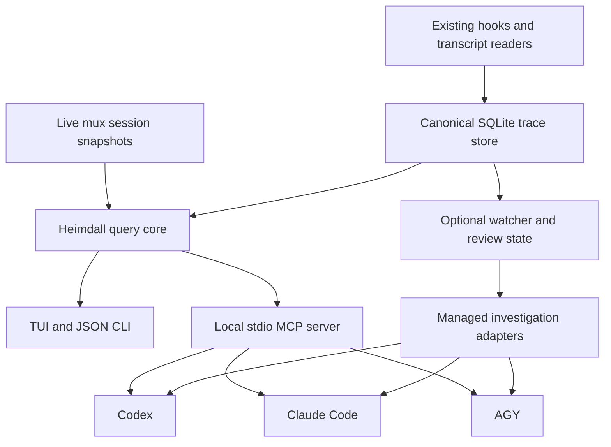

# Heimdall: reliable cross-harness agents and shared MCP analytics

Status: Proposed for review; implementation is not authorized by this document.
Date: 2026-09-14
Baseline: `8ed92d4` (dynamic agent discovery and enhanced Heimdall summaries).

## 1. Outcome and scope

Heimdall must provide the same evidence-backed monitoring and investigation capabilities when launched through Codex, Claude Code, or Antigravity (AGY). Agent definitions remain portable Markdown files owned by agent-mux. A shared Rust service computes facts and exposes them to the TUI, CLI, and a local MCP server. Harnesses interpret those facts and conduct investigations.

This spec extends the existing registry and tracing pipeline. It does not replace them. Delivery is split into three independently verifiable milestones:

1. Correct agent launching, session identity, summaries, and analytics.
2. Add the shared query service and read-only MCP integration for all three harnesses.
3. Add durable review state and opt-in event-triggered investigations.

Completion of milestone 2 constitutes the first usable release. Milestone 3 is a subsequent implementation plan under this architecture, not a prerequisite for interactive MCP investigations.

Out of scope: remote network access, a hosted service, automatic skill edits, arbitrary command execution through MCP, cancelling other sessions, autonomous deployments, and multi-agent orchestration. Existing manually initiated trace experiments remain available; Heimdall may recommend an experiment but does not execute one through this MCP API.

## 2. Existing implementation and confirmed gaps

Reuse:

- `src/agent.rs`: global/workspace Markdown discovery, workspace overrides, default Heimdall seeding, agent metadata.
- `src/app.rs`: agent picker, traced process launch, session attachment and persistence.
- `src/heimdall.rs`: recap construction, skill analysis, terminal clues, prompt generation.
- `src/tracing/`: provider adapters, hooks, correlation, canonical trace store, read-only queries, inventory, comparisons and experiments.

Correct these baseline behaviors:

- Custom Heimdall instructions currently reach Claude only.
- `default_harness` is parsed but the picker selects index zero.
- Agent launchers replace profile arguments and duplicate harness-specific construction.
- Session fallback can choose another session by reused numeric ID or working directory alone.
- History is queried only when no local session exists, and historical entries are labelled finished overnight without proof.
- Summary totals are derived from capped lists; file paths collapse to basenames; `apply_patch` and `cmd` are not adequately covered.
- Missing usage is rendered as zero, query failures disappear, and UTF-8 byte slicing can panic.
- Screen text is promoted to initial goal or assistant output without provenance.
- Generation duration and general tool errors produce unsupported TTFT and schema-error diagnoses.
- The TUI performs database analysis during rendering.

## 3. Design decision and alternatives

Chosen: a shared Rust query core with native CLI launch adapters and MCP access. This preserves existing interactive harness experiences and gives every harness the same typed evidence without requiring a new agent loop.

Alternatives considered:

| Approach | Benefit | Limitation |
| --- | --- | --- |
| Larger launch prompts plus shell SQL | Smallest implementation | Stale snapshots, repeated SQL logic, unbounded context, weak contracts |
| Shared query core plus MCP (chosen) | Reusable facts, live queries, portable agents, incremental delivery | Requires protocol and integration tests |
| Replace all launches with SDK-managed agents immediately | Full programmatic lifecycle control | Larger migration, provider-specific behavior and authentication differences, unnecessary for the first release |

Managed execution is introduced only for optional background investigations in milestone 3. It does not replace interactive PTY sessions.



## 4. Portable agent definition and launch contract

Retain `.agent-mux/agents/*.md`, the global directory, and `AGENT_MUX_AGENTS_DIR`. Workspace definitions override global definitions by agent ID. Add optional fields to the current frontmatter:

```yaml
---
id: heimdall
name: Heimdall
description: Briefings and evidence-backed session investigations
harnesses: [claude, codex, agy]
default_harness: agy
capabilities: [heimdall.read]
---
```

`capabilities` declares agent intent; it does not grant permissions by itself. Existing definitions without it retain existing launch behavior. Built-in Heimdall receives `heimdall.read`; the service still enforces workspace and content scope independently.

Use a real YAML parser with a validated typed schema. Preserve supported existing scalar/inline-list syntax. Reject malformed known fields with a visible filename and reason; warn on unknown fields to catch typos. Validate unique supported harnesses, a nonempty ID and instructions, and membership of `default_harness` in `harnesses`. If the default is omitted, choose the first supported harness. Deterministically reject duplicate IDs within one directory rather than letting filesystem iteration pick a winner. Do not overwrite existing seeded user definitions.

Introduce one launch builder returning command, argument vector, environment overrides, resolved working directory, and launch metadata. Both generic agents and Heimdall use it. Heimdall supplies a context provider, not a separate harness switch statement.

Requirements:

- All three harnesses receive the same instruction body, resolved database/workspace context, and requested initial task. Harness adapters determine the supported transport for instructions.
- A custom agent must receive an initial user task when autonomous startup is requested; a system instruction alone is not a start event.
- Honor the declared default in the picker. Reject launching an unsupported harness through non-UI entry points too.
- Preserve compatible profile flags. Resolve model, approval, resume, prompt, and MCP options through explicit precedence: requested launch override, agent setting when supported, profile, harness default. Strip conflicting prompt/resume arguments for a fresh launch and report changes in launch diagnostics. Never silently discard unknown flags.
- Use argument vectors and structured configuration, not shell interpolation. Preserve spaces, quotes, Unicode, and literal shell metacharacters.
- Record `agent_id`, instruction hash, harness version, and configuration provenance with the launch. Attach using agent ID, provider, workspace, and active launch identity rather than display name. A session awaiting approval is attachable.
- Keep existing working-directory selection semantics explicit in the resolved launch; do not accidentally use the global agent-definition directory as the workspace.
- MCP-capable launches start with a short instruction to call `heimdall_get_briefing`. If MCP is unavailable, show the reason and use the bounded JSON CLI query fallback with an explicitly timestamped snapshot.

## 5. Canonical identity and evidence

Use provider-native session keys and globally unique launch IDs. Local numeric IDs are labels only. When locating a launch from a local ID, require its mux `run_id`.

Resolution order:

1. The live session's exact tracing launch ID and its bound session key.
2. A provider-native session ID obtained from the existing provider launch/resume parser, validated against that provider.
3. An exact persisted launch binding for the current mux run.
4. No binding: return an uncorrelated live session and a correlation warning.

Working-directory matches may be returned as investigation candidates. They must never silently bind histories. Conflicting exact bindings produce an explicit correlation error. Do not join a guessed session key with an unrelated launch using an OR predicate.

Represent each live launch separately and each historical provider session once. Session-level totals and launch-level totals are separate fields; do not sum repeated session totals across multiple launches. Briefings merge open launches with historical sessions active in the selected window, deduplicating history already represented by a live launch.

Every inferred or sourced value carries evidence metadata:

```json
{
  "value": "Running cargo test",
  "source": "hook",
  "observed_at": "2026-09-14T12:00:00Z",
  "confidence": "observed",
  "evidence_ids": ["observation:obs-123"],
  "limitations": []
}
```

Allowed sources: `hook`, `transcript`, `store_rollup`, `live_process`, `terminal_screen`, `user_annotation`. Confidence is `observed`, `derived`, or `heuristic`; it is not a fabricated probability. Missing values remain null with a reason such as `not_captured`, `uncorrelated`, or `unpriced`.

Session runtime states: `working`, `waiting_for_user`, `idle`, `exited`, `disconnected`, `unknown`. Task outcome is separate: `succeeded`, `failed`, `cancelled`, `unknown`. A process exit or closed turn alone does not prove the user's objective was completed.

An open observation is an in-flight candidate, not proof of liveness. Reconcile it with exact launch/process state and source freshness. A dead process with an unclosed observation is interrupted/stale evidence. Show all concurrent active tools, with a bounded preview and a count, rather than selecting one as the entire state.

## 6. Briefing and analytics semantics

Briefings include initial user request, current activity, completed and open turns separately, tool count, changed-file evidence, recent commands, last assistant output, timing, usage and cost. Session totals and selected-window totals must be labelled separately.

- First use defaults to the preceding 24 hours, labelled with explicit bounds; do not call arbitrary history overnight. Later explicit review cursors are defined in milestone 3.
- Include sessions with activity overlapping `[since, until)`, plus currently open launches even if their last recorded activity predates the window. Report why they were included.
- Use UTC RFC3339 at API boundaries. Render local time only in the UI. Duration arithmetic must handle unfinished spans and clock skew without negative elapsed values.
- Prefer typed user messages over string filtering. Preamble cleanup is a fallback; exclude complete instruction blocks, not only their delimiters. Preserve the full source for drill-down.
- Terminal prompts become `visible_user_prompt`, not authoritative initial goals. Terminal output remains a separately labelled screen clue unless its role is established. Screen evidence is unavailable outside a live mux unless explicitly captured by its producer.
- Compute counts from the full matching set, then cap display lists. Return total counts and truncation flags. Count tool invocations independently of the number of distinct tool names.
- Normalize tool inputs through provider-aware adapters, covering `command`, `CommandLine`, `cmd`, edit/write tools, and patch records. Preserve normalized workspace-relative paths, including separate `src/a/config.rs` and `src/b/config.rs`.
- Distinguish attempted file edits, successful edit-tool results, and confirmed filesystem changes. Do not infer successful changes from a tool's name alone or claim shell-written files were captured when no evidence exists.
- Use character-safe bounded snippets. SQL or schema failures must appear as unavailable/partial data, never fabricated empty success.
- Preserve provider/model coverage and pricing provenance. Unknown cost is null; partial aggregate cost includes coverage counts and is never described as a complete bill. Do not double-count nested generation/agent usage.

Skill analysis must use “loaded with no attributed activity” rather than “wasted.” Report loaded turns, attributed calls, attributed usage, errors, sample sizes, and provider attribution limitations. Attribution is not instruction-loading cost or causal evidence.

Report completed tool duration distributions (p50/p95/max and sample count), threshold exceedances above 4 seconds, and ongoing durations separately. Exclude unfinished spans from completed-duration averages. TTFT is null unless request-start and first-token events are available; generation duration remains a separate metric. Schema-error recommendations require classified error evidence; other errors retain their actual category or `unknown`.

## 7. Shared service and live data lifecycle

Refactor Heimdall into focused modules for domain types, queries, correlation, evidence normalization, analytics, presentation, and launch context. Reuse `tracing::store::query` and existing comparisons rather than creating another ingestion pipeline.

The query core accepts a read-only trace connection, a clock, an optional immutable live snapshot, and a server-side scope. It does not spawn models, edit agent definitions, or mutate the trace database.

The TUI refreshes snapshots off the render thread, at most once per second while the Agents preview is visible. Cache the latest successful result; on failure retain it with a stale timestamp and warning. Coalesce repeated refresh requests and never queue unlimited background work.

For external stdio MCP processes, the mux publishes a bounded live snapshot under its runtime directory using atomic replacement and owner-only permissions. Each snapshot contains mux run ID, launch IDs, monotonically increasing revision, heartbeat timestamp, process states and normalized clues. It does not contain raw terminal screens. Publish every second while running; after five seconds without a heartbeat the consumer treats live state as stale, not exited. Remove the run snapshot on clean shutdown; ignore stale snapshots after a crash. Merge multiple live mux instances by exact IDs, never display name. Raw terminal content is not persisted by this feature.

Without a live publisher, MCP still serves trace history and marks runtime state unavailable. It does not start the TUI or collector. All snapshot content follows the existing metadata/full-content policy.

## 8. MCP interface, version 1

### Transport and startup

Add this command before terminal initialization:

```text
agent-mux mcp serve --stdio [--db PATH] [--workspace DIR | --all-workspaces]
```

Default session scope is exact equality with the normalized startup working directory (or explicit `--workspace`). References to descendant files are permitted only within evidence belonging to those selected sessions; path checks use components, not string prefixes. `--all-workspaces` explicitly selects all captured sessions. Server scope cannot be widened by tool arguments. Missing workspace paths retain a normalized lexical identity and are reported as missing rather than guessed from another directory.

Database precedence: explicit `--db`, `AGENT_MUX_TRACE_DB`, resolved application configuration, default trace path. Launch adapters pass the resolved path explicitly. No trace database is created or migrated by an MCP reader.

Use an established Rust MCP implementation and negotiate a supported protocol version. Initial delivery exposes tools over stdio only. Stdout contains protocol messages exclusively; diagnostics go to stderr. EOF and cancellation release pending queries and shut down cleanly. HTTP, resources, subscriptions, and MCP prompts are not required for v1.

### Tool catalog

All names below are server-local names; client-specific prefixes are not part of the API.

| Tool | Inputs | Result data |
| --- | --- | --- |
| `heimdall_get_briefing` | optional `since`, `until`, `provider`, `cursor`, `limit` | Session cards, exact scope/window totals, prioritized evidence-based findings |
| `heimdall_list_sessions` | optional `since`, `until`, `provider`, `runtime_state`, `cursor`, `limit` | Session identities, launch identities, states, correlation quality, usage coverage |
| `heimdall_get_session` | required `session_key`; optional `launch_id` | Detailed recap, source references, active tools, coverage and correlation warnings |
| `heimdall_get_timeline` | required `session_key`; optional `launch_id`, `cursor`, `limit` | Ordered turns and observations with IDs, nesting, duration and error classification |
| `heimdall_search_traces` | required `query`; optional `session_key`, `provider`, `since`, `until`, `cursor`, `limit` | Scoped FTS matches with bounded excerpts and source IDs |
| `heimdall_analyze_skills` | optional `skill`, `provider`, `since`, `until`, `cursor`, `limit` | Attribution, latency, error and usage metrics with sample sizes and limitations |
| `heimdall_compare_runs` | required `a`, `b`, each an exact launch ID | Metric deltas, tool-path differences, task/model/config comparability warnings |
| `heimdall_get_health` | empty object | Reader schema compatibility, collector freshness, content mode, provider coverage, available features |

Inputs use closed JSON object schemas. `provider` is `claude`, `codex`, or `antigravity`; `agy` is a CLI alias normalized at the boundary. IDs are nonempty strings; timestamps are RFC3339; invalid/reversed windows are rejected. Search text is limited to 4 KiB and compiled as an FTS query, never interpolated into SQL. List limit defaults to 20 and is capped at 100. Timelines sort by timestamp plus immutable ID; session lists sort by last activity plus session key.

Results provide `structuredContent` and its equivalent serialized JSON text for clients using text results. Publish input/output schemas and validate response conformance. This follows the MCP [tools contract](https://modelcontextprotocol.io/specification/2025-11-25/server/tools).

Common response envelope:

```json
{
  "schema_version": 1,
  "as_of": "2026-09-14T12:00:00Z",
  "scope": {"workspace": "/workspace/project", "all_workspaces": false},
  "window": {"since": "2026-09-13T12:00:00Z", "until": "2026-09-14T12:00:00Z"},
  "data": {},
  "coverage": {"status": "partial", "reasons": ["live_snapshot_unavailable"]},
  "warnings": [],
  "next_cursor": null,
  "truncated": false
}
```

For non-windowed tools, `window` is null. Tool-specific `data` schemas define the fields in sections 5–6; missing metrics use null rather than omission or zero. All identity-bearing results include source IDs and provider. `get_session` rejects a launch ID belonging to a different session.

Cursors are opaque, versioned, and bind filters, scope, sort position and an upper-bound timestamp. They expire after ten minutes. They provide stable ordering, not a historical transaction snapshot: ingestion may update records during pagination, so report the response's `as_of` and require refresh for changed data. Live SQLite read transactions are never held across requests. Reject altered or mismatched cursors.

### Limits and errors

- Default query deadline: 2 seconds; analytics/comparison: 5 seconds. Cancel database work using an interrupt/progress mechanism. Lock retries fit within the deadline.
- Maximum concurrent requests: 4; bounded waiting queue: 16; reject excess requests with a retryable busy error.
- Maximum serialized response: 64 KiB. Bound excerpts first, then paginate list items; return truncation and continuation metadata. Single-record details remain valid JSON and carry a truncation warning rather than silently dropping fields.
- Malformed protocol requests and unknown tools use protocol errors. Valid tool calls that fail use `isError: true` with stable codes: `INVALID_ARGUMENT`, `NOT_FOUND`, `SCOPE_DENIED`, `DB_UNAVAILABLE`, `SCHEMA_UNSUPPORTED`, `CONTENT_UNAVAILABLE`, `QUERY_TIMEOUT`, `BUSY`, `CURSOR_EXPIRED`.
- Missing content is normally a partial result; use `CONTENT_UNAVAILABLE` when the requested operation, such as full-text search in metadata-only mode, cannot be performed.

All v1 tools are read-only and carry corresponding MCP annotations. Annotations describe behavior; enforcement resides in the service. No raw SQL, shell, filesystem-write, lifecycle-control, or permission-changing tool is exposed.

The stdio process lifecycle follows the MCP [transport contract](https://modelcontextprotocol.io/specification/2025-11-25/basic/transports).

## 9. Harness connection and standalone usage

Each native launcher configures a local server named `heimdall` with an absolute executable path and separate arguments for the resolved DB and workspace. Prefer supported per-launch configuration. When a harness requires persistent configuration, provide an explicit install/update command that merges only the owned `heimdall` entry and preserves unrelated settings. Do not silently rewrite global configuration during ordinary launch.

Proposed management commands:

```text
agent-mux agent doctor heimdall --harness codex
agent-mux agent install heimdall --harness codex --scope user
agent-mux agent install heimdall --harness claude --scope workspace
agent-mux agent install heimdall --harness agy --scope user
agent-mux heimdall briefing --json [--since RFC3339] [--db PATH]
```

`doctor` checks binary availability/version, supported configuration mechanism, executable resolution, schema compatibility and MCP initialization without making model calls. Installation is idempotent, records ownership and previous values, and refuses to replace an unowned conflicting entry. Generated native entrypoints refer to one agent-mux definition source; they are not independent copies of the persona. Definitions can therefore be used from standalone harness sessions as well as the mux.

Supported release versions and exact native configuration flags must be documented from the installed binaries during implementation and pinned in fixtures. Unsupported versions receive a diagnostic and CLI fallback, never speculative flags. Native harness trust and tool permissions remain in effect; access to MCP does not grant the harness unrestricted shell access.

Interactive entrypoint behavior: load current instructions, obtain a fresh briefing, state the evidence time and coverage, summarize each relevant session, and fetch details only as needed. A reattached existing conversation must explicitly refresh before claiming current state; attachment itself must not inject prompts into a busy turn.

## 10. Durable review state and monitoring (milestone 3)

Add an optional watcher command, `agent-mux heimdall watch`, with explicit start/stop/status controls. It can continue without the TUI while running, but no OS autostart registration is performed implicitly. It does not claim to observe new events if the tracing collector is absent.

The trace database remains canonical for captured execution data. Store derived review state separately in `heimdall.db`, alongside the configured trace DB, with an independent schema and writer. MCP tools remain read-only; watcher and explicit CLI/TUI actions own these writes.

Logical records:

- Review cursors: reviewer/workspace identity, acknowledged briefing ID, reviewed-through event sequence.
- Briefings: scope/window, generation status, harness/model identity, evidence revision, text, cited IDs and creation time.
- Findings: stable deduplication key, evidence IDs, first/last occurrence, severity, open/acknowledged/resolved state.
- Jobs: trigger, evidence revision, harness session ID, pending/running/succeeded/failed/interrupted status, attempt count and budget usage.

Use a durable ingestion/change sequence assigned by the trace writer for review progress; event timestamps alone can miss late-arriving or corrected observations. Add this sequence in an additive trace-store migration in milestone 3. Changes are recorded only after successful canonical writes. Read-only queries never advance review state. Explicit `mark-reviewed` in the CLI/TUI advances to the briefing's captured sequence only after the user acknowledges it; merely generating a briefing does not hide unreviewed activity.

Detect completion/exit, approval waits, repeated classified errors and stale collection deterministically. These create local findings without model calls. Do not interpret inactivity alone as failure. Thresholds are configurable and shown with their evidence.

Automatic model investigation is disabled by default. Enabling it requires a chosen harness, workspace scope, maximum jobs/hour, per-job timeout, and a supported turn/token/cost budget. Reject a budget mode the adapter cannot enforce. Initial defaults after enablement: at most one concurrent job, three jobs/hour, 120 seconds/job, and three turns/job. A cost ceiling is an additional option only where usage reporting supports enforcement; disclose reporting lag.

Debounce related events for five seconds, deduplicate on session/finding type/evidence revision, and exclude Heimdall's own agent-tagged activity from triggering itself. Persist a job before execution. On restart, mark formerly running jobs interrupted and require a new explicit retry or fresh trigger; do not blindly replay a paid model call.

Managed adapters must support start, events, completion, cancellation, and resumable conversation identity where available. Preferred candidates are Codex App Server, Claude's structured CLI/Agent SDK, and AGY's structured streaming CLI; these are adapter choices subject to version-specific compatibility tests, not a shared wire protocol assumption. No adapter may drive interactive sessions by simulated keystrokes.

The harness receives bounded evidence, investigates through the same read-only tools, and returns a structured finding with citations. Persist results independently of harness conversation history. Changing the chosen harness retains review state and findings. Authentication or unsupported runtime capability errors disable that adapter's automatic jobs while preserving manual briefing access.

## 11. Privacy and failure behavior

Preserve existing capture modes and redaction. Metadata-only captures must not be supplemented by terminal text that circumvents the policy. Captured prompts, tool outputs and agent responses are untrusted evidence, never service instructions. Bound their lengths and label their origin.

The server checks workspace authorization for direct IDs, search, timeline, comparisons, pagination and evidence lookups. Database connections are opened read-only; prohibit extensions, attachment of other databases and mutation through all exposed paths. Missing/incompatible databases fail visibly without migration or creation.

An MCP failure must not crash the TUI or stop unrelated agent work. Show stale cached state with its timestamp, provide the read-only CLI fallback, and retain diagnostics without logging raw sensitive trace contents. Normal configuration and live snapshots use owner-only access where the platform supports it.

## 12. Module boundaries and delivery

Suggested source organization (names may follow existing conventions):

| Area | Responsibility |
| --- | --- |
| `agent.rs` / `agent/` | Validated definition, discovery, deterministic overrides, launch identity |
| `harness.rs` / adapter modules | Native launch/configuration capability handling |
| `heimdall/model.rs` | Versioned domain types and evidence semantics |
| `heimdall/query.rs` | Scoped reads, session selection, exact counts |
| `heimdall/correlation.rs` | Exact binding and candidate-only fallbacks |
| `heimdall/evidence.rs` | Tool normalization, terminal heuristics and safe snippets |
| `heimdall/analytics.rs` | Measured metrics and qualified findings |
| `heimdall/service.rs` | Limits, snapshots, caching and cancellation |
| `heimdall/mcp.rs` | Protocol transport and schema mapping |
| `heimdall/cli.rs` | Briefing, doctor and connection management |
| `heimdall/watch.rs`, `heimdall/state.rs` | Milestone 3 jobs, review cursors and findings |
| `app.rs`, `ui.rs`, `main.rs` | Thin integration, background refresh and command routing |

Milestone 1 changes behavior without requiring MCP. Milestone 2 adds protocol support and per-harness installation/launch integration. Milestone 3 adds derived persistence and optional scheduling. No milestone rewrites unrelated tracing/export functionality.

## 13. Acceptance and verification

Milestone 1:

- The same custom Heimdall instruction appears in launch fixtures for all three harnesses; declared defaults and compatible profile options are preserved.
- Two simultaneous sessions in one directory, different providers in one directory, and numeric session-ID reuse across mux runs cannot steal each other's recaps.
- Historical and live sessions appear together with correct deduplication and explicit time bounds.
- More than five tool types, eight files and five commands retain exact totals and paginated previews. Same-basename paths remain distinct; patch and `cmd` evidence is handled.
- Unicode excerpts never panic. Unknown usage stays unknown; partial pricing, stale state and database errors are visible.
- Screen heuristics never silently become authoritative user goals, assistant messages or completed-task claims.
- A failed tool without schema-error evidence never produces a schema-mismatch diagnosis; generation duration alone never becomes TTFT.

Milestone 2:

- An MCP protocol client initializes the server, lists eight tools, invokes each, validates schemas and shuts down over stdio without non-protocol stdout.
- Test metadata-only/full captures, missing DB, unsupported schema, concurrent writer, cancellation, timeout, pagination, oversized data and query limits.
- Attempt cross-workspace ID lookup, cursor reuse with different filters and search-based scope escape; all remain scoped.
- Compare equivalent CLI, TUI and MCP queries at a fixed clock/snapshot: facts, nulls and totals agree.
- With a running mux, each harness retrieves a briefing, observes a subsequent tool completion on refresh, and drills down to the same evidence IDs. Without mux live state, history remains usable and liveness is explicitly unavailable.
- Per-harness live smoke tests record CLI versions and configuration paths. Fixture tests alone do not establish live compatibility; unavailable harnesses must be reported as unverified.
- On a documented benchmark with 100,000 observations and 100 relevant sessions, cached render performs no DB I/O; standard briefing queries target p95 under one second. Record hardware, index state and cold/warm results. Deadline behavior must work even if the target is missed.

Milestone 3:

- Repeated events produce one finding/job per deduplication key. Heimdall cannot trigger an investigation loop about itself.
- Crash/restart preserves acknowledged/unreviewed state; late-arriving updates are not lost; interrupted model jobs are not automatically replayed.
- Enforced concurrency, rate, time and turn limits stop scheduling or execution as specified. Unsupported budget enforcement prevents enabling that mode.
- Switching harness preserves findings and review cursors. MCP reads never acknowledge work or change trace/review data.

Use focused unit and integration tests for these contracts, then the repository's required test/format checks. Documentation-only spec review does not require paid model runs. Implementation plans must map every acceptance item to a test or explicitly recorded manual verification.

## 14. Review decisions

This proposal selects local stdio MCP, read-only tools, exact session binding, a shared Rust query core, and optional monitoring in a separate milestone. It intentionally postpones remote transport and operational write tools. Review should focus on those boundaries and the staged delivery; implementation details such as a particular Rust MCP dependency are selected against compatibility requirements during planning.
