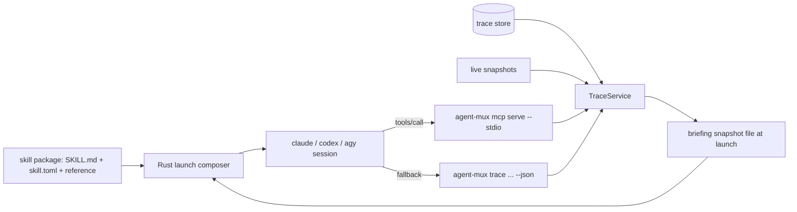

# Built-in agents: Rust facts, Markdown agents, MCP on demand

Status: Implemented on 2026-09-15 (see the plan of the same date). Open questions resolved: hydration also runs for sessions restored at startup and for respawns; Antigravity uses `--workspace-from-env`; the SQL reference moved to `docs/trace-sql-examples.md`. One deviation from section 6: the server answers `initialize` with the client's protocol version when it is one of `2025-11-25`, `2025-06-18`, `2025-03-26`, `2024-11-05`, and with `2025-11-25` otherwise, instead of rejecting unknown versions.
Date: 2026-09-15
Baseline: `25752d2` (Agents sidebar restored, read-only Skills view).
Probed binaries: Claude Code 2.1.273, Codex CLI 0.154.0, Antigravity `agy` 1.2.3 (flags quoted below come from `--help` on this machine, not documentation).

## 1. Outcome and scope

A built-in agent such as Heimdall is defined by one skill package and nothing else. Rust computes every fact the agent reasons about; the package holds the agent's identity, playbooks and report shape; a local MCP server lets the agent ask follow-up questions during a session. Three rules decide where a thing lives:

- **If it is a fact, it is Rust.** Correlation, pricing, percentiles, scope, evidence and response bounds are computed by `TraceService` and never re-implemented in Markdown.
- **If it is judgment or presentation, it is the skill.** Thresholds, what to report first, how to phrase a finding.
- **If the agent needs to ask mid-session, it is MCP.** The same `TraceService`, over stdio, registered per launch where the harness allows it.

Outcome for the user: an agent launched from the Agents sidebar starts with a fresh, typed briefing already in hand (no shell commands on turn one), can query the store through eight read-only tools while it works, and falls back to the `agent-mux trace … --json` CLI when MCP is unavailable, so nothing regresses on a harness that does not support per-launch MCP.

In scope: prompt hydration at launch, an `agent-mux mcp serve` stdio server over the existing `TraceService`, per-launch or installed MCP registration for the three harnesses, `doctor` and status reporting, and thinning Heimdall's reference SQL to examples.

Out of scope: write tools of any kind, HTTP transport, MCP resources or prompts, a second ingestion path, agent-specific Rust modules, orchestration of other sessions. These remain excluded as in the 2026-09-14 service design.

## 2. Existing implementation and confirmed gaps

Reuse:

- `src/tracing/analysis/service.rs`: `TraceService`, `Request::from_tool_call(name, arguments)` with the eight `agent_mux_*` names, closed argument schemas (`deny_unknown_fields`, `JsonSchema`), the envelope, deadlines (2 s / 5 s), admission (4 running, 16 waiting), 64 KiB response bound, per-instance cursors, scope by exact workspace.
- `src/tracing/analysis/live.rs`: live snapshots the server reads for runtime state.
- `src/skill/launch.rs`: `build_skill_launch_with_db` composes the opening prompt and the `AGENT_MUX_*` environment.
- `src/tracing/hooks/register.rs` and `install.rs`: the per-launch inline registration pattern (Claude `--settings`, Codex `-c notify=[…]`) and the opt-in persistent installer pattern (`trace hooks install codex|agy`) with ownership markers and idempotent writes.
- `src/tracing/cli.rs` `doctor`: the check-line format and provider readiness probes.

Gaps this spec closes:

- `TraceService` has MCP-shaped tool names and schemas but no transport; nothing outside `trace briefing` calls it.
- The agent's first turn is spent collecting: Heimdall's `SKILL.md` tells the model to run `trace doctor`, then `trace briefing --json`, then widen with `trace ls`. That is three shell round-trips before any analysis, and it requires the harness to allow shell commands.
- `skills/heimdall/reference/sql.md` and `agents.md` carry SQL that must track the schema by hand. Schema v9 dropped `is_error`; the analysis layer itself drifted (fixed in `f5e5166`), and reference SQL has no test.
- Nothing tells Rust what data an agent wants at launch. `capabilities = ["trace.read"]` exists in `skill.toml` but only switches the sidebar preview.

## 3. Design decision and alternatives

Chosen: keep skills as the only package type, add prompt hydration driven by declared capabilities, and expose `TraceService` over a minimal stdio MCP server registered per launch (Claude, Codex) or installed once (Antigravity), with the CLI as the documented fallback.

| Approach | Benefit | Limitation |
| --- | --- | --- |
| Pure skill (today) | Portable, no rebuild, no new process | Every fact costs a shell round-trip; SQL in Markdown drifts; needs shell permission; nothing typed |
| Pure MCP, no skill | Typed, bounded, live | No persona, no trigger phrases, no playbook; still needs a Markdown definition to be an agent |
| Rust-native agent (`src/heimdall.rs`, removed 2026-09-14) | Exact, fast | Every agent is code and a rebuild; Rust cannot reason or present |
| Hybrid (chosen) | Facts stay correct in one place, agents stay Markdown, live queries are typed, CLI fallback keeps every harness working | One stdio server binary path and three registration adapters to maintain |

MCP transport: implement the protocol subset directly (`initialize`, `notifications/initialized`, `ping`, `tools/list`, `tools/call`) with `serde_json` over line-delimited JSON-RPC on stdio. The subset is five methods; `TraceService::execute` is synchronous; the existing Tokio runtime is enough. A Rust MCP SDK is not adopted for v1 to avoid pinning a fast-moving dependency for five methods; the protocol version negotiated is `2025-11-25` and the server rejects others with a clear error. This is a reversible choice: the server module is the only place that knows the wire format.



## 4. Package contract additions

`skill.toml` gains one optional table. Absent keys keep today's behaviour.

```toml
capabilities = ["trace.read"]

[agent]
hydrate = ["briefing"]          # snapshots written before launch; v1 knows "briefing"
mcp = "auto"                    # "auto" (register when the harness allows), "off"
```

- `capabilities` containing `trace.read` remains the switch for the sidebar briefing preview and is now also the minimum for `hydrate` and `mcp`: a package without `trace.read` gets neither, and `agent-mux skill list` reports the inconsistency.
- `hydrate` names snapshots. `briefing` is `Request::Briefing` with the launch's workspace scope and the default 24-hour window. Unknown names are a package validation error.
- `mcp = "auto"` registers the server for the launch when the harness supports per-launch registration, or uses an installed entry when present; `"off"` never registers. Default is `"auto"` when `trace.read` is declared, otherwise `"off"`.

Heimdall's `skill.toml` declares both. Its `SKILL.md` playbooks are rewritten to start from the hydrated snapshot and to prefer MCP tools, with the CLI commands kept as the fallback path.

## 5. Prompt hydration

At launch (`App::launch_skill`), after the package is installed and before the process is spawned:

1. For each `hydrate` entry, Rust builds a `TraceService` with `ServiceConfig::new(db_path, Scope::workspace(cwd))` and executes the request. Failures do not block the launch: the snapshot file records the typed error envelope instead, and the status bar shows one notice.
2. The envelope is written to `<runtime dir>/briefings/<launch_id>.json` (runtime dir: `AGENT_MUX_RUNTIME_DIR` or `~/.agent-mux/snapshots`, the same tree as live snapshots) through a temp file and rename with owner-only permissions. Size is bounded by the service's 64 KiB envelope bound.
3. The child environment gains `AGENT_MUX_BRIEFING=<path>` and `AGENT_MUX_BRIEFING_AS_OF=<RFC3339>`.
4. The opening prompt becomes `<invocation> <startup_prompt>` followed by one sentence: `A briefing snapshot as of <as_of> is at $AGENT_MUX_BRIEFING (JSON, schema_version 1); read it before running any command, then use the agent-mux tools or CLI for anything newer.` The snapshot is a file, not inline text, so the prompt stays short and Codex `exec` prompts and Claude positional prompts are unaffected.
5. Snapshot files are removed when the session exits and swept by age (older than 24 hours) at TUI startup; a crash leaves at most one stale file per launch.

The snapshot is produced in a blocking thread with the service's normal deadlines, so a slow store adds at most about 2 seconds to a launch. Metadata-only content policy applies: the briefing contains the same snippets `trace briefing --json` would.

## 6. The MCP server

`agent-mux mcp serve --stdio [--db PATH] [--workspace DIR | --all-workspaces]` is dispatched in `main` before terminal setup, like `trace`. It builds one `TraceService` and serves until stdin EOF.

- Stdout carries protocol messages only; every diagnostic goes to stderr. No ANSI, no logging on stdout.
- Methods: `initialize` (returns server info `agent-mux`, the binary version, `capabilities.tools`), `notifications/initialized` (ignored), `ping`, `tools/list`, `tools/call`. Unknown methods return JSON-RPC `-32601`; malformed JSON `-32700`; a tool call with unknown name or invalid arguments returns a tool result with `isError: true` carrying the typed `ServiceError` code and message, not a protocol error.
- `tools/list` publishes the eight tools with `inputSchema` generated from the argument structs (`schemars`), a one-line description each, and annotations `readOnlyHint: true`, `destructiveHint: false`, `openWorldHint: false`.
- `tools/call` decodes through `Request::from_tool_call` and returns the envelope both as `structuredContent` and as its JSON text in `content[0].text`, so text-only clients see the same data.
- Database precedence: `--db`, then `AGENT_MUX_TRACE_DB`, then the configured `db_path`, then the default. The adapters always pass `--db` explicitly. The server never creates or migrates a store; a missing store makes every tool return `DB_UNAVAILABLE` while `agent_mux_get_health` still answers.
- Scope: adapters pass `--workspace <launch cwd>`; `--all-workspaces` is never generated for a launch. A session can widen only through the CLI.
- Concurrency: requests are answered in order on one worker; the service's admission limits still apply because the same process may be shared by a harness that fans out tool calls.

The eight tools and their request mapping are unchanged from the 2026-09-14 design, section 8: `agent_mux_get_briefing`, `agent_mux_list_sessions`, `agent_mux_get_session`, `agent_mux_get_timeline`, `agent_mux_search_traces`, `agent_mux_analyze_skills`, `agent_mux_compare_runs`, `agent_mux_get_health`.

## 7. Registration per harness

The server command is always the running binary with explicit arguments:

```text
/abs/path/agent-mux mcp serve --stdio --db <resolved db> --workspace <launch cwd>
```

| Harness | Mechanism | Verified flag / file |
| --- | --- | --- |
| Claude Code | Per launch, no user file touched. `--mcp-config '<json>'` with `{"mcpServers":{"agent-mux":{"type":"stdio","command":…,"args":[…]}}}`. The user's own servers stay active because `--strict-mcp-config` is **not** passed. | `claude --help` 2.1.273: `--mcp-config <configs...>  Load MCP servers from JSON files or strings`. |
| Codex | Per launch through configuration overrides: `-c 'mcp_servers.agent-mux.command="…"' -c 'mcp_servers.agent-mux.args=[…]'`. Codex trusts non-managed MCP servers per its own rules; the launch notice says so the first time. | `codex --help` 0.154.0: `-c, --config <key=value>` with dotted paths parsed as TOML; `codex mcp add` documents the `mcp_servers.<name>` shape. The exact key names are pinned by a fixture at implementation and re-probed if `codex` changes. |
| Antigravity | Installed once: `agent-mux mcp install agy` runs `agy mcp add agent-mux <binary> -- mcp serve --stdio` so the entry lands in `~/.gemini/config/mcp_config.json`; `agent-mux mcp uninstall agy` runs `agy mcp remove agent-mux`. Because the entry is global, it cannot carry the launch's `--db`/`--workspace`; the installed entry passes `--workspace-from-env` and the launch exports `AGENT_MUX_WORKSPACE` and `AGENT_MUX_TRACE_DB`. | `agy mcp add` 1.2.3: `agy mcp add [flags] <name> <commandOrUrl> [args...]`, `Use -- before the command to pass a command or args that begin with '-'`. No per-launch flag exists. |

`agent-mux mcp status [claude|codex|agy]` reports: per-launch registration availability (binary path absolute, harness detected), the installed agy entry and whether it points at this binary, and whether `AGENT_MUX_TRACE_DB` routing would differ from the configured `db_path`. `trace doctor` gains an `mcp` section that runs `initialize` and `agent_mux_get_health` against the binary itself.

When registration is impossible (Antigravity without the installed entry, a wrapper command that does not detect as a harness, `mcp = "off"`), the launch proceeds without MCP, the status bar says why once, and the hydrated snapshot plus the CLI remain available. The environment gains `AGENT_MUX_MCP=registered|installed|unavailable` so the skill can branch.

## 8. Heimdall changes

- `skill.toml`: `[agent] hydrate = ["briefing"]`, `mcp = "auto"`.
- `SKILL.md`: playbook A starts by reading `$AGENT_MUX_BRIEFING`, then calls `agent_mux_get_briefing` only for a fresher window; playbooks B, C and D prefer `agent_mux_analyze_skills`, `agent_mux_get_timeline`, `agent_mux_search_traces` and `agent_mux_compare_runs`, each with its CLI equivalent listed for `AGENT_MUX_MCP=unavailable`.
- `reference/sql.md`: retitled "Ad-hoc queries" and marked as examples for `trace sql`; every ready query gains a note naming the tool or CLI command that answers the same question without SQL. `reference/agents.md` and `skills.md` keep thresholds and report shapes; their SQL blocks stay but the playbooks no longer depend on them.
- Read-only rule unchanged: Heimdall never runs `import`, `export`, `prune`, `recost`, `score`, `hooks`, `mcp install` or a write through `sql`.

## 9. Configuration

```toml
[tracing]
# … existing keys …

[agents]
hydrate = true        # write briefing snapshots at launch (default true)
mcp = "auto"          # "auto" | "off": global gate over every package's [agent].mcp
```

Per-profile: none. A profile that launches a harness by hand (not through the Agents sidebar) gets no hydration and no per-launch MCP; the installed agy entry and the CLI still work there.

## 10. Verification

- `tests/mcp_protocol.rs`: spawn the built binary with piped stdio against a temporary store: `initialize` negotiation and version rejection, `tools/list` shape and annotations, each tool call round trip equal to `TraceService::execute` on the same store, unknown tool and invalid arguments as `isError` results, malformed JSON as `-32700`, EOF shutdown, no bytes on stdout other than JSON lines.
- `tests/mcp_register.rs`: the Claude JSON and Codex `-c` strings from `LaunchPlan`, absolute binary requirement, `--workspace` equals the launch cwd, `--db` equals the runtime store; agy install/uninstall call the real `agy` only under `AGENT_MUX_LIVE=1`, otherwise a fake `agy` script records its argv.
- `tests/skill_hydrate.rs`: a `trace.read` package launched through the Agents picker with a fake `claude` writes `<runtime>/briefings/<launch>.json` with `schema_version: 1`, sets `AGENT_MUX_BRIEFING`, appends the sentence to the prompt, and records a typed error envelope when the store is missing; the file is removed on exit; a package without `trace.read` writes nothing.
- `tests/skill_package.rs`: `[agent]` parsing, unknown `hydrate` names rejected, `mcp` default by capability, `skill list` reporting the inconsistency.
- `trace doctor` and `mcp status` output covered by a golden test on a temporary home.
- `scripts/verify-trace-matrix.sh` gains an optional step that launches Heimdall on each harness and asserts one `tools/call` reached the store (hook or MCP server stderr log under `AGENT_MUX_MCP_DEBUG`).

## 11. Documentation

When implemented, update: README sections 2 (runtime units table gains the MCP process), 3 (`[agents]`), 4.1 (Agents sidebar launch path), 6 (a sibling "MCP registration" subsection next to hooks), 9 (`mcp serve|install|uninstall|status`), 10.1 (the service is now exposed), 11 (package contract and Heimdall), 14 (tests, troubleshooting: "the agent says MCP is unavailable"); `docs/skills.md` sections 1 and 4; `AGENTS.md`; `skills/heimdall/*`.

## 12. Open questions for review

1. Should hydration also run for a **resumed** agent session (the restored-sessions path at startup), or only for fresh launches? The spec assumes fresh launches only; a resumed conversation already has context.
2. Antigravity's installed entry cannot be scoped per launch. Is `--workspace-from-env` acceptable, or should agy launches simply run all-workspaces with a warning?
3. Keep `reference/sql.md` at all once the tools exist, or move it to `docs/` as developer material? The spec keeps it as examples.
