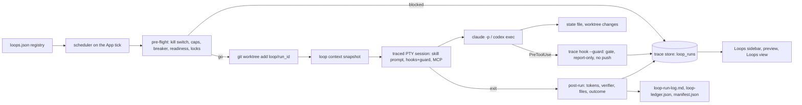

# Loop Engineering: scheduled, gated loops from the sidebar

Status: Implemented on 2026-09-15 (see the plan of the same date). Deviations from revision 2: the Loops view's inbox shows `git diff --stat` inline (open point 1 resolved yes); loop skills are not installable at user level (open point 2 resolved no); `max_concurrent` defaults to 1 globally (open point 3); `loop inbox` and `loop decide` were added to the CLI; the run id is the RFC 3339 start time with a `-N` suffix on a same-second collision; the Codex hook payload tool names matched by the guard are listed in `guard.rs`; `kill_switch_active` ignores a backticked mention of the literal so the scaffolded `LOOP.md` does not pause its own loops. After the first real run (2026-09-16): L2+ worktrees get the untracked `loop-*` skills and the verifier copied in (`worktree::seed_loop_files`, ignored by the change detectors), the state file, run log and ledger stay in the workspace with absolute paths in the context and `$AGENT_MUX_LOOP_STATE`, pre-flight blocks a run whose triage skill is not installed, `Unknown command: /<skill>` in the session output is a failed run, the briefing hint is not appended to loop prompts, and every loop run bypasses the harness's approval prompts (print mode has nobody to answer them; the guard is the control) instead of only when the profile says so.
Date: 2026-09-15
Baseline: `070020f` (master after PR #21: Agents sidebar, briefing hydration, MCP server).
Design reference: the loop-engineering method (Cobus Greyling, repository at `../loop-engineering`, commit `0948ac1`), read on 2026-09-15 for its patterns, readiness ladder, file conventions and safety rules. **Nothing from that repository or its npm packages is copied, vendored, installed or executed by agent-mux.** Every skill, template and algorithm named below is authored and tested in this repository; the file formats agent-mux writes follow the method's conventions so a repository that already uses them keeps working.
Probed binaries: Claude Code 2.1.273, Codex CLI 0.154.0, Antigravity `agy` 1.2.3 (flags quoted below come from `--help` on this machine).

Decisions taken in review:

- No third-party files or packages: skills, verifier, templates and the readiness, gate, breaker and cost logic are agent-mux's own.
- Harnesses in v1: Claude Code and Codex. Antigravity is deferred; section 16 says why and how it gets in later.
- The loop registry is per user (`~/.agent-mux/loops.json`).
- The remaining choices are made in this revision and listed in section 15 with their reasons.

## 1. Outcome and scope

A **loop** is a small, scheduled, bounded agent run against one workspace: it reads a state file, triages, at most proposes one fix, updates the state file and stops. The loop-engineering method defines the patterns, the readiness ladder (L0 Draft, L1 Report, L2 Assisted, L3 Unattended), the files a loop-ready repository carries, and the safety rules (worktrees, gates, budgets, circuit breaker, kill switch). It leaves the scheduler to the harness (`/loop` in Claude Code, Codex Automations, GitHub Actions) and the observability to hand-appended Markdown.

agent-mux becomes the local **scheduler, observer and enforcer** of those loops, and the sidebar gets a fourth section, **Loops**, between Agents and History. From it the user adds a loop to a workspace (pattern, harness, cadence, level), watches it run as an ordinary traced session, reads what it found and what it spent, decides on the fixes it proposed, and pauses everything with one key. The three rules of the agent-facts design apply unchanged: facts are Rust (budget spent, breaker state, readiness score, tokens of a run, files a run touched), judgment is the skill (what to triage, what to escalate, how to phrase a state entry), and anything the loop needs mid-run is MCP or the CLI.

Outcome for the user, in one sentence: open agent-mux in the morning and the Loops section says what every loop did overnight, what it cost, what waits for a decision, and whether anything tripped.

In scope:

- The **Loops sidebar section**, its main-pane preview, an **add-loop dialog**, and a full-screen **Loops view** (runs, human inbox, readiness, budget, files).
- A **loop registry** owned by agent-mux, a `[loops]` configuration section, and an in-process **scheduler** that launches due loops as traced PTY sessions.
- An agent-mux **pattern library**: seven patterns with their skills, a verifier agent and file templates, scaffolded into a workspace at project level for Claude Code and Codex.
- **Pre-flight** in Rust (kill switch, daily caps, circuit breaker, readiness, concurrency), a **loop context snapshot** given to the run, and **post-run** accounting from the trace store (run log line, ledger attempt, `loop_runs` row, worktree bookkeeping).
- **Enforcement** through the existing `PreToolUse` guard: `gate.yaml` denylist and file cap, report-only runs, no push or merge.
- A **Loop Ready score** computed in Rust with the method's weights, and a cost estimate for the dialog.
- `agent-mux loop …` CLI for the same operations headless, one new read-only MCP tool, `doctor` lines.

Out of scope for v1: Antigravity (section 16), generating GitHub Actions workflows or Codex Automations, auto-merge of any kind, multi-agent consensus or patch review (worktrees cover isolation), a "thin loop" pattern with no state file (it is a GitHub-Actions-only shape), harness-foundry, memory tiers and fleet files, goal tooling, budget negotiation, fault-injection drills, a standalone daemon (the scheduler runs inside the TUI; cron users call `agent-mux loop run`).

## 2. What the method defines and what agent-mux adopts

| Loop-engineering concept | The method's form | agent-mux mechanism |
| --- | --- | --- |
| Pattern (goal, cadence, level, skills, state file, gates, cost) | a registry of eight patterns | Bundled `loops/registry.toml` with seven patterns, authored here (section 7.1) |
| Scheduling | Claude `/loop <interval>`, Codex Automations, cron | `App` scheduler on the existing 250 ms tick; `agent-mux loop run` for cron |
| Worktrees | a `.loop-worktrees/<run>` layout with a `manifest.json` | Rust `git worktree add -b loop/<run_id> .loop-worktrees/<run_id>`; the manifest keeps the same keys |
| Skills | `.claude/skills/<name>/SKILL.md`, `.codex/skills/<name>/SKILL.md` per project | Same paths, written by the scaffolder from agent-mux's own skills (section 7.2) |
| Sub-agents (maker/checker) | `.claude/agents/loop-verifier.md`, `.codex/agents/verifier.toml` | Same paths from agent-mux's own verifier; the run's traces show whether it actually ran |
| State | `STATE.md` or `<pattern>-state.md` with a `Last run:` line and three sections | Written by the skill; read by the readiness audit and the preview |
| Run log | `loop-run-log.md`, one JSON line per run after a marker, pruned after 30 days | Appended by Rust after every completed run, with tokens from the store instead of the model's estimate |
| Budget | a `loop-budget.md` table and a skill that stops at 80 %/100 % | Caps in the registry entry, spend computed from `loop_runs`; the 80 %/100 % rules are enforced before launch, not by a skill |
| Circuit breaker | `loop-ledger.json` and a skill that stops on repeated failure | Rust check with the method's defaults (3 same-error, 5 consecutive failures, 10 iterations); no skill |
| Gate | `gate.yaml` (`denylist`, `maxFiles`, `autoMergeAllowlist`) | Same file, enforced synchronously in `PreToolUse` and re-checked after the run |
| Constraints | `loop-constraints.md` and a skill that loads it | agent-mux's `loop-rules` skill reads the file; the path is also in the loop context |
| Kill switch | a `loop-pause-all` label or command; resume after a human clears the state file | `K` in the Loops section (global pause), plus the literal `loop-pause-all` in the state file or `LOOP.md` blocks that workspace's loops |
| Readiness | a 0–100 audit with L0–L3 gates and a 14-day activity window | Rust implementation with the same weights and gates (section 10), plus store evidence |
| Human gates | state-file "High Priority" entries, PR review | The Loops view **Inbox** tab: runs that proposed a fix or escalated, with accept/reject |
| Observability | `status`, `metrics`, `doctor` commands | The sidebar preview and Loops view over `loop_runs` joined to `trace_stats` |

Two deliberate departures, both applications of "facts are Rust": the method's budget and breaker skills have no equivalent here because agent-mux computes those numbers and hands them to the run in `$AGENT_MUX_LOOP_CONTEXT`, so the model never estimates its own spend or decides whether it tripped its own breaker.

## 3. Existing implementation and confirmed gaps

Reuse:

- `src/tracing/experiments.rs`: the headless runner (`RunSpec`, `profile_for` composing `claude -p …` / `codex exec …`, PTY pump until exit or `--timeout`, `kill_all`, `shutdown` before judging, `final_message`, `record_run`). Loop runs use the same launch path, with a visible session instead of a private `App`.
- `src/tracing/hooks/guard.rs` and `register.rs`: the synchronous `PreToolUse` guard (Claude per launch through `--settings`, Codex through the installed `hooks.json`) that looks the launch up in the store and answers `hookSpecificOutput.permissionDecision = "deny"` with a reason. The loop gate is an extension of this lookup.
- `src/skill/launch.rs`: `hydrate` (snapshot file, `AGENT_MUX_*` environment, `HYDRATION_HINT`), `build_skill_launch_full` (per-harness skill invocation syntax), `sweep_briefings`.
- `src/mcp/*`: per-launch registration (Claude `--mcp-config`, Codex `-c mcp_servers.agent-mux.*`).
- `src/tracing/mod.rs`: `LaunchPlan.skill` → `launches.metadata.skill_id/skill_harness`; the same slot carries the loop keys.
- `src/app.rs`: `SidebarSection`, `dispatch` → `Action` → `apply`, `refresh_briefing_if_needed` (gated on the section), `prepare_agent_launch`, `restore_saved_sessions`; `src/app/skills_view.rs` as the model for a tabbed read-only view; `src/persistence.rs` for a JSON file next to `sessions.json`.
- `src/ui.rs`: `sidebar_areas`, `draw_agents_sidebar`, `draw_trace_briefing_preview`, `draw_skills_view`, the 100-column hint lines and the 84-column help overlay.
- Store: `launches`, `trace_stats`, `agent_stats` (subagent invocations per launch), `open_aux`, the writer thread, schema migrations (`SCHEMA_VERSION = 11`).

Confirmed gaps:

- Nothing in agent-mux runs on a schedule. The 250 ms tick only refreshes badges and briefings.
- Nothing launches into a worktree; the experiments runner documents that variants editing the same repository need separate checkouts.
- The guard knows two limits (`max_cost_usd`, `max_turns`) and nothing about paths, file counts or commands.
- The store has no notion of a run that belongs to a loop, so there is no "what did loops do last night" query.
- Skills install at user level only (`~/.claude/skills`, `~/.codex/skills`); loop skills are per project.
- Name collision: `trace loops`, `loops.rs` and the `loop_stats` view already mean per-turn agentic-loop diagnostics. This feature uses `loop` singular in the CLI, `loop_runs` in the store and `src/loops/` for the module; the README glossary states the difference.

## 4. Design decision and alternatives

Chosen: agent-mux owns scheduling, pre-flight, enforcement and accounting in Rust; the method's files stay the contract on disk; the harness runs an agent-mux skill as a normal traced session that the user can attach to.

| Approach | Benefit | Limitation |
| --- | --- | --- |
| Sidebar as a viewer only (parse `LOOP.md`, the state file and the run log; leave scheduling to `/loop`, Automations, Actions) | Small; no new launch path | Every harness schedules differently; nothing enforces gates or budgets; the run log stays whatever the model wrote; no worktrees |
| Shell out to third-party CLIs for audit, cost, gate and worktrees | Zero porting | Excluded by review: agent-mux installs and runs nothing from other vendors; it would also need Node at runtime and could not see the store's facts (tokens, verifier ran, files touched) |
| **Rust scheduler and enforcer, Markdown contract, skills authored here (chosen)** | Works through the existing launch path; guard, worktrees and accounting come from facts; files stay conventional so other tooling can read them | The readiness, gate, breaker and cost logic (about 600 lines) is agent-mux's to maintain; the skills are agent-mux's to write and test |
| New process model (daemon with its own store) | Runs without the TUI | Duplicates the runtime, the store and the hooks; cron plus `agent-mux loop run` covers the headless case |



## 5. UX

### 5.1 Sidebar

`SidebarSection` gains `Loops` between `Agents` and `History`; `Tab` cycles Active → Agents → Loops → History; `j/k` cross section boundaries in that order as they do today. `ui::sidebar_areas(total_height, agent_count, loop_count)` returns four rects with `[Percentage(25), Length(agent_rows), Length(loop_rows), Min(4)]`, `loop_rows` sized like `agent_rows` (rows + 2, capped at a quarter of the height, at least 3). With no loops the section shows one placeholder row.

```
┌ Active ──────────────────┐
│ 1 ● Claude Code  proj    │
│ 2 ○ daily-triage ↻ proj  │   ← a loop run is an ordinary session, badged ↻
├ Agents ──────────────────┤
│ ⚡ Heimdall               │
├ Loops ───────────────────┤
│ ○ daily-triage    L1 6h  │   ← idle, next run in 6 h
│ ● ci-sweeper      L2 now │   ← running (Enter → details, attach from there)
│ ‖ pr-babysitter   L1 —   │   ← paused
│ ! dep-sweeper     L2 in2 │   ← 2 items in the human inbox
├ History ─────────────────┤
│ …                        │
└──────────────────────────┘
```

Glyphs: `○` scheduled, `●` running, `‖` paused (by the user, the kill switch, or auto-pause after a failure), `!` waiting on a human (inbox not empty), `✗` last run failed or blocked. The right column is the countdown to the next run, `now` while running, `—` when paused, or `inN` when N inbox items wait.

Keys in the Loops section (control mode, sidebar visible):

| Key | Action |
| --- | --- |
| `Enter` | Open the Loops view on the selected loop (if it is running, the Runs tab is focused on the live run; `Enter` there attaches) |
| `r` | Run now (skips the wait, not the pre-flight) |
| `p` | Pause / resume the selected loop |
| `a` | Add a loop (dialog) |
| `e` | Edit the selected loop (same dialog, prefilled) |
| `x` | Remove the selected loop (confirmation; files in the workspace are never deleted) |
| `K` | Kill switch: pause every loop, again to resume; shown in the status bar while active |
| `E` | Open the Loops view (global key, any section; `l`/`L` stay session logs) |

Status-bar hint for the section, under 100 columns: `[b] sidebar  [Enter] details  [r] run now  [p] pause  [a] add  [e] edit  [x] remove  [K] kill  [?] help`.

### 5.2 Main-pane preview (Loops section selected, control mode)

`draw_main` gains a third branch before the History one. The card is computed by `App::loop_card(loop_id)` from the registry, the store and the workspace files, refreshed on the same cadence as the briefing preview (every 500 ms while the section is selected, cheap queries only).

```
┌ daily-triage · ~/workspace/agent-mux · Claude Code (claude) ─────────────────────┐
│ Status     scheduled · next run in 6 h 12 m · every 1d · level L1 (report-only)  │
│ Last run   2026-09-15T08:00:39Z · report-only · 9 found · 1 action · 2 escalated │
│            52k tokens · $0.31 · 10 s · verifier: not required at L1               │
│ Budget     today 1/2 runs · 52k/100k tokens (52 %) · normal                       │
│ Breaker    n/a (report-only pattern) │ Kill switch off                             │
│ Readiness  ████████████████████░░░░  82/100  L2 · activity fresh (run log, store) │
│            ! LOOP.md has no budget section                                        │
│ Inbox      0 waiting                                                              │
│ Files      state ✓  LOOP.md ✓  budget ✓  run-log ✓  constraints ✓  gate ✓        │
│ Recent     08:00 report-only 52k │ 09-14 08:00 no-op 4k │ 09-13 08:00 escalated … │
│ [Enter] details  [r] run now  [p] pause  [E] loops view                            │
└───────────────────────────────────────────────────────────────────────────────────┘
```

### 5.3 Loops view (`E`, `Mode::LoopsView(Box<LoopsViewState>)`)

Same skeleton as the Skills view: a left list of loops grouped by workspace, a right pane with tabs, `Tab`/`←`/`→` to move, `j/k` in the focused pane, `Esc` closes, `?` help. Tabs:

- **Runs**: the loop's `loop_runs` newest first: time, outcome, effective level, items / actions / escalations, tokens, cost, duration, verifier (ran, verdict), files touched, block reason. `Enter` attaches when the run is live, else opens the run's launch in the Trace Browser (`T` does the same, as in the Skills view).
- **Inbox**: runs with outcome `fix-proposed` or `escalated` and no decision, across all loops: pattern, workspace, branch `loop/<run_id>`, worktree path, files, verifier verdict, the run's final message (first 2,000 characters, as `experiment_runs.detail` stores it). `a` marks **applied** (the branch is kept, the worktree removed), `x` marks **rejected** (worktree removed, branch deleted). agent-mux never merges: applying is `git merge loop/<run_id>` by the human, and the inbox says so.
- **Readiness**: the audit for the workspace (score bar, level, assessment, findings with `✓ ! ✗`, recommendations), plus a line per level gate (`L2 needs ≥ 58 and a triage skill: ok`, `L3 needs ≥ 78, verifier, state, cost observability, fresh activity: missing cost observability`).
- **Budget**: today's runs and tokens against caps for every loop, the pattern's cost estimate at the configured cadence and level (section 10.3), and the last seven days of tokens per loop.
- **Files**: the seven contract files of the workspace with present / missing / stale (`Last run` older than 14 days), the installed skills per harness with their paths, and the `.loop-worktrees` manifest.

### 5.4 Add-loop dialog (`a`, `Mode::NewLoop(LoopDialogState)`)

Fields, in order, with the new-session dialog's widgets:

1. **Workspace**: a picker over the directories of active sessions, session history and profile `default_dir`s, or a typed path. Must exist; a warning if it is not a git repository (worktrees need one; L1 still runs).
2. **Pattern**: the seven patterns with goal, week-one level, risk and cost tier from the registry.
3. **Harness / profile**: profiles whose command is `claude` or `codex`. Antigravity profiles are not listed; the dialog footer says `Antigravity: not supported for loops yet (see docs/loops.md)`.
4. **Every**: the interval, prefilled with the pattern's default; grammar `<n>(m|h|d)`, minimum 5 m.
5. **Level**: `L1` preselected. `L2` and `L3` are selectable only when the readiness audit of the workspace allows them (section 10.2) and the dialog says why not otherwise. The week-one rule is a recommendation shown inline (`week one: report only`), not a lock.
6. **Caps**: runs/day and tokens/day prefilled from the pattern (section 7.1), USD per run prefilled from the profile's `max_cost_usd` guard if set.
7. **Scaffold**: `yes` writes every missing contract file and skill for the pattern (never overwriting); `no` registers the loop against whatever the workspace already has.

`Enter` scaffolds (if asked), runs the audit, saves the registry entry with `next_run_at = now + interval`, and shows the resulting readiness line as a notice.

### 5.5 Help overlay

A `Loops` group is added to `draw_help` (fits the 84-column width, one row per key above) and the control-mode `Tab` row becomes `cycle active / agents / loops / history sections`. The help-height assertion in the UI tests moves with it.

## 6. Loop registry and configuration

### 6.1 Registry file

`~/.agent-mux/loops.json` (override `AGENT_MUX_LOOPS_FILE`, as `AGENT_MUX_SESSIONS_FILE` does), written atomically like `sessions.json`:

```json
{
  "version": 1,
  "pause_all": false,
  "loops": [
    {
      "id": "6f1c…",
      "workspace": "/Users/me/workspace/agent-mux",
      "pattern": "daily-triage",
      "profile": "Claude Code",
      "harness": "claude",
      "interval_s": 86400,
      "level": "L1",
      "enabled": true,
      "max_runs_per_day": 2,
      "max_tokens_per_day": 100000,
      "max_cost_usd_per_run": 2.0,
      "created_at": "2026-09-15T09:12:00Z",
      "next_run_at": "2026-09-16T08:00:00Z",
      "last_run_id": "2026-09-15T08:00:39Z",
      "paused_reason": null
    }
  ]
}
```

The registry is agent-mux's; the workspace's `LOOP.md` stays a human document. The scaffolder adds a row to its Active Loops table when it creates the file and never edits it afterwards.

### 6.2 `profiles.toml [loops]`

```toml
[loops]
enabled = true            # the in-TUI scheduler; false = manual `r` and `agent-mux loop run` only
max_concurrent = 1        # loop runs at a time, across workspaces
catch_up = "once"         # "once": a run missed while agent-mux was closed fires at startup; "skip": wait for the next slot
run_timeout_s = 900       # a run past this is killed and recorded as failed
worktrees_dir = ".loop-worktrees"   # relative to the workspace
```

`config::LoopsConfig` / `LoopsSettings` / `resolve_loops` follow `AgentsConfig` exactly; `App.loops: LoopsSettings`.

## 7. Pattern library, authored in this repository

### 7.1 Patterns

`loops/registry.toml`, embedded with `include_str!`. Cadence defaults, week-one levels, state file names and caps follow the method's published values; the goals and gates are written here.

| id | default interval | week-one level | state file | agent-mux skills installed | runs/day | tokens/day | breaker |
| --- | --- | --- | --- | --- | --- | --- | --- |
| daily-triage | 1d | L1 | `STATE.md` | loop-triage, loop-fix, loop-rules | 2 | 100k | no |
| pr-babysitter | 15m | L1 | `pr-babysitter-state.md` | loop-pr-triage, loop-fix, loop-rules | 288 | 2M | yes |
| ci-sweeper | 15m | L2 | `ci-sweeper-state.md` | loop-ci-triage, loop-fix, loop-rules (+ verifier) | 96 | 1M | yes |
| post-merge-cleanup | 1d | L1 | `post-merge-state.md` | loop-post-merge, loop-fix, loop-rules | 1 | 200k | yes |
| dependency-sweeper | 1d | L2 | `dependency-sweeper-state.md` | loop-dependency-triage, loop-fix, loop-rules (+ verifier) | 4 | 500k | yes |
| changelog-drafter | 1d | L1 | `changelog-drafter-state.md` | loop-changelog, loop-rules (+ verifier) | 1 | 100k | no |
| issue-triage | 1d | L1 | `issue-triage-state.md` | loop-issue-triage, loop-rules (+ verifier) | 12 | 80k | no |

"breaker" marks the four patterns that can propose code fixes repeatedly; agent-mux seeds `loop-ledger.json` as `{ "goal", "pattern", "level", "attempts": [] }` for them and maintains it. The registry also carries `cost` (`tokens_noop`, `tokens_report`, `tokens_action`, `stable_fraction`, `early_exit_required`) for the estimate, `human_gates` for the preview and the skills, and `priority` for the scheduler (section 8.1).

### 7.2 Skills, verifier and templates

```
loops/
  registry.toml
  skills/
    loop-triage/SKILL.md              daily triage of the repository: tests, lint, TODOs, stale branches
    loop-pr-triage/SKILL.md           open PRs: conflicts, red CI, no CI, changes requested, drafts idle
    loop-ci-triage/SKILL.md           failing CI: flaky vs real, infra vs code, one fix candidate
    loop-post-merge/SKILL.md          after merges: dead flags, leftover TODOs, docs drift, merged branches
    loop-dependency-triage/SKILL.md   outdated or vulnerable dependencies; major bumps are human gates
    loop-changelog/SKILL.md           merged changes since the last tag into a draft release-notes section
    loop-issue-triage/SKILL.md        open issues: unanswered, duplicates, stale, labels
    loop-fix/SKILL.md                 one minimal fix in the worktree, gate-aware, tests must run
    loop-rules/SKILL.md               loads loop-constraints.md and the loop context; binding rules
  agents/loop-verifier.md             the verifier body; Codex gets it wrapped in TOML
  templates/                          STATE.md, LOOP.md, loop-budget.md, loop-run-log.md,
                                      loop-constraints.md, gate.yaml, loop-ledger.json, AGENTS.md
```

Every skill is written for agent-mux's runtime and shares one shape:

1. **Frontmatter**: `name`, `description` with trigger phrases, `allowed-tools` (Claude) listing read tools plus Write/Edit and Bash, so the readiness `toolScope` signal is true for what the skill actually needs.
2. **Setup**: read `$AGENT_MUX_LOOP_CONTEXT` first. It carries the state file name, the effective level and why, budget mode, breaker state, gate globs, the previous run and the inbox count. If the file is missing, stop and report `no loop context`.
3. **Procedure**: the pattern's steps, bounded (for example `loop-pr-triage`: `gh pr list` for at most 50 open PRs, bucket each into High Priority / Watch List / Noise by conflicts, red or missing CI, changes requested and idle time).
4. **Report-only vs assisted**: at effective L1 the skill only edits the state file. At L2 it may call `loop-fix` for **one** item that passed the gate; `loop-fix` runs the tests, never disables one, never touches a denylisted path, and stops after three attempts.
5. **Verifier**: at L2+ the skill hands the change to the `loop-verifier` sub-agent and records its verdict (`## Verdict: APPROVE | REJECT | ESCALATE_HUMAN`; anything else counts as REJECT).
6. **State file**: rewrite `Last run: <RFC3339>`, the three sections (`## High Priority (loop is acting or waiting on human)`, `## Watch List`, `## Recent Noise (ignored this run)`), and the footer `Run log:` line.
7. **Rules** (repeated in every skill, enforced by the guard regardless): never push, merge or rebase onto a shared branch; one fix per run; never write to a denylisted path; escalate instead of guessing.
8. **Finish** with the `loop-result` block (section 8.5).

`loop-verifier` reads the diff of the worktree, runs the project's tests and lint, checks the gate and the file cap, and answers with the verdict line and at most five bullet reasons. Its default is REJECT.

Templates use the section headings and markers the method's tooling keys off (`Last run:`, the three state sections, `<!-- Loop appends below this line -->`, `## Daily limits`, `## Kill switch`, `version: 1` + `denylist:` in `gate.yaml`), with agent-mux's own wording. `gate.yaml` ships the twelve conservative denylist globs (`**/.env`, `**/.env.*`, `**/secrets/**`, `**/auth/**`, `**/payments/**`, `**/migrations/**`, `**/*.pem`, `**/*.key`, `**/id_rsa*`, `**/credentials*`, `**/.github/workflows/**`, `**/infra/**`), `maxFiles: 10`, and an `autoMergeAllowlist` of `docs/**` and `**/*.md` that v1 records but never acts on.

These files live outside `skills/` on purpose: the Agents sidebar lists every package under `skills/`, and loop skills are not agents. They are validated by the same parser (`skill::parse_skill`) and linted by `trace skills lint` in tests.

### 7.3 Scaffolding (`loops::scaffold`)

For a workspace, pattern and harness, never overwriting (`skipped <path> (already exists)` in the report):

1. Skills to `<workspace>/.claude/skills/<name>/SKILL.md` or `<workspace>/.codex/skills/<name>/SKILL.md`.
2. The verifier for patterns that name it: `.claude/agents/loop-verifier.md`, or `.codex/agents/verifier.toml` with `name = "loop-verifier"`, `description`, and the body under `[system_prompt] content = """…"""`.
3. The state file from the template with the project name filled in.
4. `LOOP.md` with one Active Loops row, the Human Gates from the registry, a Budget section (needed for the readiness `loopMdBudget` signal) and a Worktrees line.
5. `loop-budget.md` (`## Daily limits` table with the loop's caps, `## On budget exceed`, `## Kill switch` naming `loop-pause-all`), `loop-run-log.md` with the marker, `loop-constraints.md`, `gate.yaml`, and `loop-ledger.json` for breaker patterns.
6. `AGENTS.md` from the template when absent.

`skill::install` gains `install_project(def, harness, workspace)` next to `install`, and `InstallStatus` learns to report a project-level path; the Skills view lists project installs under the harness with a `project` tag.

## 8. The run lifecycle

States: Scheduled → Preflight → Blocked | Running → (Verifying, observed from traces) → AwaitingHuman | Logged.

### 8.1 Scheduler

`App::on_tick` calls `loops::schedule::due(&registry, now)` at most once per second. A loop is due when `enabled`, not paused, `pause_all` is off and `next_run_at <= now`. Due loops are ordered by pattern priority (ci-sweeper, pr-babysitter, dependency-sweeper, post-merge-cleanup, changelog-drafter, daily-triage, issue-triage: the ones that unblock others first), then by `next_run_at`. A loop starts only when fewer than `max_concurrent` loop runs are live and no other loop run of the same workspace is live. Loops that cannot start stay due and are retried on the next tick; `next_run_at` is advanced only when a run starts or is blocked.

Missed slots: at startup, a loop whose `next_run_at` is in the past runs once (`catch_up = "once"`) or is rescheduled to the next slot (`"skip"`); never more than once per loop.

`r` sets `next_run_at = now`. `agent-mux loop run <id>` performs one scheduler pass for that loop in a headless `App` (the experiments runner's shape) and exits with the run's outcome code (0 report-only or no-op, 3 fix-proposed, 4 escalated, 1 blocked, 2 failed).

### 8.2 Pre-flight (Rust, before any process starts)

Evaluated in this order; the first failure records a `loop_runs` row with `outcome = 'blocked'` and `detail.reason`, advances `next_run_at`, and shows a notice. Blocked runs are not appended to `loop-run-log.md`: a fresh run-log line counts as loop activity in the readiness audit, and a run that never started is not activity.

1. **Kill switch**: `pause_all`, or the literal `loop-pause-all` in the workspace's state file or `LOOP.md`.
2. **Workspace**: exists; for L2+ it is a git repository with a resolvable base branch (`HEAD`'s branch; `main` when detached).
3. **Runs per day**: `COUNT(loop_runs)` since UTC midnight for this loop, excluding blocked, `< max_runs_per_day`.
4. **Tokens per day**: `SUM(tokens)` since UTC midnight. At or above 100 % the run is blocked. At or above 80 % the run's **effective level is L1** (report-only), the reason is in the context, and the guard enforces it (section 9.2).
5. **Circuit breaker** (breaker patterns): `loops::breaker::check(ledger)` over the trailing run of consecutive failures: `stagnation` (3 attempts with the same normalized error), `frustration` (3 similar errors at 0.85 trigram Jaccard similarity after normalizing timestamps, hex, paths and digits), `no-progress` (5 consecutive failures), `max-iterations` (10). A trip blocks the run and **auto-pauses the loop** with `paused_reason`; the human resumes with `p`, which also resets the trailing failure window (a new attempt `{ "action": "human-reset", "outcome": "noop" }`).
6. **Readiness**: the audit (section 10) runs on the workspace. The effective level is the minimum of the configured level and what the audit allows; a stale state file (`Last run` older than 14 days) caps the run at L1 with reason `state stale`. The score is stored on the run.
7. **Harness**: the profile's command resolves; for L2+ the guard is available for that harness (section 9.5), else the run is capped at L1.
8. **Concurrency** (section 8.1).

### 8.3 Isolation

L1 runs execute in the workspace itself: the only writes the guard permits are the state file and the run log, so isolation buys nothing and the model sees the real repository.

L2 and L3 runs execute in a worktree agent-mux creates before launch:

```
git -C <workspace> worktree add -b loop/<run_id> <workspace>/.loop-worktrees/<run_id> <base>
```

The run's `cwd` is the worktree; `launches.cwd` therefore points at it, and `launches.metadata.loop_workspace` keeps the grouping key. `.loop-worktrees/manifest.json` is `{ "version": 1, "worktrees": [{ "id", "path", "branch", "baseBranch", "pattern", "createdAt", "status" }] }` with statuses `active | rejected | escalated | merged | stale`, written atomically (temp file and rename) under a `.manifest.mutex` lock file. The harness worktree flags probed on this machine (`claude -w/--worktree [name]`, `codex exec --worktree`) are not used: neither documents where the worktree lands, and agent-mux needs the path for cleanup and the inbox.

After the run: no change in the worktree (`git status --porcelain` empty) → `git worktree remove` and `git branch -D`, manifest entry dropped. Changes → the branch and worktree stay, manifest `status = "active"`, the run is in the inbox; the inbox decision moves it to `merged` (branch kept) or `rejected` (both removed). Stale entries (older than 24 h and not in the inbox) are removed in the sweep that already runs `sweep_briefings`.

### 8.4 Launch composition

The run is `App::spawn_traced_with_env` with the loop's profile, the run cwd, the loop environment and `skill_id = <pattern's triage skill>`, through `prepare_agent_launch`, so hydration and MCP registration apply exactly as for an agent launch. Per harness, from `--help` on 2026-09-15:

| Harness | One-shot command (as `experiments::profile_for` composes it) | Isolation and permissions | Guard |
| --- | --- | --- | --- |
| Claude Code 2.1.273 | `claude [profile args] -p "<prompt>" --session-id <uuid> --settings <inline hooks JSON> --mcp-config <inline JSON>`; `--dangerously-skip-permissions` when the profile bypasses approvals; `--max-budget-usd <cap>` when a USD cap is set (a `--print`-only flag) | worktree cwd | `PreToolUse` per launch (existing `--guard` path) |
| Codex CLI 0.154.0 | `codex exec [profile args] -C <cwd> -s workspace-write --json -o <runtime>/loops/<run_id>.last.md -c notify=[…] -c mcp_servers.agent-mux.… "<prompt>"`; `--yolo` when the profile bypasses (as the experiments runner already emits) | worktree cwd, `-s workspace-write` | `PreToolUse` through the installed `hooks.json` (`agent-mux trace hooks install codex`); without it the run is L1 by section 8.2 step 7 |

Headless loop runs need approvals answered or bypassed: a `-p` session cannot answer a permission prompt. The dialog warns when the chosen profile does not bypass approvals, and the run is still attempted; a run that exits with no tool use and a permission refusal in its output is recorded `failed` with reason `permissions`.

The prompt is the triage skill's per-harness invocation (`/loop-triage` on Claude, `$loop-triage` on Codex, the syntax `build_skill_launch_full` already knows) followed by one line: `Run the <pattern> loop for this workspace. Facts for this run are in $AGENT_MUX_LOOP_CONTEXT (read it first). Update <state file>. Finish with a loop-result block.` plus `HYDRATION_HINT`.

Environment added to the launch: `AGENT_MUX_LOOP_ID`, `AGENT_MUX_LOOP_RUN_ID`, `AGENT_MUX_LOOP_PATTERN`, `AGENT_MUX_LOOP_LEVEL` (effective), `AGENT_MUX_LOOP_CONTEXT` (path), `AGENT_MUX_LOOP_WORKSPACE`. `LaunchPlan` carries `loop: Option<LoopLaunch>` and writes `launches.metadata.loop_id`, `loop_run_id`, `loop_pattern`, `loop_level`, `loop_workspace`, `loop_policy` (the guard's input, section 9.1).

### 8.5 The loop context snapshot

`<runtime>/loops/<run_id>.json`, written by `loops::context::write` before launch, swept with the briefings after 24 h:

```json
{
  "schema_version": 1,
  "as_of": "2026-09-16T08:00:00Z",
  "run": { "id": "2026-09-16T08:00:00Z", "pattern": "daily-triage", "level_configured": "L2",
           "level_effective": "L1", "level_reason": "tokens today at 84% of cap" },
  "workspace": "/Users/me/workspace/agent-mux",
  "worktree": null,
  "files": { "state": "STATE.md", "run_log": "loop-run-log.md", "constraints": "loop-constraints.md",
             "ledger": null, "gate": "gate.yaml" },
  "budget": { "runs_today": 1, "max_runs_per_day": 2, "tokens_today": 84000, "max_tokens_per_day": 100000,
              "percent": 84, "mode": "report-only" },
  "breaker": { "applicable": false },
  "gate": { "denylist": ["**/.env", "…"], "max_files": 10, "auto_merge_allowlist": ["docs/**", "**/*.md"] },
  "readiness": { "score": 82, "level": "L2", "findings": ["! LOOP.md has no budget section"] },
  "previous_run": { "id": "2026-09-15T08:00:39Z", "outcome": "report-only", "items_found": 9 },
  "recent_runs": [ "…up to five…" ],
  "inbox_waiting": 0,
  "kill_switch": false
}
```

The skills read it on turn one (the same "read before you run anything" rule as Heimdall's briefing). The run ends with a fenced block the post-run parser looks for in the final message:

````
```loop-result
{"outcome":"report-only","items_found":9,"actions_taken":1,"escalations":2,"summary":"…one line…"}
```
````

### 8.6 Post-run accounting

On the session's exit (or the timeout kill), after `shutdown` flushes the store as the experiments runner does:

1. **Facts from the store**: tokens and cost from `trace_stats` for the launch; duration from the launch row; the final message (`experiments::final_message`); the verifier: any subagent observation on the launch whose agent name contains `verifier` (the rows `agent_stats` aggregates), with the verdict read from its output (`## Verdict: APPROVE | REJECT | ESCALATE_HUMAN`); files touched: distinct `file_path` inputs of Write/Edit/MultiEdit/NotebookEdit observations, plus `git status --porcelain` of the worktree.
2. **Outcome**: the `loop-result` block when present; otherwise derived: changes in the worktree → `fix-proposed`; a verifier verdict `ESCALATE_HUMAN` or the state file's High Priority section grew → `escalated`; state file changed only → `report-only`; nothing changed → `no-op`; exit code non-zero or timeout → `failed`. A `fix-proposed` at L2+ **without a verifier observation** keeps its outcome but is flagged `verifier_missing`, shown in the Runs tab and the inbox.
3. **Gate re-check**: files touched against `gate.yaml`; a hit (possible on Codex without hooks, or through a shell command) sets `detail.gate_violation`, forces `escalated`, and auto-pauses the loop.
4. **Store**: the `loop_runs` row (section 11).
5. **Run log**: one line appended after the marker, then the 30-day prune by the `run_id` date (lines whose `run_id` is not an ISO date are kept, so hand-written entries survive):
   `{"run_id":"2026-09-16T08:00:00Z","pattern":"daily-triage","duration_s":41,"items_found":9,"actions_taken":1,"escalations":2,"tokens_estimate":48210,"outcome":"report-only","readiness_score":82,"level":"L1","harness":"claude","launch_id":"…","source":"agent-mux"}`
   `tokens_estimate` is the store's number. If the skill already appended a line for this `run_id`, agent-mux replaces it.
6. **Ledger** (breaker patterns): an attempt `{ "iteration", "timestamp", "action": "<pattern>", "outcome": success|failure|noop, "error", "tokensUsed" }` where `fix-proposed` → `success`, `failed`/gate violation → `failure` with the error text (last stderr or the verifier's REJECT reason), everything else → `noop`; then a prune to the last five attempts, traces cut to eight lines, consecutive similar failures collapsed with a `repeated` count.
7. **Registry**: `last_run_id`, `next_run_at = started_at + interval`; auto-pause on `failed` or gate violation with `paused_reason`.
8. **Session**: the run's session stays in Active as Exited (attachable scrollback) until the loop's next run replaces it or the user removes it.

## 9. Enforcement

### 9.1 The loop policy on the launch row

`launches.metadata.loop_policy` is what the hook process reads (the guard already looks the launch up by id in the store):

```json
{ "report_only": true, "state_file": "STATE.md", "run_log": "loop-run-log.md",
  "gate": { "denylist": ["**/.env", "…"], "max_files": 10 }, "worktree": "/…/.loop-worktrees/<run_id>" }
```

### 9.2 Guard rules (`trace hook claude --guard`, `trace hook codex …` through the installed PreToolUse)

Evaluated for every `PreToolUse` on a loop launch, first hit wins, reason text is what the model sees:

| Order | Tool | Rule | Reason |
| --- | --- | --- | --- |
| 1 | Bash | command matches `git push`, `git merge`, `gh pr merge`, `git rebase`, or a checkout of the base branch | `agent-mux loop: pushing and merging are human gates` (every level) |
| 2 | Write, Edit, MultiEdit, NotebookEdit | `file_path` matches a `denylist` glob | `agent-mux loop: <path> is on the gate.yaml denylist` |
| 3 | same | `report_only` and the path is not the state file, the run log or under `.loop-context/` | `agent-mux loop: this run is report-only (<level_reason>)` |
| 4 | same | distinct files edited on this launch so far (from observations) `>= max_files` and this path is new | `agent-mux loop: <n> files changed, gate.yaml maxFiles is <max>` |
| 5 | any | the launch's existing `max_cost_usd` / `max_turns` guard | unchanged |

Globs use the `globset` crate configured so `**/secrets/**` matches `.secrets/prod.json` and `**/.env` matches at any depth (dotfiles included). Bash paths are not inspected (a shell can rename anything); the post-run re-check (section 8.6 step 3) and the worktree are the backstop.

Fail-closed for loops: the budget guard permits on any error (no store, lock past its 2 s budget). For a loop launch the guard **denies write tools** when it cannot read the policy (`agent-mux loop guard unavailable, retry`), and permits read-only tools. A denied write costs the model one retry; an unguarded write on a scheduled run is the incident the whole design exists to prevent.

### 9.3 Budget

Per run: the profile's `max_cost_usd` / `max_turns` guard, and on Claude `--max-budget-usd`. Per day: section 8.2 steps 3 and 4. Spend is `loop_runs.tokens`, which is `trace_stats` for the launch, so a run's tokens are known within the writer's 250 ms flush of its last turn.

### 9.4 Kill switch and pauses

`pause_all` in the registry (key `K`, `agent-mux loop pause --all`), the literal `loop-pause-all` in the workspace files, per-loop `enabled = false` (`p`), and `paused_reason` set by auto-pause. A paused loop never pre-flights. Resuming clears `paused_reason` and, for breaker trips, appends the human-reset attempt. The status bar shows `LOOPS PAUSED` while `pause_all` is on.

### 9.5 Per-harness ceiling

| Harness | Path guard | Worktree | Ceiling |
| --- | --- | --- | --- |
| Claude Code | per launch | yes | L3 |
| Codex with installed hooks | installed `hooks.json` | yes | L3 |
| Codex without installed hooks | none (sandbox `workspace-write` only) | yes | L1, and the state file update is enforced by the skill and the post-run check, not a guard |
| Antigravity | not supported in v1 | — | section 16 |

The dialog and the preview print the ceiling; pre-flight step 7 applies it.

## 10. Readiness score (`loops::readiness`)

### 10.1 The score

Implemented in Rust from the method's published weight table, so a repository scores the same here as under the method's own audit. Additive, every signal boolean, clamped to 100:

| Signal | Points | Detected by |
| --- | --- | --- |
| base | 7 | always |
| state file | 18 | any of `STATE.md`, `pr-babysitter-state.md`, `ci-sweeper-state.md`, `post-merge-state.md`, `dependency-sweeper-state.md`, `changelog-drafter-state.md`, `issue-triage-state.md` |
| triage skill | 14 | a triage skill in `.claude/skills`, `.codex/skills`, `.grok/skills` or `skills/` (agent-mux's `loop-*-triage`/`loop-triage` names and the method's names both count) |
| `LOOP.md` | 9 | present |
| `AGENTS.md` or `CLAUDE.md` | 9 | present |
| loop skills | 14 for two or more, 7 for one | count of known loop skill names |
| verifier | 14 | a loop-verifier skill, `.claude/agents/*verifier*`, `.codex/agents/*verifier*` |
| safety | 4 + 4 | `LOOP.md` mentions gate, denylist, auto-merge or safety; `docs/safety.md` or `SECURITY.md` present |
| GitHub | 6 + 4 | `.github/` present; any workflow file |
| MCP | 3 | `.mcp.json`, `mcp.json`, `.mcp/config.json`, or `LOOP.md` mentions MCP |
| worktree evidence | 3 | `LOOP.md` mentions worktrees |
| pattern registry | 2 | a `patterns/registry.*` file |
| cost observability | 3 + 3 + 2 + 2 | `loop-budget.md`; `loop-run-log.md`; a budget section in `LOOP.md`; a budget skill |
| governance | 3 + 3 + 3 + 3 | tool scope (`allowed-tools:` in a skill, or least-privilege wording); stall detection (a ledger file or circuit-breaker wording); escalation wording; `gate.yaml` |
| constraints | 4 + 2 | `loop-constraints.md`; a constraints skill (`loop-rules` counts) |
| loop activity | 14 | a state file `Last run:` within 14 days (not more than 60 s in the future), a run-log line whose `run_id` is within 14 days, a `git log --since=14.days` touching state or run-log files (1.5 s timeout), **or a completed `loop_runs` row for the workspace within 14 days** |
| harness, memory, fleet | 4+1+2+1+1, 4+2, 4+2 | the method's foundry, memory-tier and fleet files; recognized for parity, never scaffolded by agent-mux |

Level gates: L1 needs ≥ 38 and a state file; L2 needs ≥ 58 and a triage skill; L3 needs ≥ 78, a verifier, a state file, cost observability (`loop-budget.md`, `loop-run-log.md`, a budget section in `LOOP.md`) and fresh activity. Two warnings name the reason when the score qualifies for L3 but a gate does not. Assessment text is agent-mux's own. A stale state file (`Last run` older than 14 days) produces its own warning: files on disk are not loop activity.

The `store:` evidence kind is agent-mux's addition: a loop agent-mux ran is activity even when the model forgot the `Last run:` line.

### 10.2 Where it is used

The dialog enables levels from the gates; pre-flight caps the effective level; the Readiness tab and `agent-mux loop audit` print the score, findings and recommendations; the JSON form (`target, score, level, assessment, signals, findings, recommendations`) is the CLI's `--json` output.

### 10.3 Cost estimate (`loops::cost`)

For the dialog and the Budget tab: runs/day = `floor(86400 / interval)`; a realistic mix of no-op, report and action runs per level (`L1: 0.9/0.1/0` when the pattern requires early exit, else `0.6/0.4/0`; `L2: 0.85/0.1/0.05`, else `0.5/0.3/0.2`; `L3: 0.4/0.35/0.25`); the verifier doubles the action cost for patterns that name it; prompt caching modelled as `variable + stable × 0.1` using the pattern's `stable_fraction`. Warnings: early exit required; worst case over the cap; realistic over the cap; 96 or more runs/day; multiplier above 2. Tokens only, never dollars.

## 11. Data model and queries

Schema v12:

```sql
CREATE TABLE loop_runs (
  id               TEXT PRIMARY KEY,                 -- RFC3339 UTC; the run_id in loop-run-log.md
  loop_id          TEXT NOT NULL,
  workspace        TEXT NOT NULL,
  pattern          TEXT NOT NULL,
  harness          TEXT NOT NULL,
  level            TEXT NOT NULL CHECK (level IN ('L1','L2','L3')),
  effective_level  TEXT NOT NULL CHECK (effective_level IN ('L1','L2','L3')),
  launch_id        TEXT REFERENCES launches (id),
  scheduled_ns     INTEGER NOT NULL,
  started_ns       INTEGER,
  ended_ns         INTEGER,
  outcome          TEXT NOT NULL CHECK (outcome IN ('report-only','fix-proposed','escalated','no-op','blocked','failed')),
  items_found      INTEGER,
  actions_taken    INTEGER,
  escalations      INTEGER,
  tokens           INTEGER,
  cost_usd         REAL,
  readiness_score  INTEGER,
  worktree         TEXT,
  branch           TEXT,
  decision         TEXT CHECK (decision IN ('applied','rejected')),
  decided_ns       INTEGER,
  detail           TEXT NOT NULL DEFAULT '{}'        -- reason, level_reason, verifier{ran,verdict}, files[], gate_violation, final_message, exit_code, timed_out
);
CREATE INDEX loop_runs_by_loop ON loop_runs (loop_id, scheduled_ns DESC);
CREATE INDEX loop_runs_inbox ON loop_runs (outcome) WHERE decision IS NULL;
CREATE VIEW loop_run_stats AS
SELECT loop_id, pattern, workspace,
       COUNT(*)                                            AS runs,
       SUM(outcome = 'fix-proposed')                       AS fixes_proposed,
       SUM(outcome = 'escalated')                          AS escalated,
       SUM(outcome = 'blocked')                            AS blocked,
       SUM(outcome = 'failed')                             AS failed,
       COALESCE(SUM(tokens), 0)                            AS tokens,
       COALESCE(SUM(cost_usd), 0)                          AS cost_usd,
       MAX(started_ns)                                     AS last_started_ns
FROM loop_runs GROUP BY loop_id;
```

Queries (`store/query.rs`):

```sql
-- today's spend for pre-flight and the preview (?2 = UTC midnight in ns)
SELECT COUNT(*), COALESCE(SUM(tokens), 0), COALESCE(SUM(cost_usd), 0)
FROM loop_runs WHERE loop_id = ?1 AND started_ns >= ?2 AND outcome != 'blocked';
-- recent runs for the preview, the context snapshot and the Runs tab
SELECT id, outcome, effective_level, items_found, actions_taken, escalations, tokens, cost_usd,
       started_ns, ended_ns, readiness_score, detail
FROM loop_runs WHERE loop_id = ?1 ORDER BY scheduled_ns DESC LIMIT ?2;
-- the human inbox
SELECT id, loop_id, pattern, workspace, branch, worktree, detail
FROM loop_runs WHERE outcome IN ('fix-proposed','escalated') AND decision IS NULL ORDER BY started_ns DESC;
-- store evidence for the readiness audit (?2 = now - 14 days)
SELECT COUNT(*) FROM loop_runs WHERE workspace = ?1 AND ended_ns >= ?2 AND outcome NOT IN ('blocked','failed');
-- tokens and cost of one run, once the writer flushed
SELECT SUM(total_tokens), SUM(total_cost_usd) FROM trace_stats WHERE launch_id = ?1;
-- did a verifier run: the rows agent_stats aggregates, restricted to the launch
```

Retention: `loop_runs` rows follow the store's `retention_days` like launches; the run log's own 30-day prune is independent.

## 12. CLI and MCP additions

`agent-mux loop …` (module `loops::cli`, dispatched from `main.rs` next to `mcp` and `run`):

| Command | Does |
| --- | --- |
| `loop ls [--json]` | The registry with next run, last outcome, today's spend, readiness |
| `loop add --workspace <dir> --pattern <id> [--profile <name>] [--harness claude\|codex] [--every 1d] [--level L1] [--max-runs-per-day n] [--max-tokens-per-day n] [--no-scaffold]` | Section 5.4 headless |
| `loop rm <id>` | Remove the entry (files untouched) |
| `loop run <id\|pattern@workspace> [--now]` | One scheduler pass for that loop in a headless `App`; exit codes as in section 8.1 |
| `loop pause [<id>\|--all]`, `loop resume [<id>\|--all]` | Section 9.4 |
| `loop init <dir> --pattern <id> --harness claude\|codex` | Scaffold only |
| `loop audit <dir> [--json]` | Section 10 |
| `loop status [<id>] [--json]` | The preview card as text |
| `loop cost --pattern <id> [--every 15m] [--level L2] [--with-caching] [--json]` | Section 10.3 |

`trace doctor` gains a `loops:` section: registry path and entry count, scheduler on/off, pause state, per-harness ceiling, `git` version for worktrees, and one line per loop with a stale state file or a missing contract file.

MCP: one new read-only tool, `agent_mux_get_loop_context` (`run_id` optional; defaults to the run of the calling launch through `AGENT_MUX_LOOP_RUN_ID` in the server's environment when registered per launch), returning the snapshot of section 8.5 recomputed live. The catalog grows to nine tools; `tests/mcp_protocol.rs` asserts the count.

## 13. Verification

- **Skills, `tests/loop_skills.rs`**: every file under `loops/skills` and `loops/agents` parses with `skill::parse_skill`, passes `trace skills lint`, contains the eight sections of section 7.2 (checked by heading), names `$AGENT_MUX_LOOP_CONTEXT` before any command, and ends with the `loop-result` instruction; the per-harness invocation composes (`/loop-triage`, `$loop-triage`); the Codex verifier TOML parses with `name = "loop-verifier"`.
- **Unit, `src/loops/`**: readiness against fixture trees under `tests/fixtures/loops/` (`full`, `minimal`, `empty`, `stale-state`) with expected scores computed by hand from the weight table and written in the test; level gates; the 14-day window with the 60 s future tolerance; gate globs against the twelve template entries including `.secrets/prod.json` and a `docs/README.md` that must stay allowed; breaker vectors (stagnation, frustration after normalization, no-progress, max-iterations, prune with `repeated`); cost arithmetic (ci-sweeper at 15 m, L2, with verifier: 96 runs/day, realistic blend 2.8M tokens/day, 32 % less with caching at `stable_fraction` 0.35); run-log append and 30-day prune (non-ISO ids kept, marker respected, existing `run_id` replaced); registry round-trip and `catch_up` semantics; scheduler ordering, `max_concurrent`, same-workspace lock; pre-flight order with a seeded store (80 % → report-only, 100 % → blocked, kill-switch text, breaker trip → auto-pause).
- **Guard, `tests/trace_guard.rs`**: a loop policy on the launch row denies denylisted paths, report-only writes outside the state file, the file cap, push/merge commands; permits the state file; fails closed for writes without a store; the reply shape is unchanged.
- **End to end, new `tests/loop_runs.rs`** with the fake `claude` script of `tests/skill_hydrate.rs` extended to write a state file, a `loop-result` block and (in one case) a file under `secrets/`: the run is a traced session with the loop environment, prompt, `--mcp-config`, and worktree cwd at L2; after exit a `loop_runs` row, a run-log line with store tokens, a ledger attempt, the manifest entry; the inbox accept and reject paths remove or keep the worktree; the post-run gate re-check escalates and pauses; a missing verifier flags `verifier_missing`; timeout → `failed` and auto-pause. The same for a fake `codex`.
- **UI, `tests/skill_ui.rs` and `tests/persistent_sessions.rs`**: four sidebar sections in `sidebar_areas` and `Tab`/`j`/`k` order; the preview card renders with and without a store; the Loops view tabs, keys and hint lines under 100 columns; the help overlay fits 84 columns and its height assertion; `E` opens the view, `K` toggles the status-bar badge; the dialog lists no Antigravity profile.
- `cargo fmt --check`, `cargo clippy --all-targets -- -D warnings`, `cargo test` green. No test downloads or executes anything outside this repository.

## 14. Documentation

- `README.md`: section 4.1 (sidebar with four sections), new 4.10 "Loops section, preview, add-loop dialog and Loops view", 4.2 keys, 4.9 panel-to-data map; 6.5 guard rules for loops; 7.3 DDL v12; 8 SQL catalog entries above; 9 command reference (`loop …`); 10.1 the ninth tool; a new "15. Loop Engineering" section (concepts, the mapping table of section 2, the run lifecycle, per-harness ceilings, why Antigravity waits, troubleshooting) and the glossary line distinguishing `trace loops` from `agent-mux loop`.
- `docs/loops.md`: the operator's guide (week one, promotion and demotion, the inbox, what to do when a breaker trips), the file contract, the skill catalogue with what each one reads and writes, and the Antigravity status.
- `docs/skills.md` and `AGENTS.md`: project-level installs; loop skills are not agents.
- `skills/heimdall/SKILL.md`: one playbook line so Heimdall can report loop runs (`loop_run_stats`, `loop ls --json`).
- The plan under `docs/superpowers/plans/2026-09-15-loop-engineering.md` once this revision is accepted.

## 15. Choices made in this revision

Resolved by review: no third-party files (sections 4, 7, 13), Claude and Codex only (sections 5.4, 8.4, 9.5, 16), registry per user (section 6.1).

Chosen here, with the reason:

1. **`E` opens the Loops view.** `l` and `L` both open session logs today and users have that in their fingers; taking `L` would be a silent behaviour change for no gain.
2. **The loop guard fails closed for write tools.** The budget guard fails open because a missed limit costs money, not integrity. A missed gate on an unattended run can write a secret or a migration. The cost of failing closed is one retried tool call.
3. **Auto-pause, not auto-demotion,** on a failed run, a breaker trip or a gate violation. A pause makes the human look at the inbox; a demotion keeps a misbehaving loop running quietly at L1.
4. **Blocked runs are stored but not appended to the run log,** so a run that never started cannot count as activity in a readiness audit.
5. **The `loop-result` block is the outcome contract, with derivation as the fallback.** Items found and escalations are judgment; tokens and files touched are facts and always come from the store.
6. **In-TUI scheduler plus `agent-mux loop run` for cron.** A daemon duplicates the runtime for a case cron already covers.
7. **`agent-mux loop` (singular)** as the namespace; `trace loops` keeps its meaning and the README glossary separates the two.
8. **L1 runs in the workspace, L2+ in a worktree.** At L1 the guard permits only the state file and the run log, so a worktree would only hide the repository from the triage.

Still open for iteration before the plan:

- Whether the inbox should also show a diff summary (`git diff --stat` of the branch) inline, or only the branch name for the human to inspect in their own tools.
- Whether loop skills should also be installable at user level through `agent-mux skill install` for people who want them outside a scheduled loop.
- The default `max_concurrent`: 1 (proposed, the safest) or per workspace.

## 16. Antigravity: why not now, and the path to it

Every point below is a probed fact from this repository's Antigravity integration (`src/tracing/hooks/install.rs`, `guard.rs`, `src/mcp/register.rs`, `src/skill/install.rs`, `src/skill/launch.rs`) or from `agy --help` at 1.2.3.

| Requirement of a loop | Claude / Codex | Antigravity 1.2.3 | Consequence |
| --- | --- | --- | --- |
| A synchronous `PreToolUse` hook that can deny some calls and stay silent on the rest | Claude per launch, Codex installed | agy's `PreToolUse` **requires a `decision` in every response, and every value changes permission behaviour**; agent-mux therefore registers no `PreToolUse` for agy (`AGY_EVENTS` lists `PostToolUse`, `PreInvocation`, `PostInvocation`, `Stop` only) | No denylist, no report-only, no push/merge rule can be enforced: the ceiling would be L1 with no guard at all |
| Per-launch hook registration carrying this run's policy | Claude `--settings` inline, Codex `-c notify` | None: hooks are a plugin under `~/.gemini/config/plugins/agent-mux/` installed once for the user and discovered at agy's next start | A loop cannot start on a machine that has not run `trace hooks install agy`; tracing itself still works through the plugin |
| Per-launch MCP registration | Claude `--mcp-config`, Codex `-c mcp_servers.…` | None: only `agy mcp add` into the global `~/.gemini/config/mcp_config.json`; scoping comes from `--workspace-from-env` | Workable, but only after `agent-mux mcp install agy` |
| Project-level skills and agents | `.claude/skills`, `.codex/skills`, `.claude/agents`, `.codex/agents` | Skills are read from `~/.gemini/config/skills`; custom agents from `~/.gemini/config/agents/<dir>/agent.md`; a workspace copy under `.agents/agents/` was **not** picked up by `--agent` (probe of 2026-09-14) | Loop skills are per project by design (state file names, gates); two workspaces would share one user-level copy and the verifier could not be a project agent |
| A maker/checker sub-agent inside one run | Claude sub-agents, Codex agents | `--agent` selects the main agent of a session; whether a session can spawn a second agent is **unverified** | L2 verification cannot be promised |
| Headless run with a timeout | `claude -p`, `codex exec` | `agy --print`, `--print-timeout` (default 5 m), `--output-format json`, `--sandbox`, `--mode accept-edits\|plan` | Fine for a report-only run |
| Worktree | agent-mux creates it | same | Not a blocker |

Path to support, in three probes and two deliveries, to be written as its own spec:

1. **Probe the `PreToolUse` contract**: register a `PreToolUse` with a matcher restricted to write tools (the plugin's `PostToolUse` already takes `"matcher": "*"`, so matchers exist) and record which `decision` values agy accepts and what each does to the permission flow. If an explicit allow and deny exist and a matcher can narrow the hook to `Write`/`Edit`/shell tools, the loop guard becomes possible without touching read calls.
2. **Probe skill and agent discovery** on the then-current agy: project-level skill directories and `.agents/agents/` for `--agent`. If still user-level only, the scaffolder installs `loop-*` skills at user level and the loop context carries every per-workspace parameter (state file, gates), which the skills already read first.
3. **Probe sub-agent spawning** from a print-mode session; if absent, the verifier runs as a **second agent-mux launch** after the maker (the scheduler already sequences runs), reading the worktree diff and writing its verdict to the run's detail.
4. **Delivery A, L1 only**: `agy --print --sandbox` in the workspace; pre-flight requires the installed hooks plugin and the installed MCP entry; enforcement is the post-run gate re-check plus auto-pause; the dialog states the ceiling.
5. **Delivery B, L2** once probe 1 succeeds: the `PreToolUse` guard through the plugin, the verifier per probe 3, the same ceiling table as Claude and Codex.
